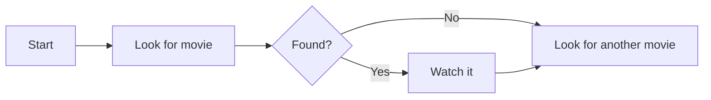
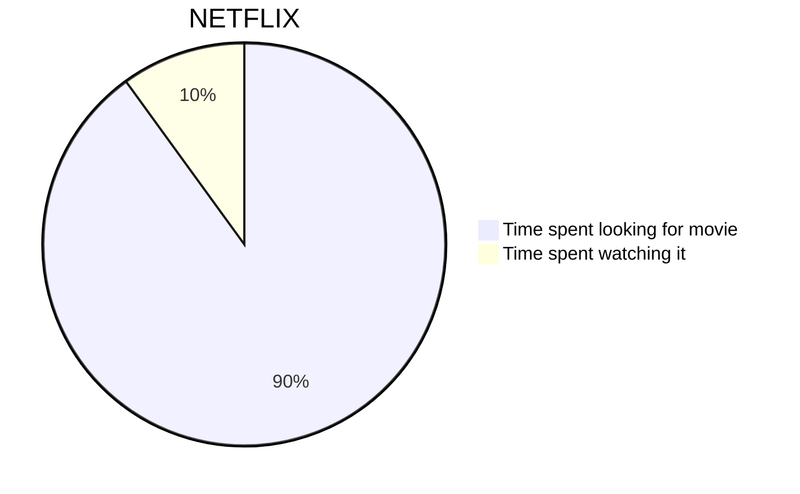
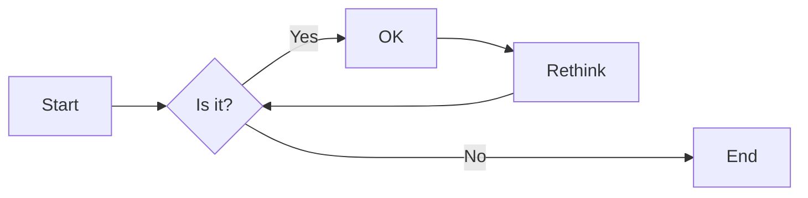
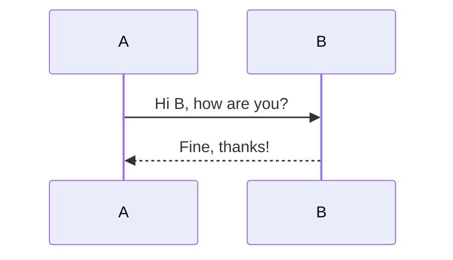
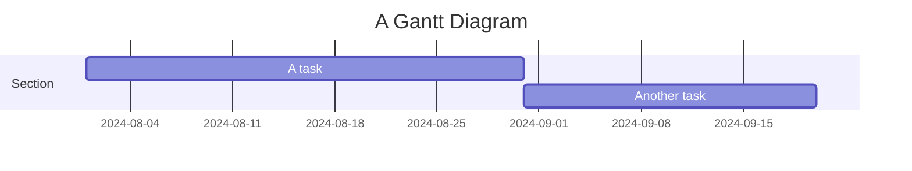
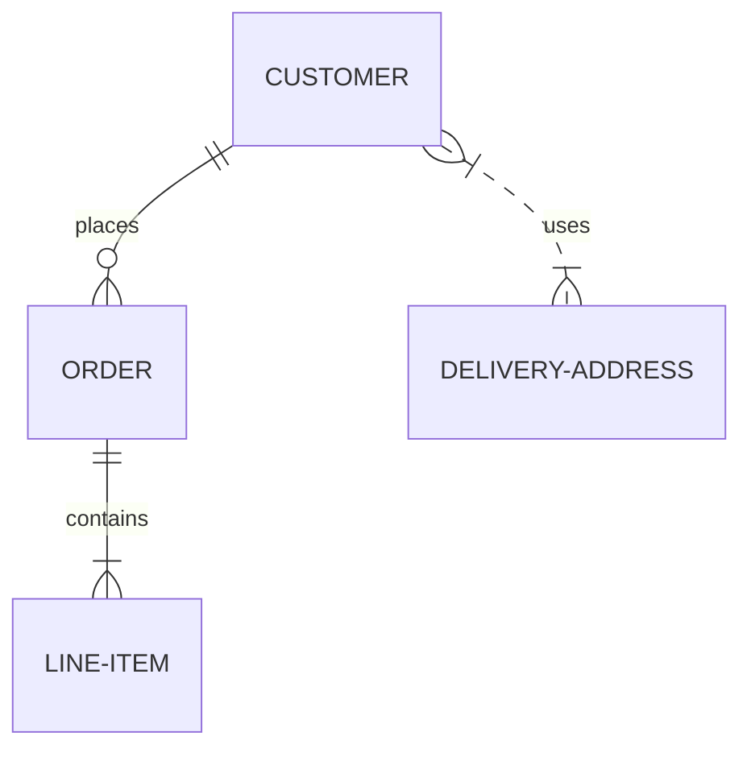
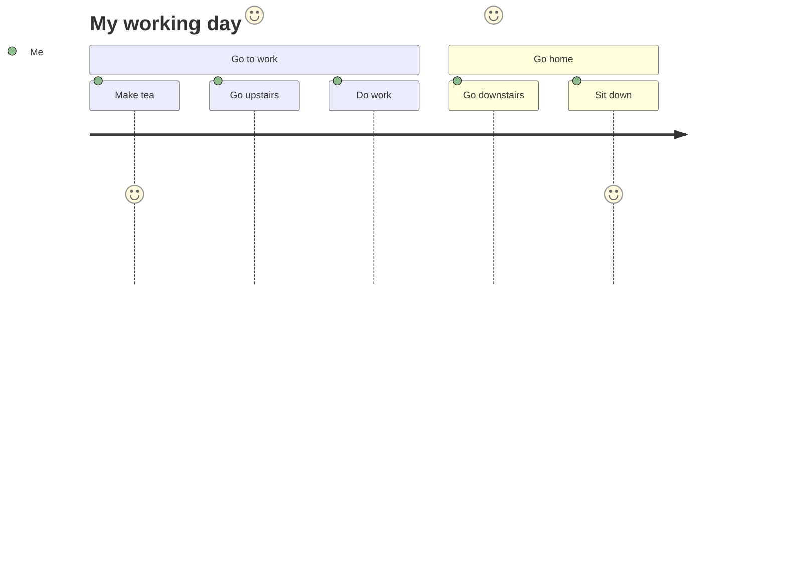

# Hinzufügen von mermaid.js mit htmx

<!--category-- HTMX, Markdown -->
<datetime class="hidden">2024-08-02T20:00</datetime>

## Einleitung

Mermaid ist ein einfaches Diagrammformat, das textbasierte Eingaben nimmt und Diagramme im SVG-Format generiert. Es ist ein großartiges Werkzeug für die Erstellung von Flussdiagrammen, Sequenzdiagrammen, Gantt-Diagrammen und mehr. In diesem Tutorial werden wir untersuchen, wie man Mermaid mit htmx verwendet, um interaktive Diagramme zu erstellen, die dynamisch ohne Seitenneuladen aktualisieren.
Die Mermaid Website ist [Hierher](https://mermaid.js.org/) und hat viel mehr Informationen, als ich hier bereitstellen kann.

[TOC]

## Markdown und Meerjungfrau

Mermaid-Diagramme können in Ihre Markdown-Dateien aufgenommen werden, indem Sie die folgende Syntax verwenden:

<pre>
# My Markdown Title

</pre>
Dies ermöglicht es Ihnen, Mermaid-Diagramme direkt in Ihre Markdown-Dateien aufzunehmen, die als SVG-Bilder wiedergegeben werden, wenn die Datei in HTML konvertiert wird.


Sie können auch Meerjungfrau-Diagramme zu normalen HTML-Dateien hinzufügen, indem Sie die folgende Syntax verwenden:

```html
<pre class="mermaid">
    graph TD
    A[Start] --> B[Look for movie]
    B --> C{Found?}
    C -->|Yes| D[Watch it]
    C -->|No| E[Look for another movie]
    D --> E
</pre>
```

### Beispiele für Meerjungfrauen-Diagramme

Mermaid ist ein leistungsstarkes Tool, mit dem Sie eine breite Palette von Diagrammen mit einfachen textbasierten Syntax erstellen können.
Hier sind einige Beispiele für die Arten von Diagrammen, die Sie mit Mermaid erstellen können:

- Pie Charts:



- Flugpläne:
Flussdiagramme können die Richtung angeben, z.B. LR (von links nach rechts), RL (von rechts nach links), TB (von oben nach unten), BT (von unten nach oben).



- Sequenzdiagramme:



- Gantt-Diagramme:



-Entität Beziehungsdiagramme:



-Benutzer-Reisediagramme:



etc...Siehe diese Seite für mehr der MYRIAD von Diagrammen, die Sie mit Mermaid erstellen können [Hierher](https://mermaid.js.org/syntax/examples.html)

## Erste Schritte mit Mermaid und htmx

Zuerst müssen Sie die Mermaid-Bibliothek in Ihre HTML-Datei aufnehmen. Sie können dies tun, indem Sie das folgende Script-Tag zu Ihrem Dokument hinzufügen:

```html
<script src="https://cdn.jsdelivr.net/npm/mermaid@10.9.1/dist/mermaid.min.js
"></script>
```

Der Nächste in Ihrem _Layout.cshtml-Datei müssen Sie das folgende Script-Tag hinzufügen, um Mermaid zu initialisieren (in der Regel tun Sie dies am unteren Rand der Datei)

```html
<script>
    document.addEventListener('DOMContentLoaded', function () {
        mermaid.initialize({ startOnLoad: true });
    });
    document.body.addEventListener('htmx:afterSwap', function(evt) {
        mermaid.run();
        
    });

</script>
```

Das macht zwei Dinge:

1. Es initialisiert Mermaid, wenn die Seite geladen wird; wenn Sie also direkt zu einer Seite mit einem Mermaid-Diagramm navigieren (z.B. [/blog/mermaidandhtmx](/blog/mermaidandhtmx) ) wird es korrekt rendern.
2. Wenn Sie htmx wie in unserem [vorheriges Tutorial](/blog/htmxwithaspnetcore) es wird das Mermaid-Diagramm nach der Aktualisierung der Seite erneut ausgeben (das htmx:afterswap-Ereignis).