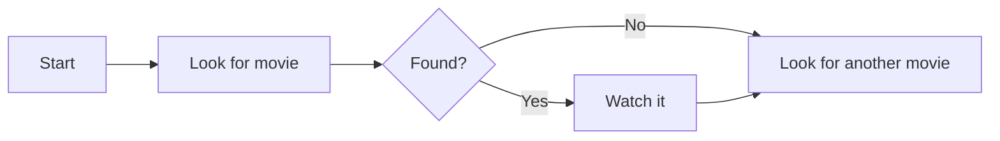
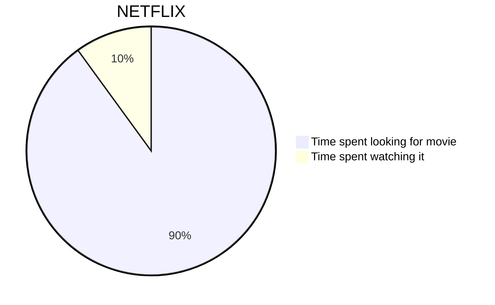
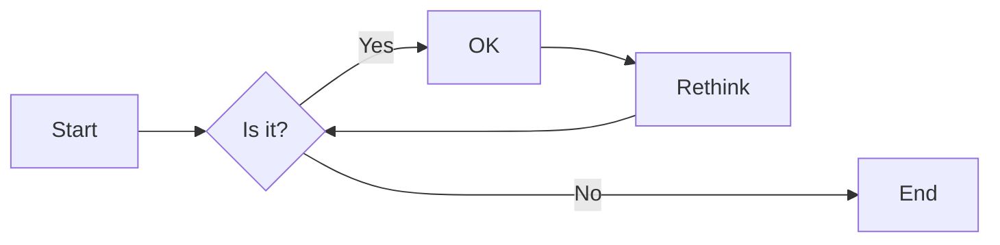
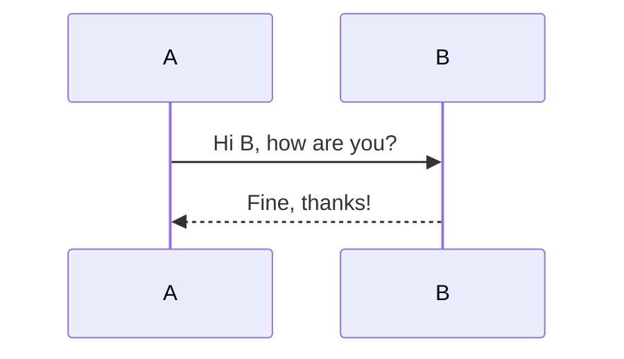
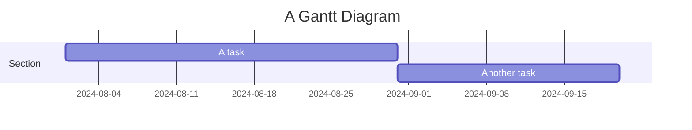
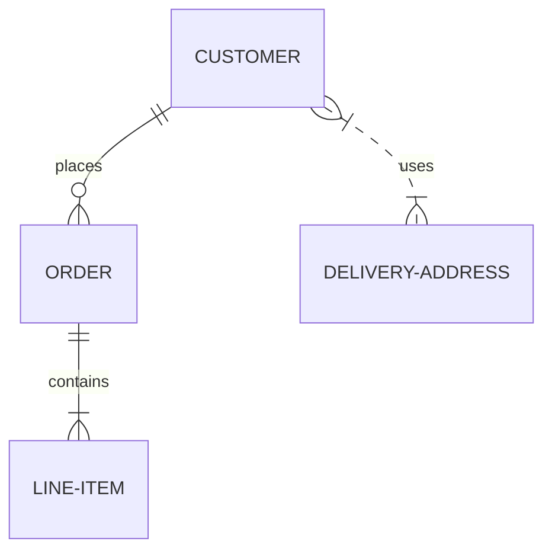
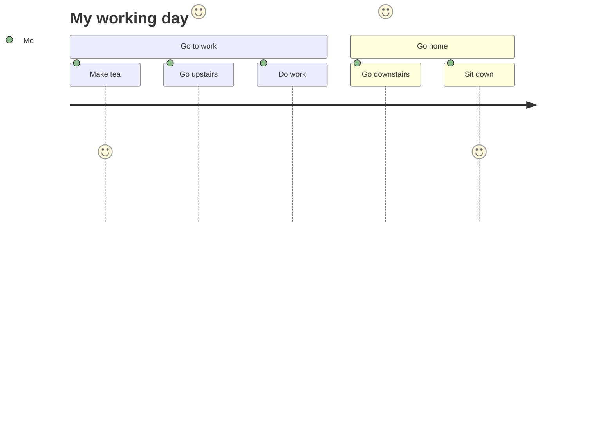

# Προσθήκη γοργόνας.js με htmx

<!--category-- HTMX, Markdown -->
<datetime class="hidden">2024-08-02T20:00</datetime>

## Εισαγωγή

Γοργόνα είναι μια απλή μορφή διαγραμμάτων που παίρνει κείμενο-based εισόδου και παράγει διαγράμματα σε μορφή SVG. Είναι ένα μεγάλο εργαλείο για τη δημιουργία διαγραμμάτων ροής, διαγράμματα ακολουθίας, διαγράμματα Gantt, και πολλά άλλα. Σε αυτό το φροντιστήριο, θα εξερευνήσουμε πώς να χρησιμοποιήσετε Γοργόνα με htmx για να δημιουργήσετε διαδραστικά διαγράμματα που ενημερώνονται δυναμικά χωρίς reloads σελίδα.
Η ιστοσελίδα της Γοργόνας είναι [Ορίστε.](https://mermaid.js.org/) και έχει πολύ περισσότερες πληροφορίες από ό, τι μπορώ να παρέχω εδώ.

[TOC]

## Markdown και Γοργόνα

Γοργόνα διαγράμματα μπορούν να συμπεριληφθούν στα αρχεία σας markdown χρησιμοποιώντας την ακόλουθη σύνταξη:

<pre>
# My Markdown Title

</pre>
Αυτό σας επιτρέπει να συμπεριλάβετε διαγράμματα Γοργόνα απευθείας στα αρχεία σας markdown, τα οποία θα μετατραπούν ως εικόνες SVG όταν το αρχείο μετατρέπεται σε HTML.


Μπορείτε επίσης να προσθέσετε διαγράμματα γοργόνας στα κανονικά αρχεία html χρησιμοποιώντας την ακόλουθη σύνταξη:

```html
<pre class="mermaid">
    graph TD
    A[Start] --> B[Look for movie]
    B --> C{Found?}
    C -->|Yes| D[Watch it]
    C -->|No| E[Look for another movie]
    D --> E
</pre>
```

### Παραδείγματα διαγραμμάτων Γοργόνας

Γοργόνα είναι ένα ισχυρό εργαλείο που σας επιτρέπει να χτίσει ένα ευρύ φάσμα διαγραμμάτων χρησιμοποιώντας απλή κείμενο-based σύνταξη.
Εδώ είναι μερικά παραδείγματα των τύπων των διαγραμμάτων που μπορείτε να δημιουργήσετε με τη Γοργόνα:

-Διαγράμματα πίτας:



-Flowcharts:
Τα διαγράμματα ροής μπορούν να καθορίσουν την κατεύθυνση, π.χ. LR (αριστερά προς τα δεξιά), RL (δεξιά προς τα αριστερά), TB (πάνω προς τα κάτω), BT (κάτω προς τα επάνω).



-Διαγράμματα αλληλουχίας:



-Διαγράμματα Gantt:



-Διαγράμματα σχέσεων πληρότητας:



-Διαγράμματα ταξιδιού χρήστη:



κ.λπ..Δείτε αυτή τη σελίδα για περισσότερα από τα διαγράμματα μου μπορείτε να δημιουργήσετε με τη Γοργόνα [Ορίστε.](https://mermaid.js.org/syntax/examples.html)

## Ξεκινάμε με τη Γοργόνα και την Α.Μ.Χ.

Πρώτα θα πρέπει να συμπεριλάβετε τη βιβλιοθήκη της Γοργόνας στο αρχείο HTML σας. Μπορείτε να το κάνετε αυτό προσθέτοντας την ακόλουθη ετικέτα σεναρίου στο έγγραφό σας:

```html
<script src="https://cdn.jsdelivr.net/npm/mermaid@10.9.1/dist/mermaid.min.js
"></script>
```

Ο επόμενος... _Διάταξη.cshtml αρχείο θα πρέπει να προσθέσετε την ακόλουθη ετικέτα σεναρίου για την αρχικοποίηση της Γοργόνας (κάνετε συνήθως αυτό στο κάτω μέρος του αρχείου)

```html
<script>
    document.addEventListener('DOMContentLoaded', function () {
        mermaid.initialize({ startOnLoad: true });
    });
    document.body.addEventListener('htmx:afterSwap', function(evt) {
        mermaid.run();
        
    });

</script>
```

Αυτό κάνει δύο πράγματα.

1. Αρχικοποιείται η Γοργόνα όταν η σελίδα φορτώνει, οπότε αν πλοηγηθείτε απευθείας σε μια σελίδα με διάγραμμα Γοργόνας (π.χ. [/blog/mermaidandhtmx](/blog/mermaidandhtmx) ) θα αποδώσει σωστά.
2. Αν χρησιμοποιείτε htmx όπως στην δική μας [προηγούμενο φροντιστήριο](/blog/htmxwithaspnetcore) θα ξαναδώσει το διάγραμμα Γοργόνας μετά την ενημέρωση της σελίδας (το htmx:afterswap event).