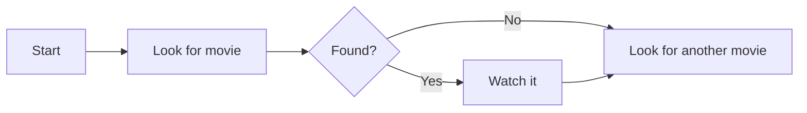
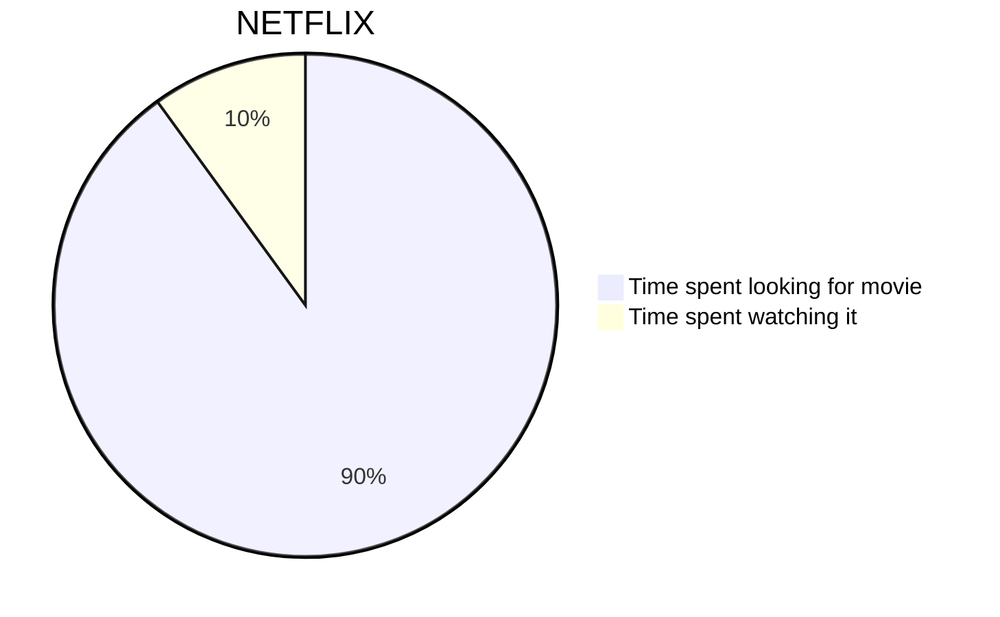
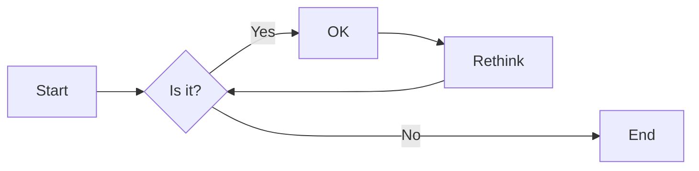
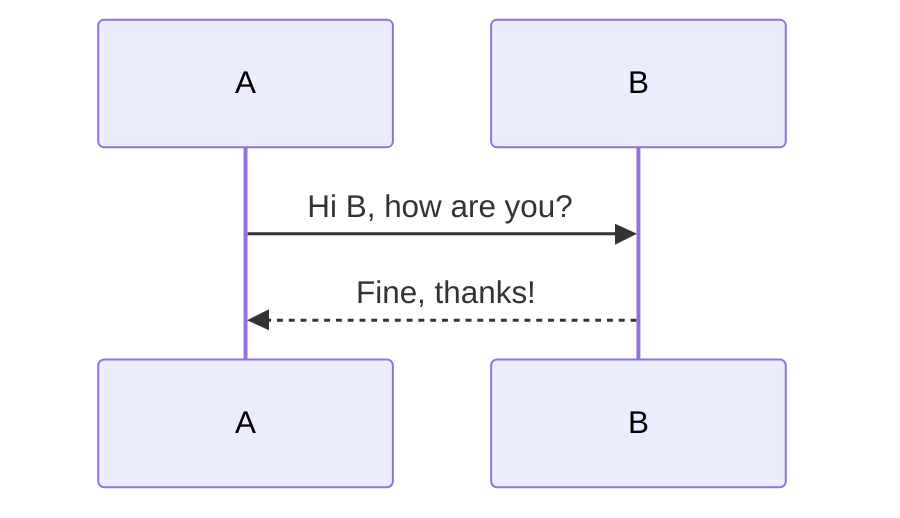
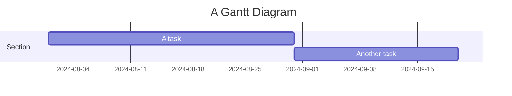
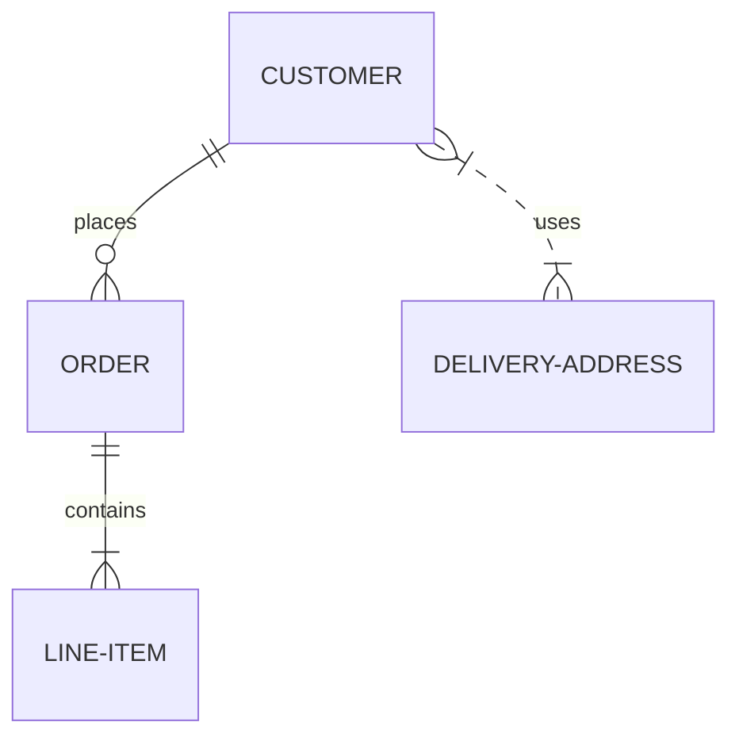
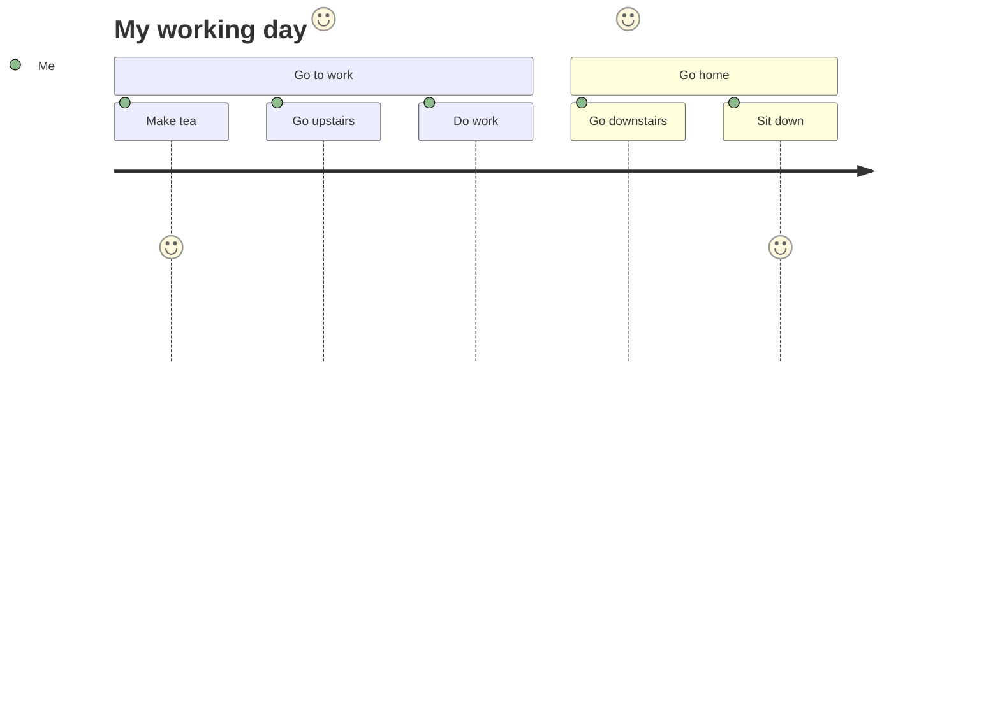

# Añadir sirena.js con htmx

<!--category-- HTMX, Markdown -->
<datetime class="hidden">2024-08-02T20:00</datetime>

## Introducción

Mermaid es un formato de diagramación simple que toma la entrada basada en texto y genera diagramas en formato SVG. Es una gran herramienta para crear diagramas de flujo, diagramas de secuencia, gráficos de Gantt, y más. En este tutorial, exploraremos cómo usar Mermaid con htmx para crear diagramas interactivos que se actualicen dinámicamente sin recargas de páginas.
El sitio de Sirena es [aquí](https://mermaid.js.org/) y tiene mucha más información de la que puedo proporcionar aquí.

[TOC]

## Markdown y Sirena

Los diagramas de Sirena se pueden incluir en sus archivos Markdown usando la siguiente sintaxis:

<pre>
# My Markdown Title

</pre>
Esto le permite incluir diagramas de Sirena directamente en sus archivos Markdown, que serán renderizados como imágenes SVG cuando el archivo se convierta a HTML.


También puede añadir diagramas de sirena a archivos html normales utilizando la siguiente sintaxis:

```html
<pre class="mermaid">
    graph TD
    A[Start] --> B[Look for movie]
    B --> C{Found?}
    C -->|Yes| D[Watch it]
    C -->|No| E[Look for another movie]
    D --> E
</pre>
```

### Ejemplos de diagramas de sirena

Mermaid es una poderosa herramienta que le permite construir una amplia gama de diagramas utilizando sintaxis simple basada en texto.
Estos son algunos ejemplos de los tipos de diagramas que puede crear con Sirena:

- Gráficas de Pie:



-Flowcharts:
Los diagramas de flujo pueden especificar la dirección, por ejemplo. LR (de izquierda a derecha), RL (de derecha a izquierda), TB (de arriba a abajo), BT (de abajo a arriba).



- Diagramas de secuencia:



- Tablas de Gantt:



- Diagramas de relaciones de la entidad:



- Diagramas de viaje del usuario:



etc...Vea esta página para más de la MYRIAD de diagramas que puede crear con Sirena [aquí](https://mermaid.js.org/syntax/examples.html)

## Comenzando con Mermaid y htmx

Primero necesita incluir la biblioteca de Sirena en su archivo HTML. Puede hacer esto añadiendo la siguiente etiqueta de guión a su documento:

```html
<script src="https://cdn.jsdelivr.net/npm/mermaid@10.9.1/dist/mermaid.min.js
"></script>
```

Siguiente en tu _Archivo Layout.cshtml que necesita añadir la siguiente etiqueta de script para inicializar Mermaid (normalmente lo hace en la parte inferior del archivo)

```html
<script>
    document.addEventListener('DOMContentLoaded', function () {
        mermaid.initialize({ startOnLoad: true });
    });
    document.body.addEventListener('htmx:afterSwap', function(evt) {
        mermaid.run();
        
    });

</script>
```

Esto hace dos cosas;

1. Inicializa Sirena cuando la página se carga; por lo que si navega directamente a una página con un diagrama de Sirena (por ejemplo. [/blog/mermaidandhtmx](/blog/mermaidandhtmx) ) se renderizará correctamente.
2. Si utiliza htmx como en nuestro [tutorial anterior](/blog/htmxwithaspnetcore) volverá a entregar el diagrama de Sirena después de que la página haya sido actualizada (el evento htmx:afterswap).