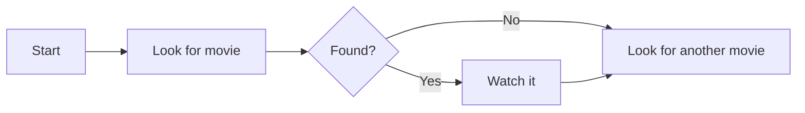
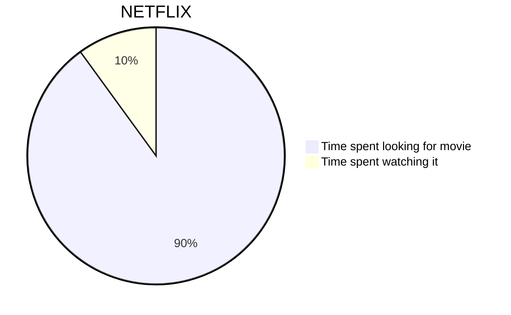
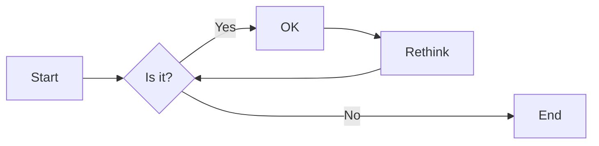
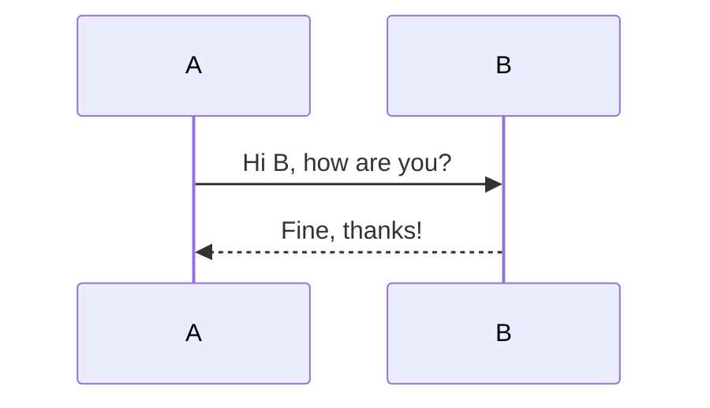
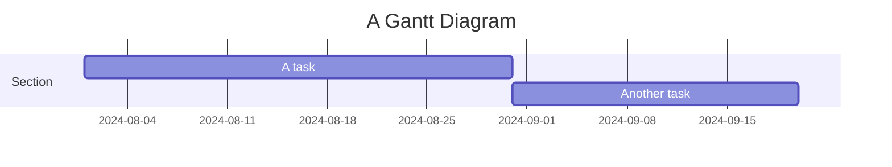
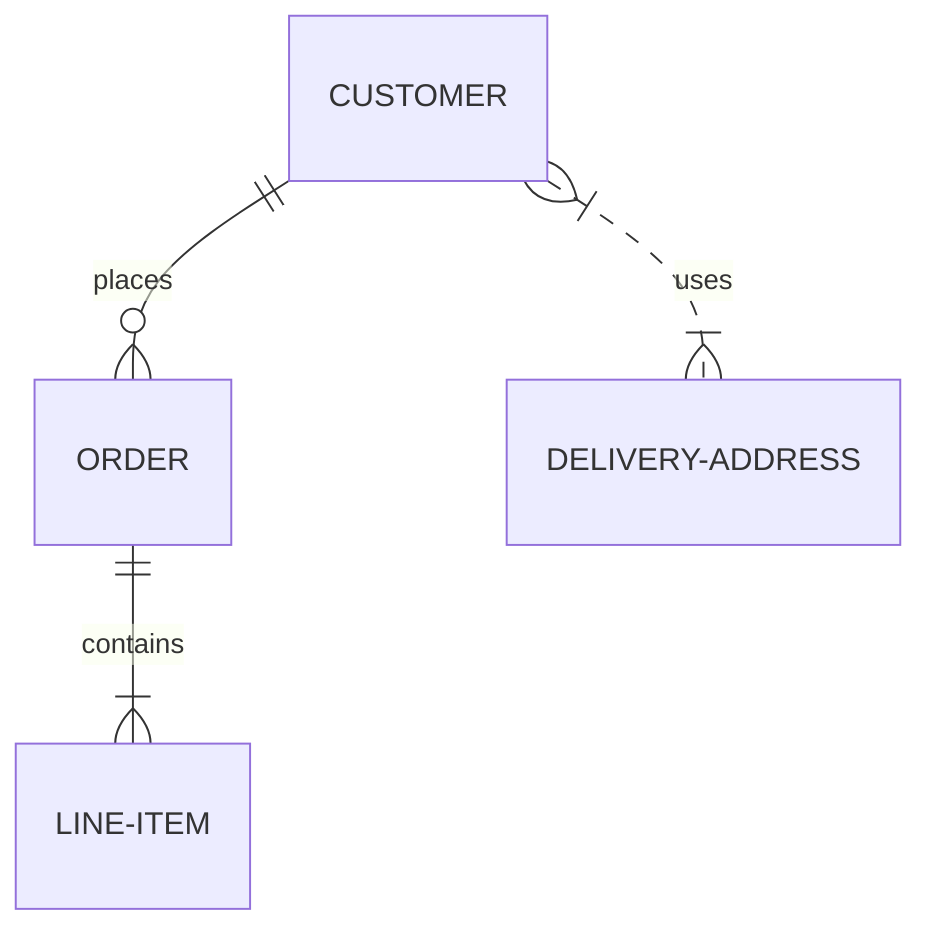
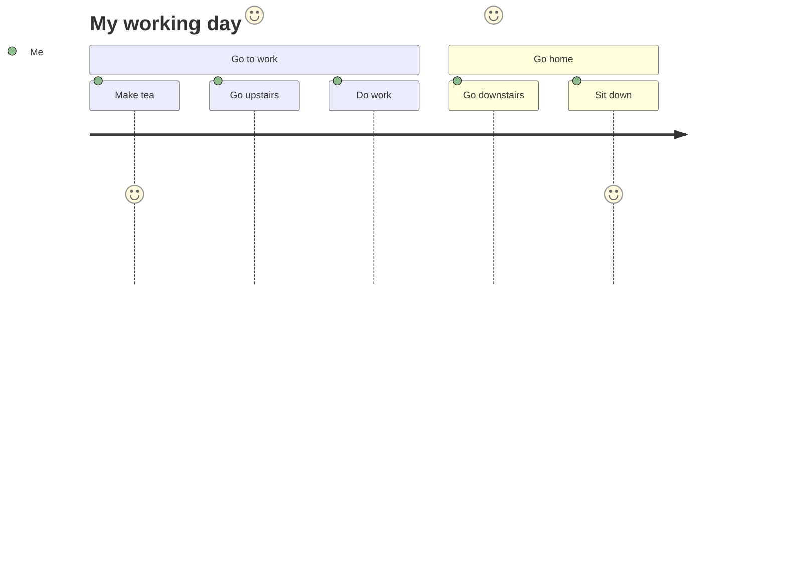

# Lisää merenneito.js kanssa htmx

<!--category-- HTMX, Markdown -->
<datetime class="hidden">2024-08-02T20:00</datetime>

## Johdanto

Merenneito on yksinkertainen kaaviomuoto, joka ottaa tekstipohjaisen syötteen ja luo kaavioita SVG-muodossa. Se on loistava työkalu vuokaavioiden, sekvenssikaavioiden, Ganttin kaavioiden ja muun luomiseen. Tässä tutoriaalissa tutkitaan, miten merenneitoa ja htmxiä käytetään luomaan vuorovaikutteisia kaavioita, jotka päivittyvät dynaamisesti ilman sivujen uudelleenlatauksia.
Merenneidon paikka on [täällä](https://mermaid.js.org/) Ja minulla on paljon enemmän tietoa kuin voin antaa täällä.

[TÄYTÄNTÖÖNPANO

## Markdown ja merenneito

Merenneidon kaaviot voidaan sisällyttää markdown-tiedostoihin käyttämällä seuraavaa syntaksia:

<pre>
# My Markdown Title

</pre>
Näin voit liittää Merenneito-kaaviot suoraan markdown-tiedostoihisi, jotka renderoidaan SVG-kuviksi, kun tiedosto muutetaan HTML:ksi.


Voit myös lisätä merenneitokaavioita normaaleihin html-tiedostoihin käyttämällä seuraavaa syntaksia:

```html
<pre class="mermaid">
    graph TD
    A[Start] --> B[Look for movie]
    B --> C{Found?}
    C -->|Yes| D[Watch it]
    C -->|No| E[Look for another movie]
    D --> E
</pre>
```

### Merenneidon kaavioita

Merenneito on tehokas työkalu, jonka avulla voit rakentaa laajan valikoiman kaavioita yksinkertaisella tekstipohjaisella syntaksilla.
Tässä muutamia esimerkkejä siitä, millaisia kaavioita merenneito voi luoda:

-Pie kaaviot:



-Kukkakaalit:
Flowcharts voi määritellä suunnan, esim. LR (vasemmalta oikealle), RL (oikealta vasemmalle), TB (ylhäältä alas), BT (alapuolelta ylös).



-Sekvenssikaaviot:



-Suuret kartat:



-Yleisyyssuhdekaaviot:



-Käyttäjän matkakaaviot:



jne. Katso tältä sivulta lisää MYRIAD kaavioita voit luoda merenneito [täällä](https://mermaid.js.org/syntax/examples.html)

## Merenneidon ja htmxin alku

Ensin sinun on sisällytettävä merenneitokirjasto HTML-tiedostoosi. Voit tehdä tämän lisäämällä seuraavan skriptitunnuksen asiakirjaasi:

```html
<script src="https://cdn.jsdelivr.net/npm/mermaid@10.9.1/dist/mermaid.min.js
"></script>
```

Seuraava _Layout.cshtml-tiedosto, johon täytyy lisätä seuraava skriptilappu merenneidon alustamiseksi (yleensä teet tämän tiedoston alalaidassa)

```html
<script>
    document.addEventListener('DOMContentLoaded', function () {
        mermaid.initialize({ startOnLoad: true });
    });
    document.body.addEventListener('htmx:afterSwap', function(evt) {
        mermaid.run();
        
    });

</script>
```

Tämä tekee kaksi asiaa:

1. Se alustaa merenneitoa, kun sivu latautuu, joten jos navigoidaan suoraan sivulle, jossa on merenneitokaavio (esim. [/blog/merineito jahtmx](/blog/mermaidandhtmx) ) se tekee oikein.
2. Jos käytät htmxia kuten meidän [aiempi opetusohjelma](/blog/htmxwithaspnetcore) se korjaa Merenneidon kaavion sivun päivityksen jälkeen (htmx:afterswap-tapahtuma).