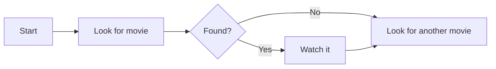
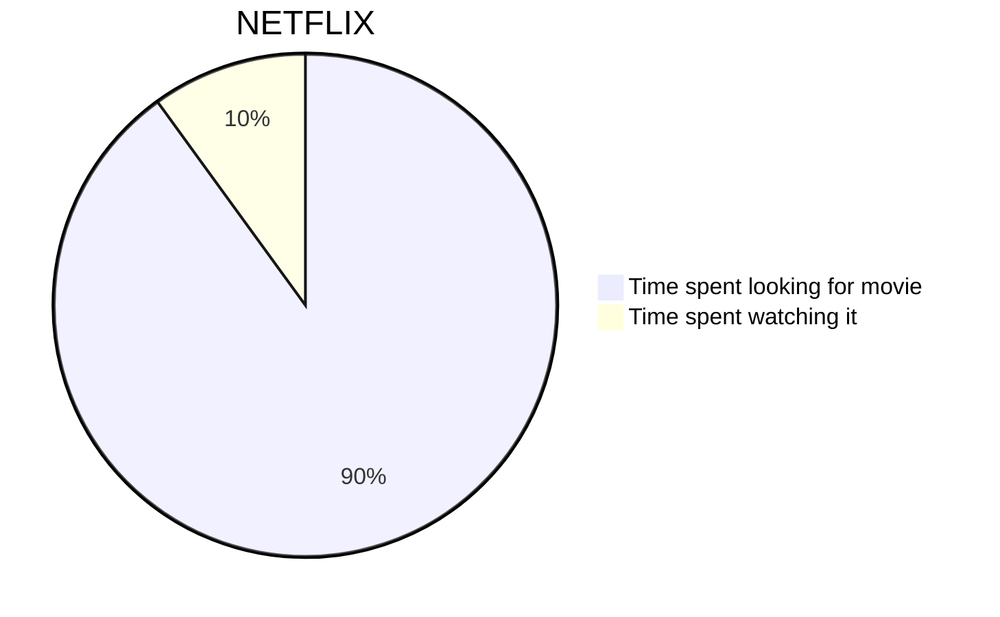
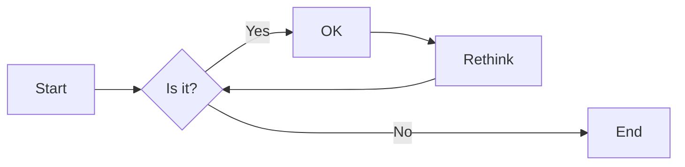
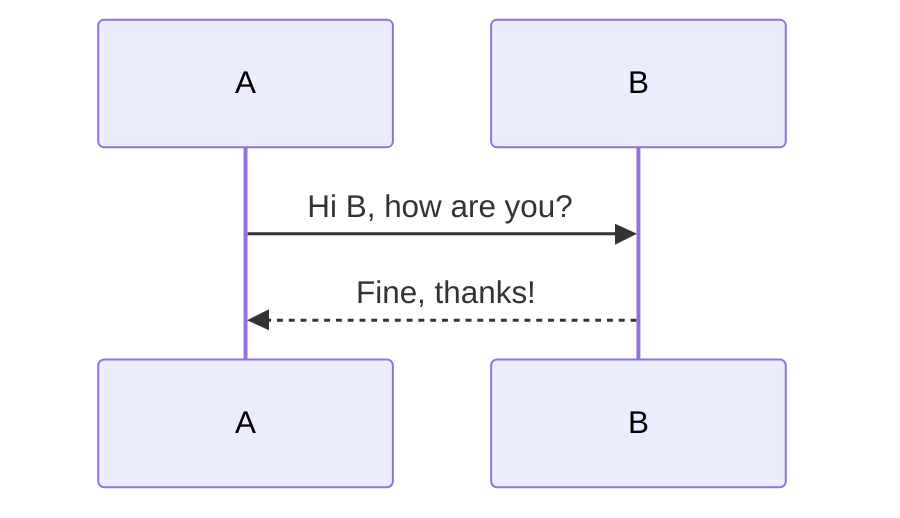
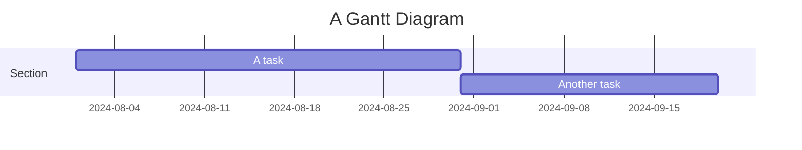
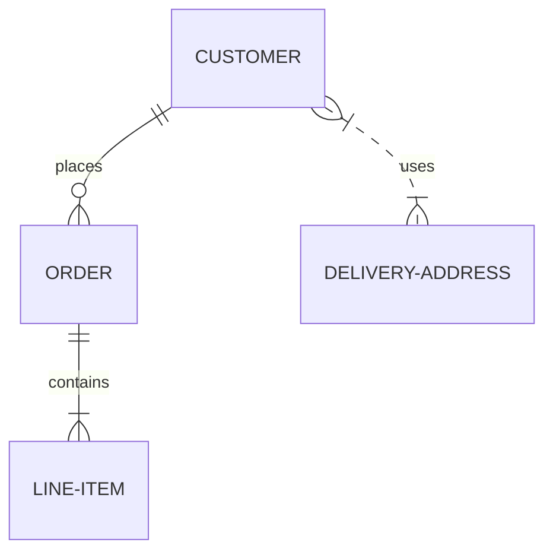
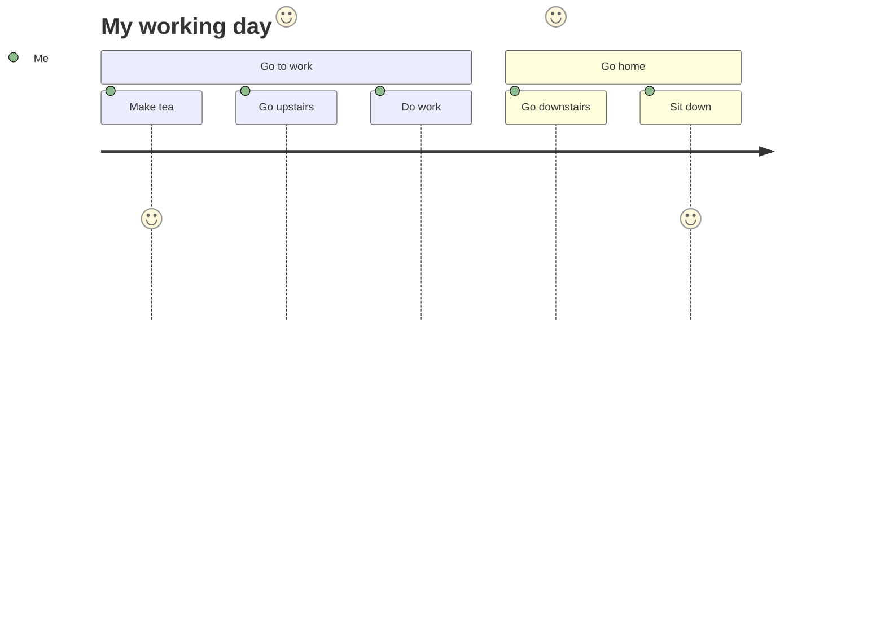

# Ajouter sirmaid.js avec htmx

<!--category-- HTMX, Markdown -->
<datetime class="hidden">2024-08-02T20:00</datetime>

## Présentation

La sirène est un simple format de diagramme qui prend des entrées texte et génère des diagrammes au format SVG. C'est un excellent outil pour créer des diagrammes de flux, des diagrammes de séquence, des diagrammes de Gantt, et plus encore. Dans ce tutoriel, nous allons explorer comment utiliser Sirmaid avec htmx pour créer des diagrammes interactifs qui mettent à jour dynamiquement sans recharger de page.
Le site de Sirmaid est [Ici.](https://mermaid.js.org/) et a beaucoup plus d'informations que je peux fournir ici.

[TOC]

## Markdown et sirène

Les diagrammes de sirène peuvent être inclus dans vos fichiers de balisage en utilisant la syntaxe suivante :

<pre>
# My Markdown Title

</pre>
Cela vous permet d'inclure des diagrammes de Sirène directement dans vos fichiers de balisage, qui seront rendus sous forme d'images SVG lorsque le fichier est converti en HTML.


Vous pouvez également ajouter des diagrammes de sirène à des fichiers html normaux en utilisant la syntaxe suivante :

```html
<pre class="mermaid">
    graph TD
    A[Start] --> B[Look for movie]
    B --> C{Found?}
    C -->|Yes| D[Watch it]
    C -->|No| E[Look for another movie]
    D --> E
</pre>
```

### Exemples de diagrammes de sirène

Sirène est un outil puissant qui vous permet de construire une large gamme de diagrammes en utilisant une syntaxe simple basée sur le texte.
Voici quelques exemples des types de diagrammes que vous pouvez créer avec Sirmaid:

- Cartes postales :



- Des planches à roulettes.
Les diagrammes de flux peuvent spécifier la direction, par exemple. LR (de gauche à droite), RL (de droite à gauche), TB (de haut en bas), BT (de bas en haut).



- Diagrammes de séquence:



- Graphiques de bord :



- Diagrammes de relation d'entité :



- Diagrammes de voyage de l'utilisateur :



etc...Voir cette page pour plus de la MYRIAD de diagrammes que vous pouvez créer avec Mermaid [Ici.](https://mermaid.js.org/syntax/examples.html)

## Commencer avec Sirmaid et htmx

D'abord, vous devez inclure la bibliothèque Sirmaid dans votre fichier HTML. Vous pouvez le faire en ajoutant la balise de script suivante à votre document :

```html
<script src="https://cdn.jsdelivr.net/npm/mermaid@10.9.1/dist/mermaid.min.js
"></script>
```

Suivant dans votre _Fichier Layout.cshtml vous devez ajouter la balise de script suivante pour initialiser Mermaid (vous le faites normalement en bas du fichier)

```html
<script>
    document.addEventListener('DOMContentLoaded', function () {
        mermaid.initialize({ startOnLoad: true });
    });
    document.body.addEventListener('htmx:afterSwap', function(evt) {
        mermaid.run();
        
    });

</script>
```

Cela fait deux choses;

1. Il initialise la sirène lorsque la page se charge; donc si vous naviguez directement vers une page avec un diagramme de sirène (p. ex. [/blog/mermaidandhtmx](/blog/mermaidandhtmx) ) il rendra correctement.
2. Si vous utilisez htmx comme dans notre [tutoriel précédent](/blog/htmxwithaspnetcore) il renverra le diagramme de Sirène après la mise à jour de la page (l'événement htmx:afterswap).