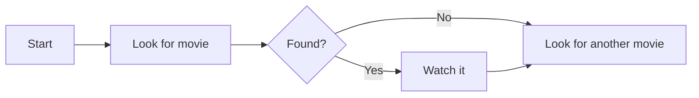
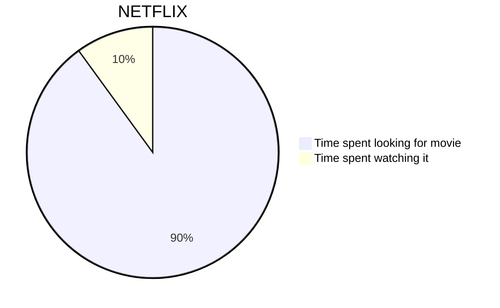
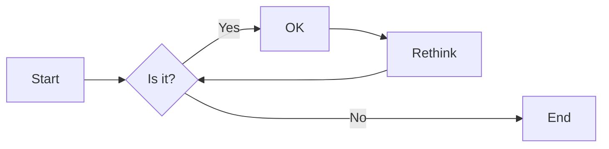
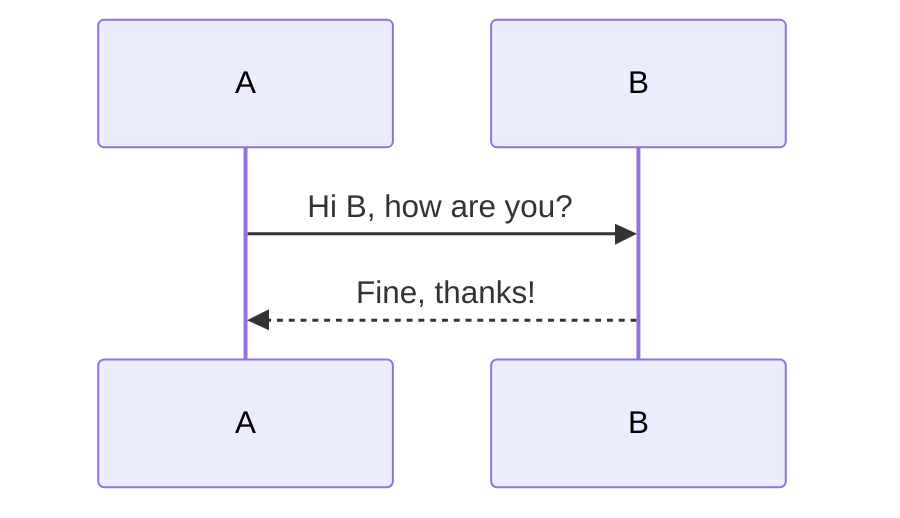
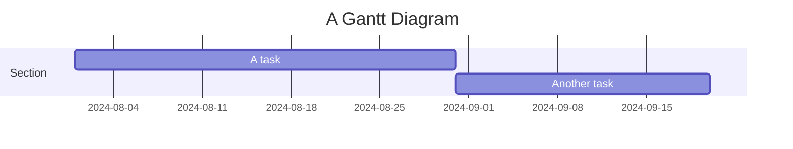
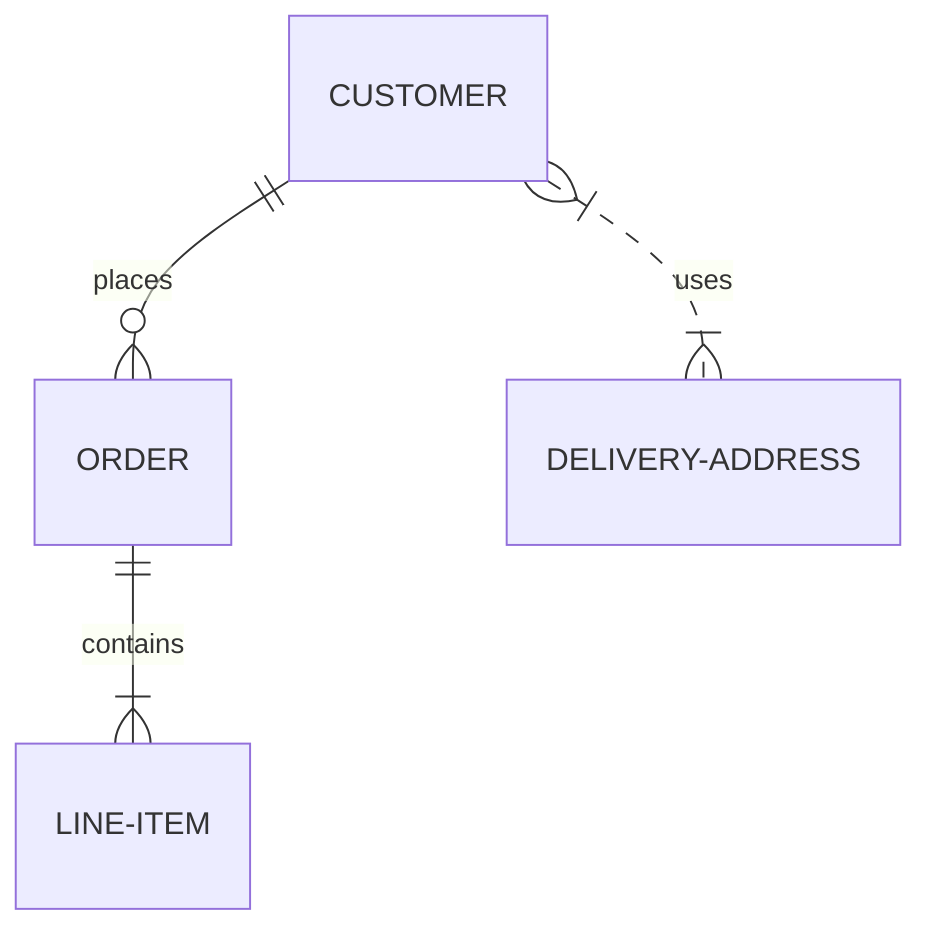
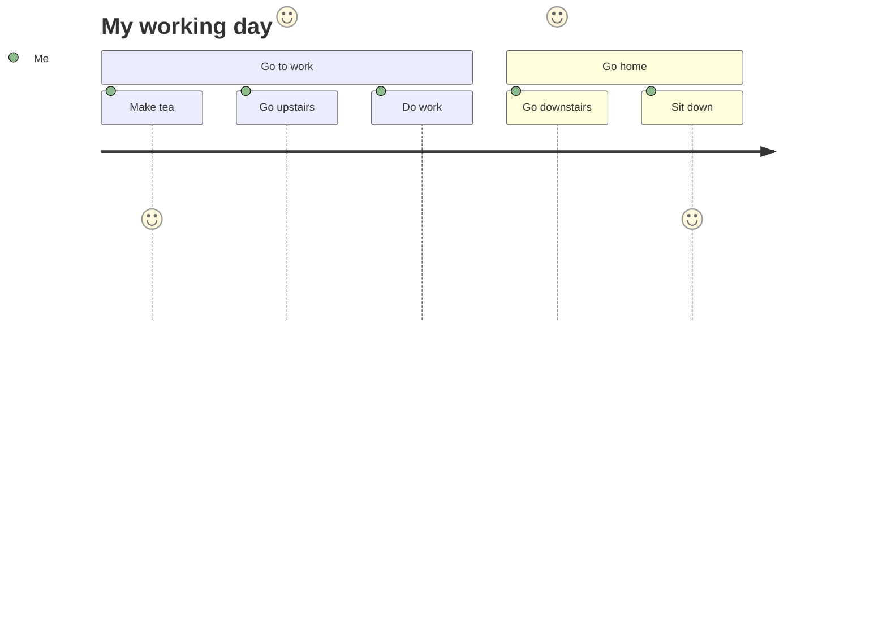

# मेक्स के साथ.jks जोड़ रहे हैं

<!--category-- HTMX, Markdown -->
<datetime class="hidden">2024- 08- 02टी20: 00</datetime>

## परिचय

मेरिकर एक सरल डायग्राम तैयार करता है जो कि पाठ- आधारित इनपुट बनाता है और एसवीजी फॉर्मेट में आरेख बनाता है. यह facuts, अनुक्रम, sss, और अधिक से अधिक बनाने के लिए एक महान औजार है. इस शिक्षण में, हम पता लगाने के लिए कि कैसे Mervivix के साथ Mex बनाने के लिए प्रयोग किया जाता है पता लगाने के लिए।
मेरशी साइट है[यहाँ](https://mermaid.js.org/)और मैं यहाँ प्रदान कर सकते हैं की तुलना में कहीं अधिक जानकारी है.

[विषय

## मेर्ज़ और मेकर

मेररिकार्ड डायग्राम में निम्न वाक्यों का उपयोग करके अपने चिह्न नीचे की फ़ाइलों में शामिल किया जा सकता है:

<pre>
# My Markdown Title

</pre>
यह आपको तुम्हारी पंक्ति नीचे की फ़ाइलों में सीधे मे शामिल करने देता है, जिसे जब फ़ाइल को एचटीएमएल में बदला जाता है तो एसवीजी छवि के रूप में अनुवादित किया जाएगा.


निम्न सिंटेक्स का उपयोग करके आप मेकर डायग्राम को सामान्य एचटीएमएल फ़ाइलें भी जोड़ सकते हैं:

```html
<pre class="mermaid">
    graph TD
    A[Start] --> B[Look for movie]
    B --> C{Found?}
    C -->|Yes| D[Watch it]
    C -->|No| E[Look for another movie]
    D --> E
</pre>
```

### मेरिकर डायग्राम के उदाहरण

मेरीरी एक शक्तिशाली औज़ार है जो आपको चित्र की एक विस्तृत सीमा बनाने देता है साधारण पाठ आधारित सिंटेक्स का उपयोग करके.
यहाँ चित्रों के कुछ प्रकार हैं जो आप मेकर के साथ बना सकते हैं:

-पी चार्ट:



-Fluts:
फ़्लोचार्ट्स दिशा निर्धारित कर सकते हैं, जैसे कि LR (दायीं ओर से दाएँ), RL (दायीं ओर), TT (BT), BT (ऊपर से ऊपर).



- सामग्री डायग्राम:



- दस्तावेज चार्ट:



- स्थिर सम्बन्ध डायग्राम:



- अंग्रेजी यात्रा डायग्राम:



... इस पृष्ठ को देखें आरेखों के मेरे कमांडर के अधिक के लिए आप मेकर के साथ बनाया जा सकता है[यहाँ](https://mermaid.js.org/syntax/examples.html)

## मेकर और htmx के साथ प्रारंभ किया जा रहा है

पहले आपको अपने एचटीएमएल फ़ाइल में मेकर्टर लाइब्रेरी को शामिल करना होगा. आप इसे निम्न स्क्रिप्ट टैग को अपने दस्तावेज़ में जोड़ने के द्वारा कर सकते हैं:

```html
<script src="https://cdn.jsdelivr.net/npm/mermaid@10.9.1/dist/mermaid.min.js
"></script>
```

अपने में अगला_खाका.cml फ़ाइल आपको निम्न स्क्रिप्ट टैग को प्रारंभ करने के लिए जोड़ने की जरूरत है मेकर फ़ाइल के तल पर (आप इसे सामान्य रूप से करते हैं)

```html
<script>
    document.addEventListener('DOMContentLoaded', function () {
        mermaid.initialize({ startOnLoad: true });
    });
    document.body.addEventListener('htmx:afterSwap', function(evt) {
        mermaid.run();
        
    });

</script>
```

यह दो बातें करता है;

1. यह मेरशी को तब आरंभ करता है जब पृष्ठ बोझ होता है; सो यदि आप सीधे मेकर एक मेकर आरेख के साथ पृष्ठ पर पहुंचते हैं (उदाहरण).[/ब्लॉग/ मेरकुण्ड](/blog/mermaidandhtmx)) यह सही तरीके से रेंडर करेगा.
2. यदि आप हमारे अंदर htkx का उपयोग करते हैं[पिछला शिक्षण पाठ](/blog/htmxwithaspnetcore)यह पृष्ठ के अद्यतन के बाद मेकर्टर आरेख फिर से देगा.