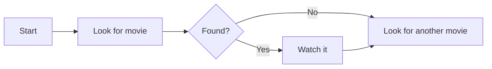
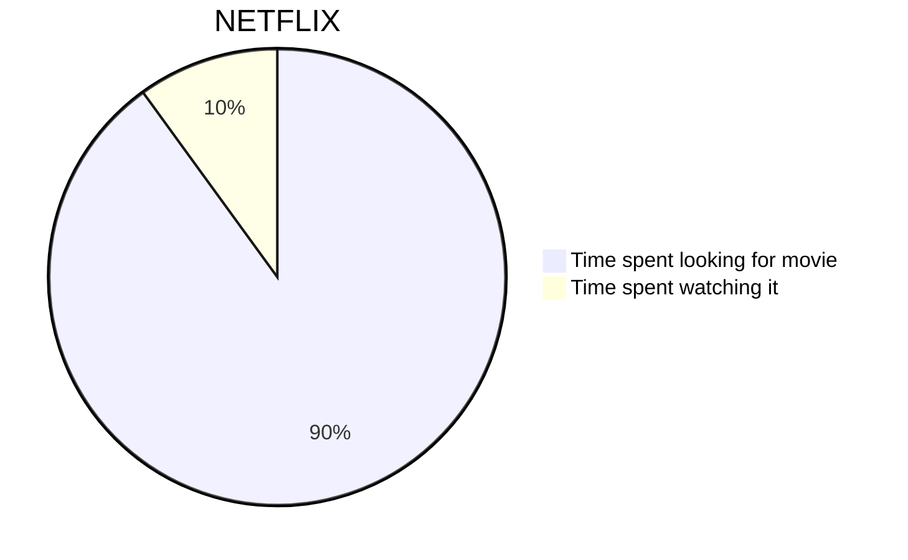
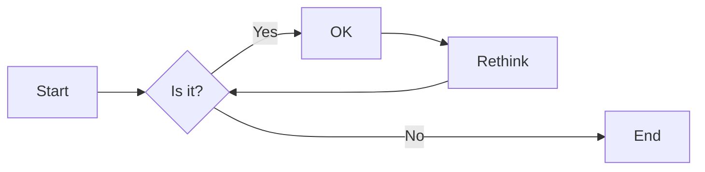
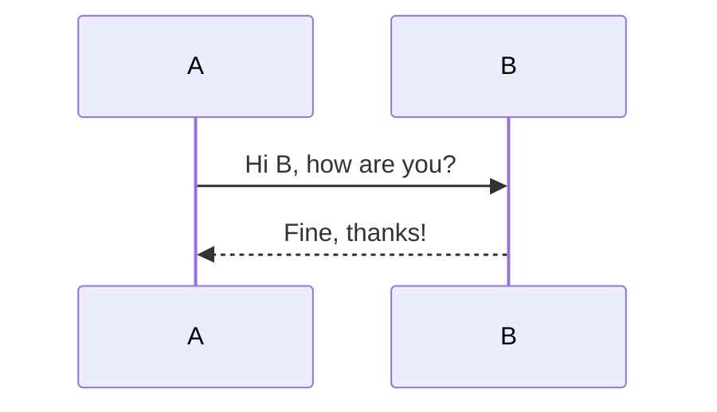
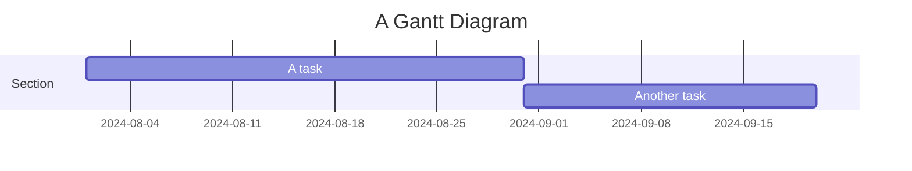
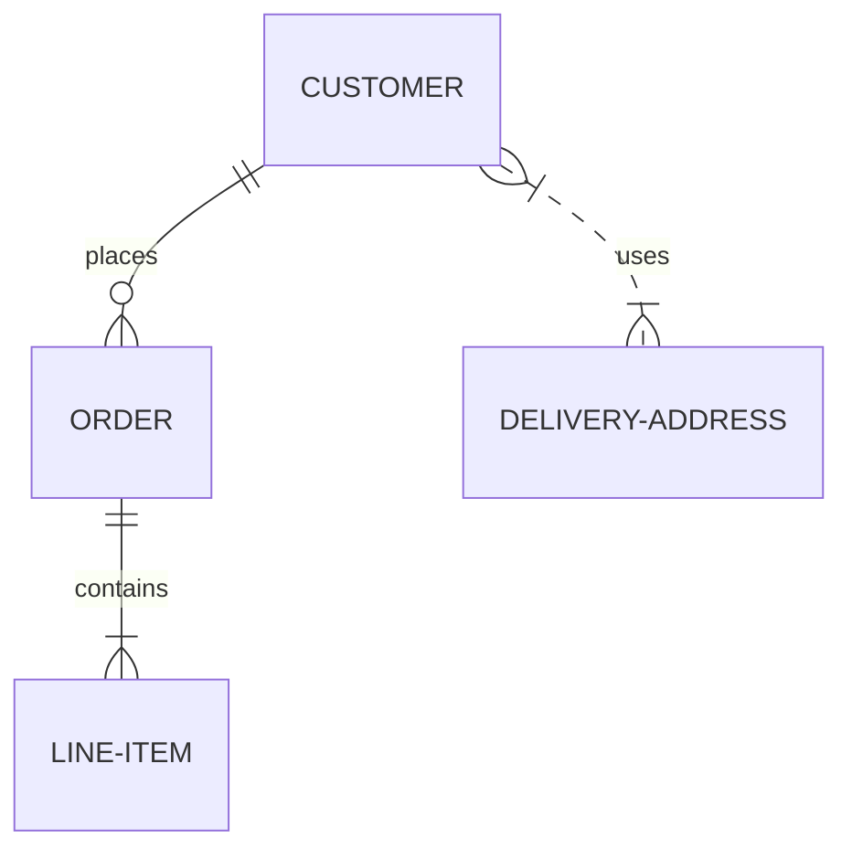
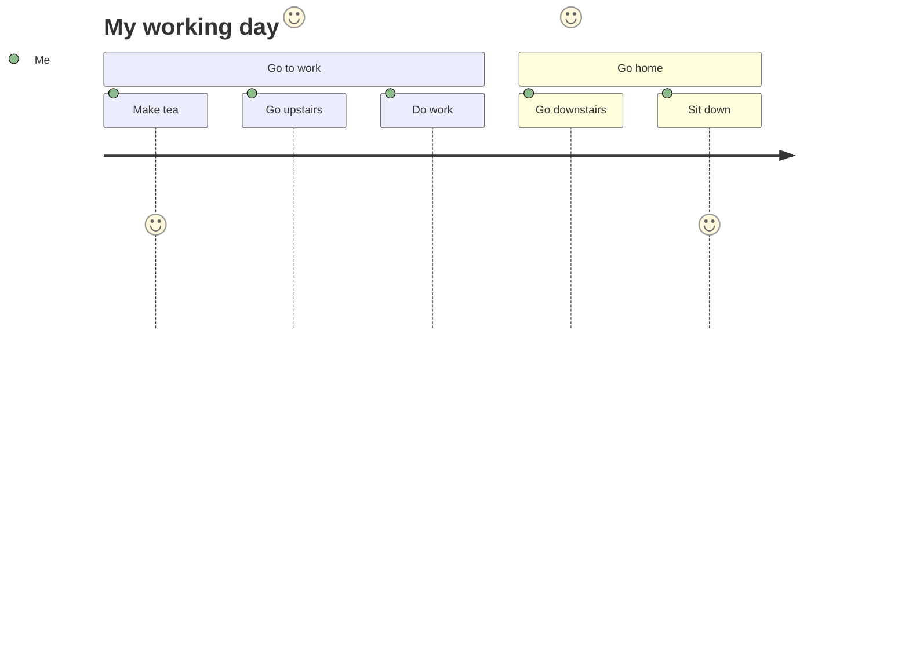

# Aggiungere sirena.js con htmx

<!--category-- HTMX, Markdown -->
<datetime class="hidden">2024-08-02T20:00</datetime>

## Introduzione

La sirena è un semplice formato di diagramma che prende ingresso basato sul testo e genera diagrammi in formato SVG. È un ottimo strumento per creare diagrammi di flusso, diagrammi di sequenza, grafici Gantt e altro ancora. In questo tutorial, esploreremo come usare la sirena con htmx per creare diagrammi interattivi che aggiornano dinamicamente senza ricaricare le pagine.
Il sito della Sirenetta è[qui](https://mermaid.js.org/)e ha molte più informazioni di quante io possa fornire qui.

[TOC]

## Markdown e Sirenetta

I diagrammi della sirena possono essere inclusi nei file markdown utilizzando la seguente sintassi:

<pre>
# My Markdown Title

</pre>
Questo ti permette di includere i diagrammi di Sirenetta direttamente nei tuoi file markdown, che saranno resi come immagini SVG quando il file viene convertito in HTML.


È inoltre possibile aggiungere diagrammi di sirena ai file html normali utilizzando la seguente sintassi:

```html
<pre class="mermaid">
    graph TD
    A[Start] --> B[Look for movie]
    B --> C{Found?}
    C -->|Yes| D[Watch it]
    C -->|No| E[Look for another movie]
    D --> E
</pre>
```

### Esempi di diagrammi della sirena

La sirena è un potente strumento che consente di costruire una vasta gamma di diagrammi utilizzando una semplice sintassi basata sul testo.
Ecco alcuni esempi dei tipi di diagrammi che puoi creare con la Sirenetta:

- Grafici delle torte:



- Caratteri di accesso:
I diagrammi di flusso possono specificare la direzione, ad esempio LR (da sinistra a destra), RL (da destra a sinistra), TB (dall'alto verso il basso), BT (dal basso verso l'alto).



- Diagrammi di sequenza:



- Carte Gantt:



-Diagrammi di relazione di entrata:



- Schemi di viaggio dell'utente:



Vedi questa pagina per più del MYRIAD dei diagrammi che puoi creare con la Sirenetta[qui](https://mermaid.js.org/syntax/examples.html)

## Iniziare con la sirena e l'htmx

Per prima cosa devi includere la libreria Mermaid nel tuo file HTML. Puoi farlo aggiungendo il seguente tag script al tuo documento:

```html
<script src="https://cdn.jsdelivr.net/npm/mermaid@10.9.1/dist/mermaid.min.js
"></script>
```

La prossima nella tua_Il file Layout.cshtml è necessario aggiungere il seguente tag script per inizializzare la sirena (di solito lo fai nella parte inferiore del file)

```html
<script>
    document.addEventListener('DOMContentLoaded', function () {
        mermaid.initialize({ startOnLoad: true });
    });
    document.body.addEventListener('htmx:afterSwap', function(evt) {
        mermaid.run();
        
    });

</script>
```

Questo fa due cose:

1. Si inizializza la sirena quando la pagina viene caricata; quindi se si naviga direttamente su una pagina con un diagramma della sirena (es.[/blog/mermaidandhtmx](/blog/mermaidandhtmx)) renderà correttamente.
2. Se si utilizza htmx come nel nostro[tutorial precedente](/blog/htmxwithaspnetcore)re-renderà il diagramma della Sirenetta dopo che la pagina è stata aggiornata (l'evento htmx:afterswap).