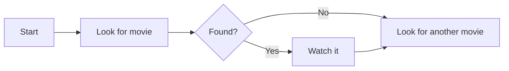
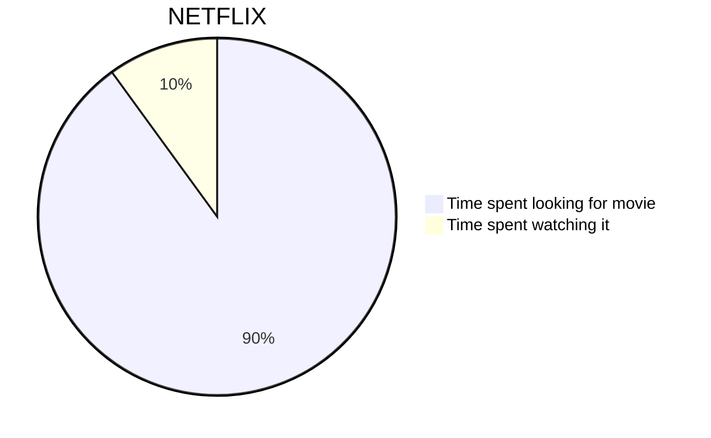
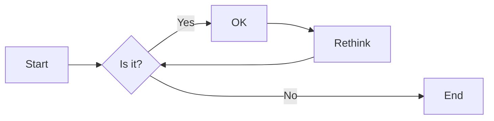
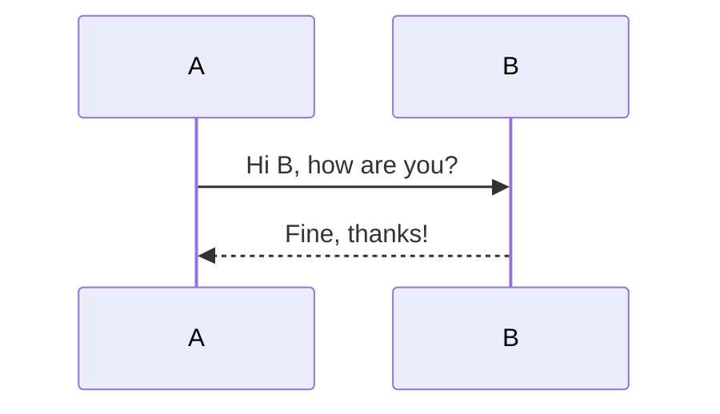
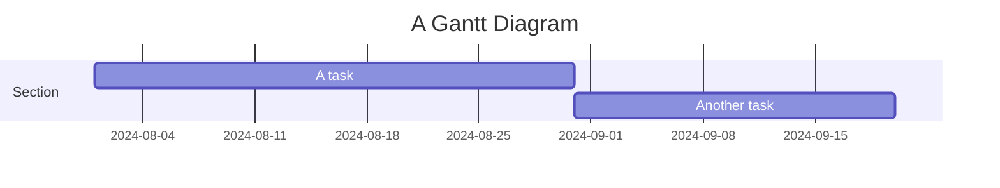
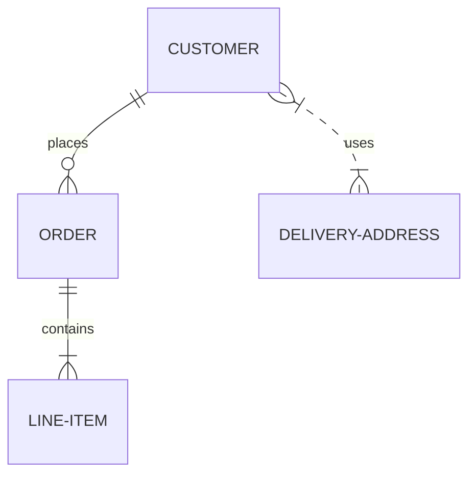
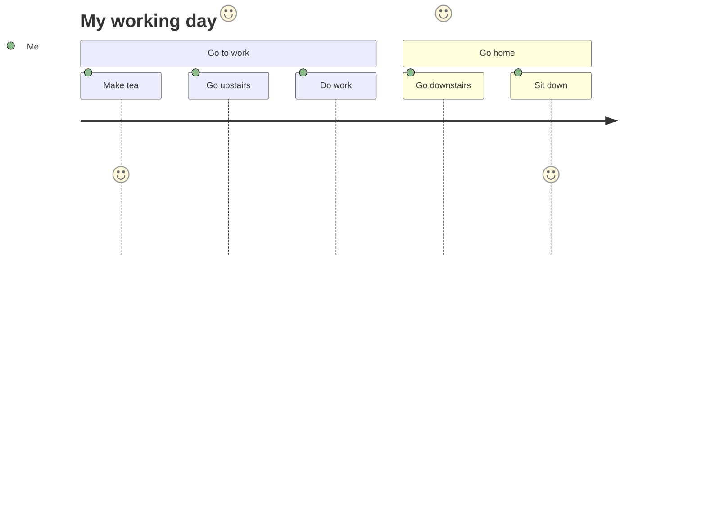

# Meermin.js toevoegen met htmx

<!--category-- HTMX, Markdown -->
<datetime class="hidden">2024-08-02T20:00</datetime>

## Inleiding

Mermaid is een eenvoudig diagramformaat dat tekst-gebaseerde invoer neemt en diagrammen genereert in SVG-formaat. Het is een geweldig hulpmiddel voor het maken van stroomschema's, volgordediagrammen, Gantt-diagrammen, en nog veel meer. In deze tutorial zullen we onderzoeken hoe Mermaid met htmx te gebruiken om interactieve diagrammen te maken die dynamisch bijwerken zonder pagina-herladen.
De Mermaid site is[Hier.](https://mermaid.js.org/)en heeft veel meer informatie dan ik hier kan geven.

[TOC]

## Markdown en Mermaid

Zeemeermin diagrammen kunnen worden opgenomen in uw markdown bestanden met behulp van de volgende syntax:

<pre>
# My Markdown Title

</pre>
Hiermee kunt u Mermaid-diagrammen direct opnemen in uw markdown-bestanden, die worden weergegeven als SVG-afbeeldingen wanneer het bestand wordt omgezet naar HTML.


U kunt ook zeemeermin diagrammen toe te voegen aan normale html-bestanden met behulp van de volgende syntax:

```html
<pre class="mermaid">
    graph TD
    A[Start] --> B[Look for movie]
    B --> C{Found?}
    C -->|Yes| D[Watch it]
    C -->|No| E[Look for another movie]
    D --> E
</pre>
```

### Voorbeelden van Mermaid-diagrammen

Mermaid is een krachtige tool waarmee u een breed scala aan diagrammen te bouwen met behulp van eenvoudige tekst-gebaseerde syntax.
Hier zijn enkele voorbeelden van de soorten diagrammen die u kunt maken met Mermaid:

- Pie charts:



-Flowcharts:
Flowcharts kunnen richting specificeren, bijvoorbeeld LR (van links naar rechts), RL (van rechts naar links), TB (van boven naar beneden), BT (van onder naar boven).



-Sequence diagrammen:



-Gantt grafieken:



-Entity relatie diagrammen:



-User reisschema's:



Zie deze pagina voor meer van de MYRIAD van diagrammen die je kunt maken met Mermaid[Hier.](https://mermaid.js.org/syntax/examples.html)

## Aan de slag met Mermaid en htmx

Eerst moet u de Mermaid-bibliotheek in uw HTML-bestand opnemen. U kunt dit doen door de volgende scripttag aan uw document toe te voegen:

```html
<script src="https://cdn.jsdelivr.net/npm/mermaid@10.9.1/dist/mermaid.min.js
"></script>
```

Volgende in je_Layout.cshtml-bestand dat u nodig hebt om de volgende script tag toe te voegen om Mermaid te initialiseren (u doet dit normaal gesproken onderaan het bestand)

```html
<script>
    document.addEventListener('DOMContentLoaded', function () {
        mermaid.initialize({ startOnLoad: true });
    });
    document.body.addEventListener('htmx:afterSwap', function(evt) {
        mermaid.run();
        
    });

</script>
```

Dit doet twee dingen:

1. Het initialiseert Mermaid wanneer de pagina wordt geladen; dus als je direct navigeert naar een pagina met een Mermaid diagram (bijv.[/blog/mermaidandhtmx](/blog/mermaidandhtmx)) zal het correct renderen.
2. Als u htmx gebruikt zoals in onze[vorige tutorial](/blog/htmxwithaspnetcore)het zal het Mermaid diagram opnieuw uitvoeren nadat de pagina is bijgewerkt (de htmx:afterswap event).