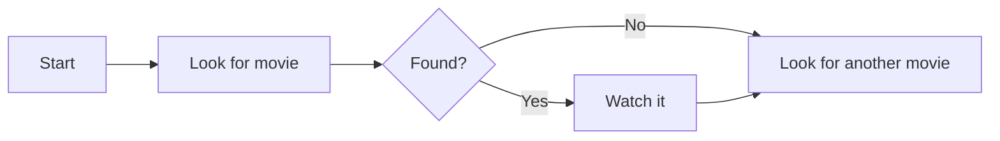
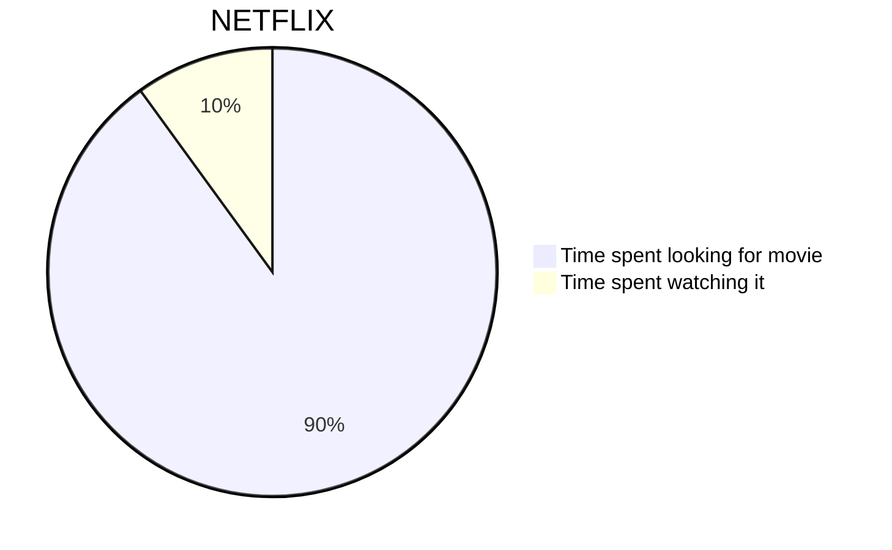
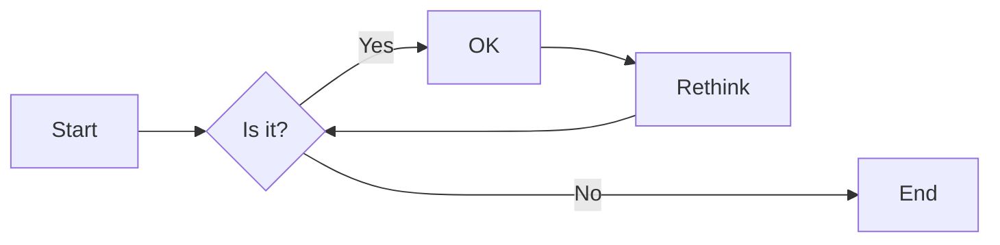
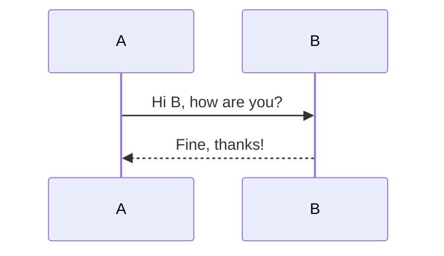
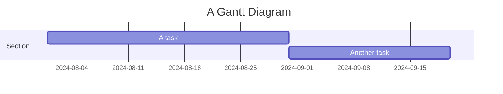
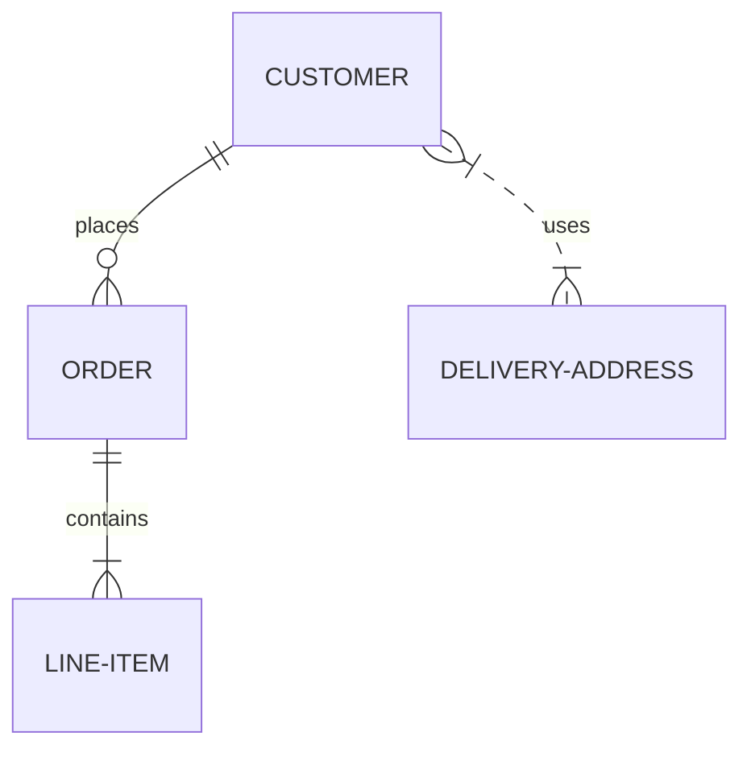
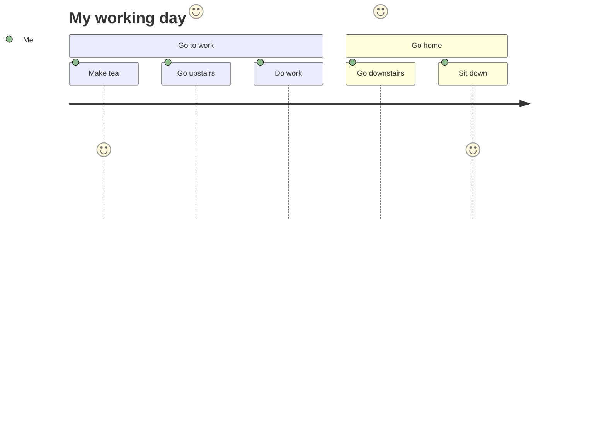

# Lägga till sjöjungfru.js med htmx

<!--category-- HTMX, Markdown -->
<datetime class="hidden">2024-08-02T20:00</datetime>

## Inledning

Mermaid är ett enkelt diagramformat som tar textbaserad inmatning och genererar diagram i SVG-format. Det är ett bra verktyg för att skapa flödesdiagram, sekvensdiagram, Gantt diagram och mycket mer. I denna handledning kommer vi att undersöka hur man använder Mermaid med htmx för att skapa interaktiva diagram som uppdaterar dynamiskt utan sidladdningar.
Mermaid webbplats är [här](https://mermaid.js.org/) och har mycket mer information än jag kan ge här.

[TOC]

## Markering och sjöjungfru

Mermaid diagram kan inkluderas i dina markdown filer genom att använda följande syntax:

<pre>
# My Markdown Title

</pre>
Detta gör att du kan inkludera Mermaid diagram direkt i dina markdown-filer, som kommer att återges som SVG bilder när filen konverteras till HTML.


Du kan också lägga till sjöjungfrudiagram till normala html-filer genom att använda följande syntax:

```html
<pre class="mermaid">
    graph TD
    A[Start] --> B[Look for movie]
    B --> C{Found?}
    C -->|Yes| D[Watch it]
    C -->|No| E[Look for another movie]
    D --> E
</pre>
```

### Exempel på sjöjungfrudiagram

Mermaid är ett kraftfullt verktyg som låter dig bygga ett brett utbud av diagram med enkel textbaserad syntax.
Här är några exempel på vilka typer av diagram du kan skapa med Mermaid:

- Pie diagram:



-Flowcharts:
Flödesscheman kan ange riktning, t.ex. LR (vänster till höger), RL (höger till vänster), TB (uppifrån och ned), BT (nedifrån och upp).



-Sekvensdiagram:



-Gantt diagram:



-Entitetsförhållande diagram:



-Användarfärddiagram:



...Se denna sida för mer av MYRIAD diagram som du kan skapa med Mermaid [här](https://mermaid.js.org/syntax/examples.html)

## Komma igång med Mermaid och htmx

Först måste du inkludera Mermaid-biblioteket i din HTML-fil. Du kan göra detta genom att lägga till följande skripttag i ditt dokument:

```html
<script src="https://cdn.jsdelivr.net/npm/mermaid@10.9.1/dist/mermaid.min.js
"></script>
```

Nästa i din _Layout.cshtml fil du behöver för att lägga till följande skript tagg för att initiera Mermaid (du gör normalt detta längst ner i filen)

```html
<script>
    document.addEventListener('DOMContentLoaded', function () {
        mermaid.initialize({ startOnLoad: true });
    });
    document.body.addEventListener('htmx:afterSwap', function(evt) {
        mermaid.run();
        
    });

</script>
```

Detta gör två saker.

1. Det initierar sjöjungfru när sidan laddas, så om du direkt navigerar till en sida med ett sjöjungfrudiagram (t.ex. [/blogg/medhjälpare ochhtmx](/blog/mermaidandhtmx) ) det kommer att göra korrekt.
2. Om du använder htmx som i vår [tidigare handledning](/blog/htmxwithaspnetcore) Det kommer att återrendera Mermaid diagram efter att sidan har uppdaterats (htmx: afterswap händelse).