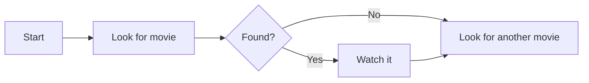
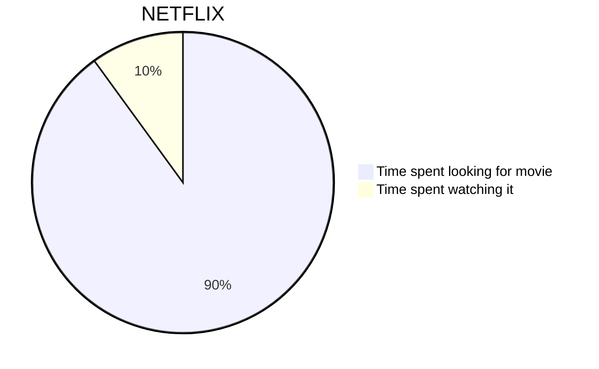
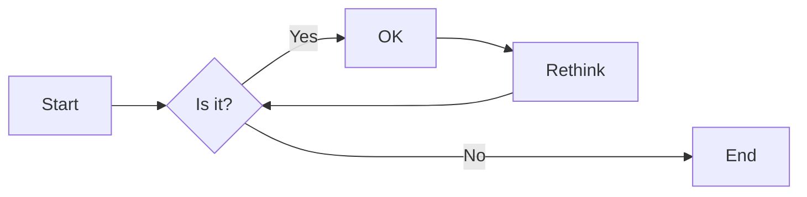
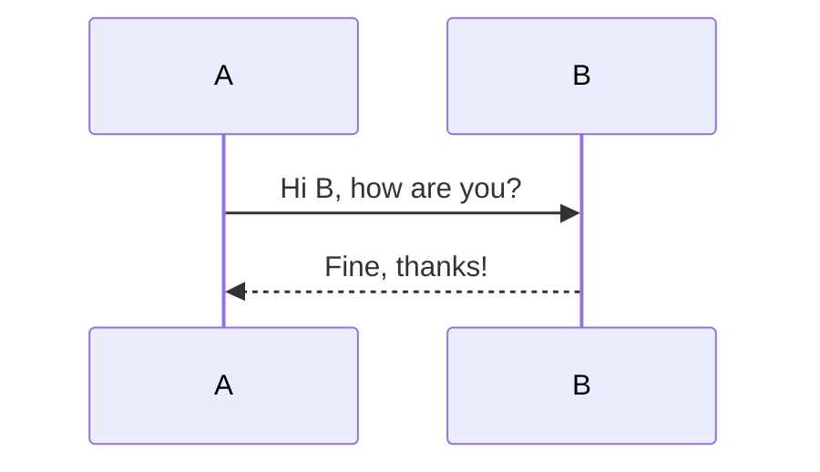
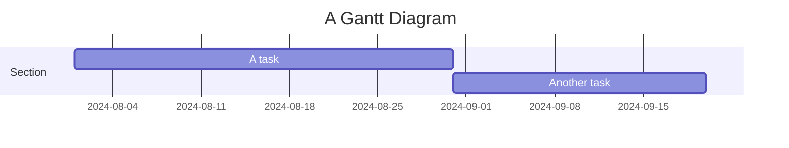
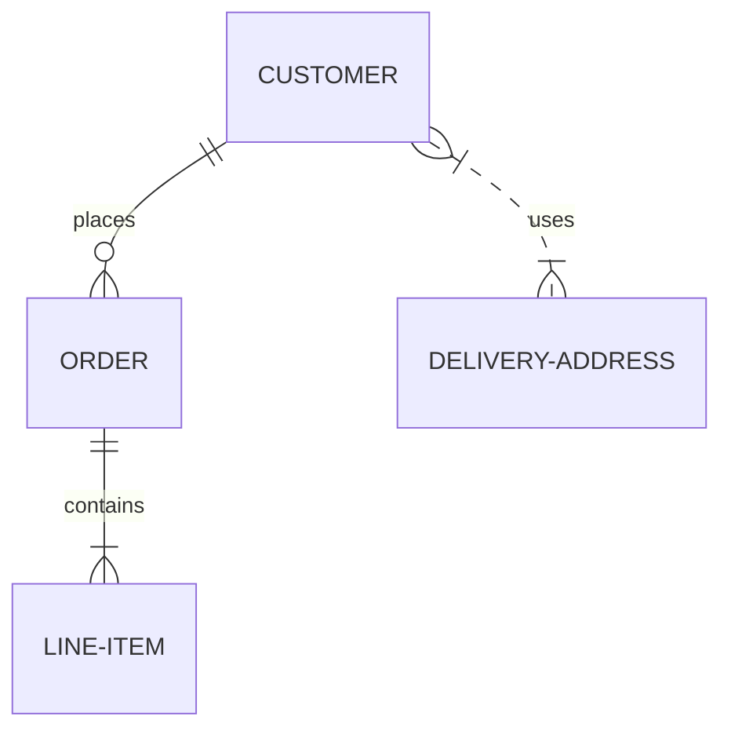
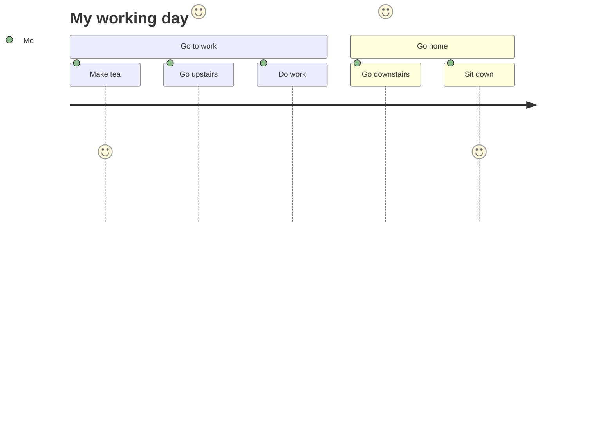

# Додавання mudrow.js з htmx

<!--category-- HTMX, Markdown -->
<datetime class="hidden">2024- 08- 02T20: 00</datetime>

## Вступ

Merowage - це простий формат діаграм, який отримує текстові вхідні дані і створює діаграми у форматі SVG. Це чудовий інструмент для створення блок-карт, послідовних діаграм, діаграм Ґанта тощо. У цьому підручнику ми дослідимо, як використовувати Mer покоївку з htmx для створення інтерактивних діаграм, які динамічно оновлюються без перезавантаження сторінок.
Место хозяйки. [тут](https://mermaid.js.org/) і має набагато більше інформації, ніж я можу надати тут.

[TOC]

## Markdown і Mer покоївка

Діаграми Mercow можна додавати до ваших файлів markdown за допомогою такого синтаксису:

<pre>
# My Markdown Title

</pre>
За допомогою цього пункту ви можете безпосередньо включати діаграми Mercanow у ваші файли markdown, які буде показано як зображення SVG, якщо файл буде перетворено на HTML.


Крім того, ви можете додати діаграми miroldie до звичайних файлів html за допомогою такого синтаксису:

```html
<pre class="mermaid">
    graph TD
    A[Start] --> B[Look for movie]
    B --> C{Found?}
    C -->|Yes| D[Watch it]
    C -->|No| E[Look for another movie]
    D --> E
</pre>
```

### Приклади діаграм " Мернір "

Мерміль - це потужний інструмент, який надає вам змогу побудувати широкий спектр діаграм, використовуючи простий текстовий синтаксис.
Ось декілька прикладів типів діаграм, які ви можете створити за допомогою Mer покоївки:

- Діаграми:



- Коробки:
Блок- схема може вказувати напрямок, наприклад. LR (ліворуч направо), RL (праворуч ліворуч), TB (внизу вниз), BT (внизу вгорі).



- Широкі діаграми:



- Діаграми:



- Схеми взаємозв' язків між Entity:



- Користувачі діаграми маршрутів:



тощо... на цій сторінці ви знайдете більше діаграм, які ви можете створити за допомогою Mer покоївки. [тут](https://mermaid.js.org/syntax/examples.html)

## Початок з Mer покоївки і htmx

Спочатку вам слід включити бібліотеку Mermany до вашого файла HTML. Ви можете зробити це додаванням наступної мітки скрипту до вашого документа:

```html
<script src="https://cdn.jsdelivr.net/npm/mermaid@10.9.1/dist/mermaid.min.js
"></script>
```

Наступний у вашій _Компонування. cshtml файл, вам слід додати наступний теґ скрипту для ініціалізації Mermald (ви, зазвичай, робите це у нижній частині файла)

```html
<script>
    document.addEventListener('DOMContentLoaded', function () {
        mermaid.initialize({ startOnLoad: true });
    });
    document.body.addEventListener('htmx:afterSwap', function(evt) {
        mermaid.run();
        
    });

</script>
```

Це робить дві речі:

1. Вона ініціалізує " Мерміль " під час завантаження сторінки; отже, якщо ви безпосередньо натрапите на сторінку з діаграмою Мерміль (наприклад, [/ blog/merbaldhtmx](/blog/mermaidandhtmx) ) вона буде правильно виражатися.
2. Якщо використовувати htmx як у нашому [Попередній підручник](/blog/htmxwithaspnetcore) після оновлення сторінки (подія htmx: afterswap).