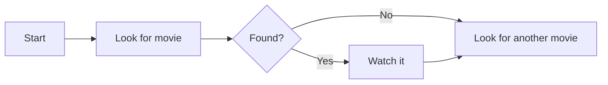
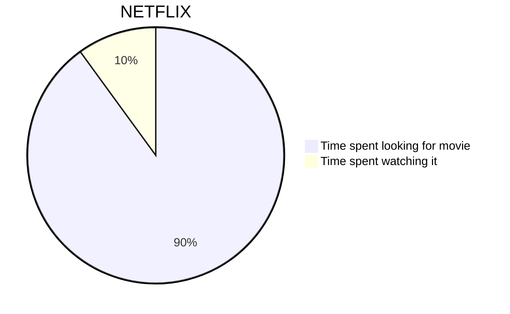
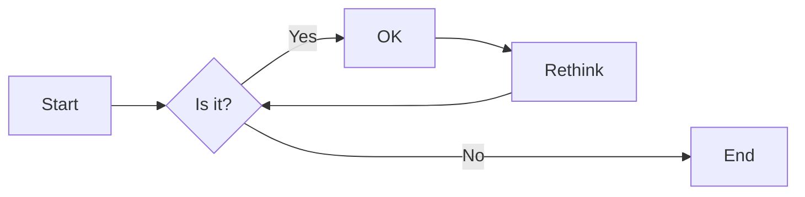
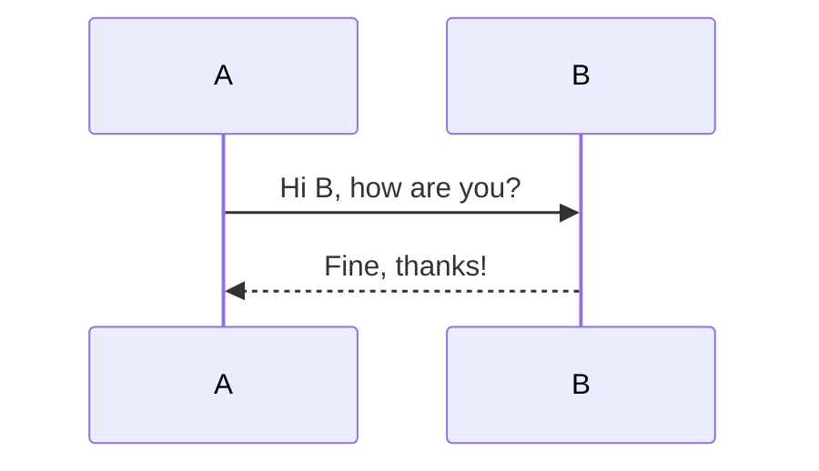
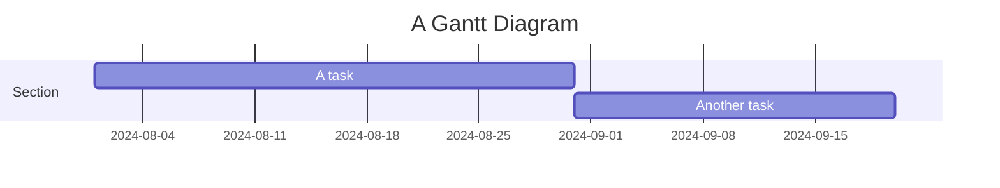
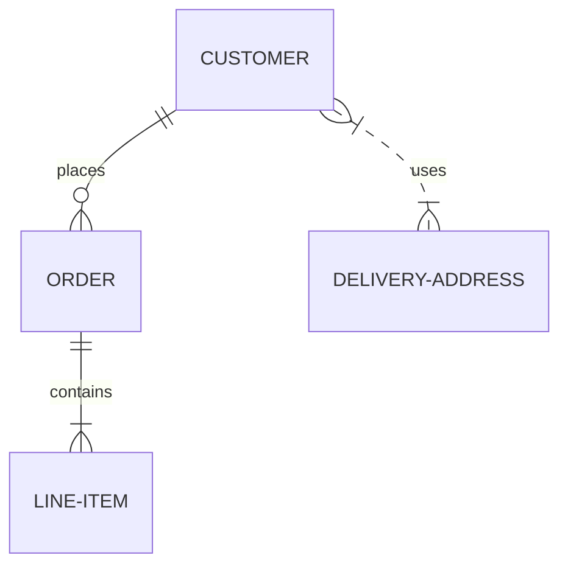
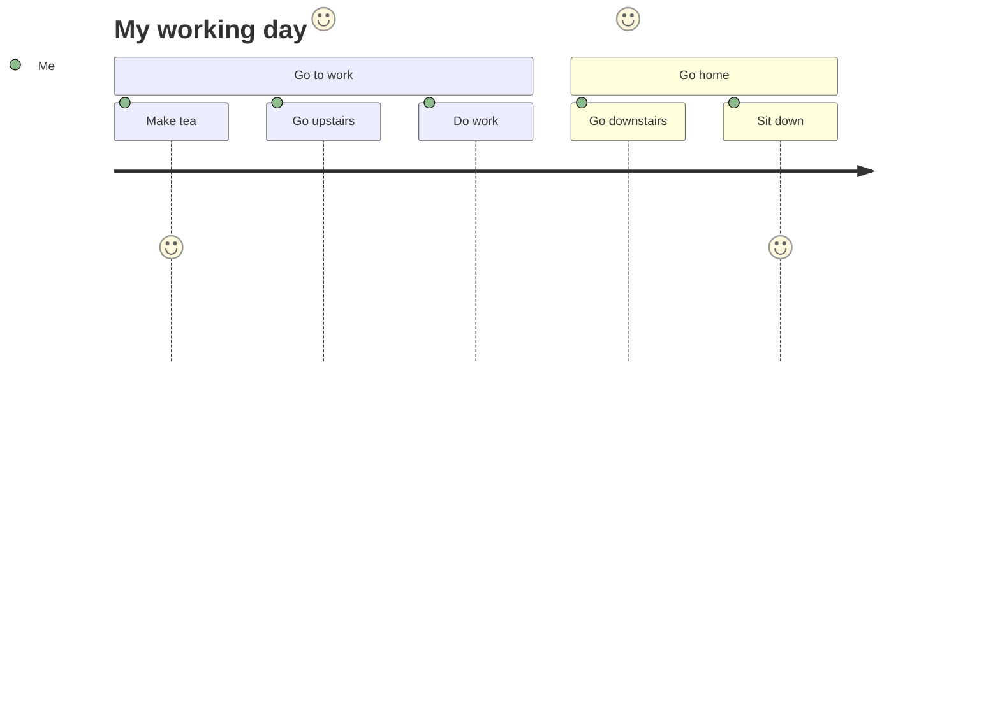

# 添加美人鱼。 js 与 htmx

<!--category-- HTMX, Markdown -->
<datetime class="hidden">2024-008-002T20:00</datetime>

## 一. 导言 导言 导言 导言 导言 导言 一,导言 导言 导言 导言 导言 导言

美人鱼是一种简单的图表格式,它采用基于文本的输入并以 SVG 格式生成图表。它是一个创建流程图、序列图、甘特图等等的极好工具。在这个教程中,我们将探索如何使用 htmx 的美人鱼来创建交互式图表,在没有重新加载页面的情况下动态更新。
美人鱼站是[在这里](https://mermaid.js.org/)并且拥有的信息远超过我在这里所能提供的信息。

[技选委

## Markdown和美人鱼

使用以下语法可以将美人鱼图表包含在您的标记减低文件中 :

<pre>
# My Markdown Title

</pre>
允许您直接将美人鱼图表包含在标记文件内, 当文件转换为 HTML 时, 它会以 SVG 图像的形式被显示为 SVG 图像 。


您也可以使用以下语法将美人鱼图添加到普通 html 文件中 :

```html
<pre class="mermaid">
    graph TD
    A[Start] --> B[Look for movie]
    B --> C{Found?}
    C -->|Yes| D[Watch it]
    C -->|No| E[Look for another movie]
    D --> E
</pre>
```

### 美人鱼图表实例

美人鱼是一种强大的工具 它可以让你用简单的基于文本的语法 建立各种各样的图表。
以下是一些与美人鱼一起绘制的图表类型的例子:

-皮图:



-花纹:
流程图可以指定方向,如LR(左向右)、RL(右向左)、TB(上至下)、BT(下至上)。



-序列图:



- 古特图表:



- 实体关系图:



-用户行程图:



等... 更多与美人鱼一起创建的MYRIAD图表, 请参看此页面 。[在这里](https://mermaid.js.org/syntax/examples.html)

## 开始与美人鱼和西人鱼

首先,您需要在 HTML 文件中包含美人鱼图书馆。 您可以在文档中添加以下脚本标记来做到这一点 :

```html
<script src="https://cdn.jsdelivr.net/npm/mermaid@10.9.1/dist/mermaid.min.js
"></script>
```

下一个在你的_布局. cshtml 文件 您需要添加以下脚本标记来初始化美人鱼( 您通常在文件底部这样做)

```html
<script>
    document.addEventListener('DOMContentLoaded', function () {
        mermaid.initialize({ startOnLoad: true });
    });
    document.body.addEventListener('htmx:afterSwap', function(evt) {
        mermaid.run();
        
    });

</script>
```

这样做有两件事:

1. 当页面加载时, 它会初始化美人鱼; 所以, 如果您直接用美人鱼图( 例如 : ) 导航到页面( 例如 : “ 美人鱼 ” ), 则它会初始化美人鱼 。[/博客/美美人,](/blog/mermaidandhtmx))它会正确表达。
2. 如果你使用 htmx 如在我们的[上一个前一个教程](/blog/htmxwithaspnetcore)它会在页面更新后( htmx:afterswap event) 重现美人鱼图 。