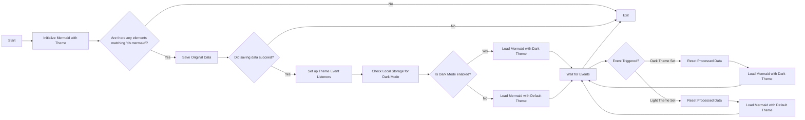

# موضوعات التبديل للحورية (مستكمل)

<!--category-- Mermaid, Markdown, Javascript -->
<datetime class="hidden">الساعة24/2024-00/02</datetime>

## أولاً

أستخدم حورية البحر لإنشاء الرسوم البيانية الرائعة التي ترونها في عدد قليل من الوظائف. مثل واحد تحت.
لكن الشيء الذي أزعجني هو أنه لم يكن رد فعل على تغيير المواضيع (الظلام والضوء) وبدا أن هناك معلومات ضعيفة جدا هناك عن تحقيق هذا.

هذه هي نتيجة بضع ساعات من الحفر ومحاولة لمعرفة كيفية القيام بذلك.

يمكنك أن تجد المصدر لـ هنا:
[مقدسر-(ج)](https://github.com/scottgal/mostlylucidweb/blob/main/Mostlylucid/src/js/mdeswitch.js).

**<span style="color:green"> ملاحظة: لقد استكملت هذا التقرير بشكل كبير.</span>**

[رابعاً -

## الـ



## المشكلة

القضية هي أنك تحتاج إلى بدء حورية البحر لوضع الموضوع، ولا يمكنك تغييره بعد ذلك. على أي حال إذا كنت تريد إعادة توضيحه على رسم بياني مُنشأ بالفعل، فإنه لا يستطيع إعادة صياغة الرسم التخطيطي كما أن البيانات ليست مخزنة في DOM.

## الإحلال

لذا بعد الكثير من الحفر والمحاولة لمعرفة كيفية القيام بذلك، وجدت حلاً في [هذا مُنتج المُنتمِج](https://github.com/mermaid-js/mermaid/issues/1945)

ومع ذلك لا تزال لديها بعض المسائل، لذلك كان علي أن أغيرها قليلاً لأجعلها تعمل.

### 

هذا الموقع مبني على موضوع "تايلويند" الذي جاء مع محول موضوع فظيع جداً

سترى أن هذا يقوم بالعديد من الأشياء حول تبديل السمة، وضع السمة لما يتم تخزينه في التخزين المحلي، تغيير زوجين من مسودات الموضة لبسط mde و تسليط الضوء. js ومن ثم تطبيق السمة.

```javascript
export  function globalSetup() {
    const lightStylesheet = document.getElementById('light-mode');
    const darkStylesheet = document.getElementById('dark-mode');
    const simpleMdeDarkStylesheet = document.getElementById('simplemde-dark');
    const simpleMdeLightStylesheet = document.getElementById('simplemde-light');
    return {
        isMobileMenuOpen: false,
        isDarkMode: false,
        // Function to initialize the theme based on localStorage or system preference
        themeInit() {
            if (
                localStorage.theme === "dark" ||
                (!("theme" in localStorage) &&
                    window.matchMedia("(prefers-color-scheme: dark)").matches)
            ) {
                localStorage.theme = "dark";
                document.documentElement.classList.add("dark");
                document.documentElement.classList.remove("light");
                this.isDarkMode = true;
              
                this.applyTheme(); // Apply dark theme stylesheets
            } else {
                localStorage.theme = "base";
                document.documentElement.classList.remove("dark");
                document.documentElement.classList.add("light");
                this.isDarkMode = false;
                this.applyTheme(); // Apply light theme stylesheets
            }
        },

        // Function to switch the theme and update the stylesheets accordingly
        themeSwitch() {
            if (localStorage.theme === "dark") {
                localStorage.theme = "light";
                document.body.dispatchEvent(new CustomEvent('light-theme-set'));
                document.documentElement.classList.remove("dark");
                document.documentElement.classList.add("light");
                this.isDarkMode = false;
            } else {
                localStorage.theme = "dark";
                document.body.dispatchEvent(new CustomEvent('dark-theme-set'));
                document.documentElement.classList.add("dark");
                document.documentElement.classList.remove("light");
                this.isDarkMode = true;
            }
            this.applyTheme(); // Apply the theme stylesheets after switching
        },

        // Function to apply the appropriate stylesheets based on isDarkMode
        applyTheme() {
         
            if (this.isDarkMode) {
                // Enable dark mode stylesheets
                lightStylesheet.disabled = true;
                darkStylesheet.disabled = false;
                simpleMdeLightStylesheet.disabled = true;
                simpleMdeDarkStylesheet.disabled = false;
            } else {
                // Enable light mode stylesheets
                lightStylesheet.disabled = false;
                darkStylesheet.disabled = true;
                simpleMdeLightStylesheet.disabled = false;
                simpleMdeDarkStylesheet.disabled = true;
            }
        }
    };
}
```

## إنشاء

وفيما يلي الإضافات الرئيسية لمحول الحوريات:

```javascript
  document.body.dispatchEvent(new CustomEvent('dark-theme-set'));
    document.body.dispatchEvent(new CustomEvent('light-theme-set'));
```

هذان الحدثان يستخدمان في عنصر مقايضة السمة الخاص بنا لإعادة تنصيب رسومات حورية البحر.

### علىLoad / htmx: بعد Swap

(ب) في `main.js` أُعِدّ مُدَوِّل الموضوع. استوردت ايضاً `mdeswitch` الملف الذي يحتوي على رمز التبديل.

```javascript
//Important: Memraid will ALWAYS intialize on window.onload, so we need to make sure we disable this behaviour:
import mermaid from "mermaid";

window.mermaid=mermaid;
mermaid.initialize({startOnLoad:false});

window.mermaidinit = function() {
    mermaid.initialize({ startOnLoad: false });
    try {
        window.initMermaid().then(r => console.log('Mermaid initialized'));
    } catch (e) {
        console.error('Failed to initialize Mermaid:', e);
    }

}

document.body.addEventListener('htmx:afterSwap', function(evt) {
    mermaidinit();
    //This should be called after the mermaid diagrams have been rendered.
    hljs.highlightAll();
});

window.onload = function(ev) {
    if(document.readyState === 'complete') {
        mermaidinit();
        hljs.highlightAll();
    }
};
```

## مُعمَّمْتich

هذا هو ملفّ يحتوي رمز لـ تغيير لـ حورية.
(الفظ [رسم الرسوم الرسوم](#the-diagram) عرض متتالي الأحداث التي تحدث عندما يُبدّل الموضوع)

```javascript
(function(window) {
    'use strict';

    const elementCode = 'div.mermaid';

    const loadMermaid = async (theme) => {

        mermaid.initialize({startOnLoad: false, theme: theme });
        console.log("Loading mermaid with theme:", theme);
        await mermaid.run({
            querySelector: elementCode,
        });
    };

    const saveOriginalData = async () => {
        try {
            console.log("Saving original data");
            const elements = document.querySelectorAll(elementCode);
            const count = elements.length;

            if (count === 0) return;

            const promises = Array.from(elements).map((element) => {
                if (element.getAttribute('data-processed') != null) {
                    console.log("Element already processed");
                    return;
                }
                element.setAttribute('data-original-code', element.innerHTML);
            });

            await Promise.all(promises);
        } catch (error) {
            console.error(error);
            throw error;
        }
    };

    const resetProcessed = async () => {
        try {
            console.log("Resetting processed data");
            const elements = document.querySelectorAll(elementCode);
            const count = elements.length;

            if (count === 0) return;

            const promises = Array.from(elements).map((element) => {
                if (element.getAttribute('data-original-code') != null) {
                    element.removeAttribute('data-processed');
                    element.innerHTML = element.getAttribute('data-original-code');
                }
                else {
                    console.log("Element already reset");
                }
            });

            await Promise.all(promises);
        } catch (error) {
            console.error(error);
            throw error;
        }
    };

    window.initMermaid = async () => {
        const mermaidElements = document.querySelectorAll(elementCode);
        if (mermaidElements.length === 0) return;

        try {
            await saveOriginalData();
        } catch (error) {
            console.error("Error saving original data:", error);
            return; // Early exit if saveOriginalData fails
        }

        const handleDarkThemeSet = async () => {
            try {
                await resetProcessed();
                await loadMermaid('dark');
                console.log("Dark theme set");
            } catch (error) {
                console.error("Error during dark theme set:", error);
            }
        };

        const handleLightThemeSet = async () => {
            try {
                await resetProcessed();
                await loadMermaid('default');
                console.log("Light theme set");
            } catch (error) {
                console.error("Error during light theme set:", error);
            }
        };
        document.body.removeEventListener('dark-theme-set', handleDarkThemeSet);
        document.body.removeEventListener('light-theme-set', handleLightThemeSet);
        document.body.addEventListener('dark-theme-set', handleDarkThemeSet);
        document.body.addEventListener('light-theme-set', handleLightThemeSet);

        const isDarkMode = localStorage.theme === 'dark';
        await loadMermaid(isDarkMode ? 'dark' : 'default').then(r => console.log('Initial load complete'));


    };

})(window);
```

من الأسفل إلى الأعلى هنا.

1. `init` الدالة هي الدالة الرئيسية التي تُدعى عند تحميل الصفحة.

أولاً يحفظ المحتوى الأصلي لمخططات حورية البحر، هذه كانت قضية في النسخة التي نسختها منها، استخدموا 'innerHTML' التي لم تعمل بالنسبة لي كبعض الرسوم البيانية تعتمد على خطوط جديدة التي تقوم بالتجزئة.

ومن ثم تضيف مستمعين لحدثين من أجل `dark-theme-set` وقد عقد مؤتمراً بشأن `light-theme-set` أحداث أحداث أحداث. وعندما تُطلق هذه الأحداث فإنها تعيد ضبط البيانات المجهزة ثم تعيد تأطير رسومات حورية البحر مع الموضوع الجديد.

ثم تقوم بعد ذلك بفحص التخزين المحلي للموضوع وتبدأ رسوم الحوريات مع الموضوع المناسب.

```javascript
let isDarkMode = localStorage.theme === 'dark';
        if(isDarkMode) {
            loadMermaid('dark');
         }
         else{
             loadMermaid('default')
         }
```

### 

مفتاح هذا الشيء كله هو تخزين ثم استعادة المحتوى الموجود في `<div class="mermaid"><div>` التي تحتوي على علامة حورية البحر من مواقعنا

سترى أن هذا فقط يرتب وعداً يقوم بالدورات من خلال كل العناصر ويخزن المحتوى الأصلي في `data-original-code` ........... ،..............................................................................................................

```javascript
    const saveOriginalData = async () => {
    try {
        console.log("Saving original data");
        const elements = document.querySelectorAll(elementCode);
        const count = elements.length;

        if (count === 0) return;

        const promises = Array.from(elements).map((element) => {
            if (element.getAttribute('data-processed') != null) {
                console.log("Element already processed");
                return;
            }
            element.setAttribute('data-original-code', element.innerHTML);
        });

        await Promise.all(promises);
    } catch (error) {
        console.error(error);
        throw error;
    }
};
```

`resetProcessed` هو نفسه باستثناء العكس العكسي حيث يأخذ الرفعة من `data-original-code` اضف وارجعها الى العنصر

### بوصة بوصةitt

الآن لدينا كل هذه البيانات التي يمكننا إعادة تأريخها للحورية لتطبيق موضوعنا الجديد وإعادة إدخال مخطط SVG في مخرجاتنا HTML.

```javascript
    const elementCode = 'div.mermaid';

const loadMermaid = async (theme) => {

    mermaid.initialize({startOnLoad: false, theme: theme });
    console.log("Loading mermaid with theme:", theme);
    await mermaid.run({
        querySelector: elementCode,
    });
};
```

## في الإستنتاج

كان هذا قليلا من الألم لمعرفة ذلك، ولكن أنا سعيد لأنني فعلت. آمل أن يساعد هذا شخصاً آخر هناك يحاول أن يفعل نفس الشيء