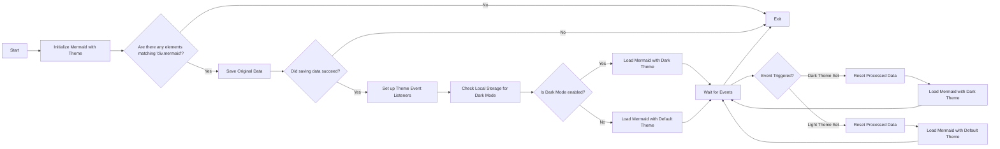

# Wechseln von Themes für Meerjungfrau (aktualisiert)

<!--category-- Mermaid, Markdown, Javascript -->
<datetime class="hidden">2024-08-29T05:00</datetime>

## Einleitung

Ich benutze Mermaid.js, um die Dope-Diagramme zu erstellen, die Sie in ein paar Beiträgen sehen. Wie die unten.
Aber etwas, das mich ärgerte, ist, dass es nicht reaktiv war, Themen zu wechseln (Dunkel/Licht) und es schien sehr schlechte Informationen da draußen zu geben, um dies zu erreichen.

Dies ist das Ergebnis von ein paar Stunden zu graben und zu versuchen, herauszufinden, wie dies zu tun.

Die Quelle für mdeswitcher finden Sie hier:
[mdeswitcher.js](https://github.com/scottgal/mostlylucidweb/blob/main/Mostlylucid/src/js/mdeswitch.js).

**<span style="color:green"> HINWEIS: Ich habe dies wesentlich aktualisiert.</span>**

[TOC]

## Das Diagramm



## Das Problem

Das Problem ist, dass Sie Mermaid initialisieren müssen, um das Thema zu setzen, und Sie können es danach nicht ändern. WIE auch immer, wenn Sie es auf einem bereits erstellten Diagramm wieder initialisieren wollen; es kann das Diagramm nicht wiederholen, da die Daten nicht im DOM gespeichert sind.

## Die Lösung

Also, nachdem MUCH graben und versuchen, herauszufinden, wie dies zu tun, fand ich eine Lösung in [diese GitHub Ausgabe post](https://github.com/mermaid-js/mermaid/issues/1945)

Allerdings hatte es noch ein paar Probleme, so dass ich es ein wenig ändern musste, um es an die Arbeit zu bekommen.

### Themen

Diese Website basiert auf einem Tailwind-Thema, das mit einem ziemlich schrecklichen Thema Switcher kam.

Sie werden sehen, dass dies verschiedene Sachen um das Thema zu wechseln, die Einstellung des Themas für das, was im lokalen Speicher gespeichert ist, ändern ein paar Stylesheers für simplemde & highlight.js und dann die Anwendung des Themas.

```javascript
export  function globalSetup() {
    const lightStylesheet = document.getElementById('light-mode');
    const darkStylesheet = document.getElementById('dark-mode');
    const simpleMdeDarkStylesheet = document.getElementById('simplemde-dark');
    const simpleMdeLightStylesheet = document.getElementById('simplemde-light');
    return {
        isMobileMenuOpen: false,
        isDarkMode: false,
        // Function to initialize the theme based on localStorage or system preference
        themeInit() {
            if (
                localStorage.theme === "dark" ||
                (!("theme" in localStorage) &&
                    window.matchMedia("(prefers-color-scheme: dark)").matches)
            ) {
                localStorage.theme = "dark";
                document.documentElement.classList.add("dark");
                document.documentElement.classList.remove("light");
                this.isDarkMode = true;
              
                this.applyTheme(); // Apply dark theme stylesheets
            } else {
                localStorage.theme = "base";
                document.documentElement.classList.remove("dark");
                document.documentElement.classList.add("light");
                this.isDarkMode = false;
                this.applyTheme(); // Apply light theme stylesheets
            }
        },

        // Function to switch the theme and update the stylesheets accordingly
        themeSwitch() {
            if (localStorage.theme === "dark") {
                localStorage.theme = "light";
                document.body.dispatchEvent(new CustomEvent('light-theme-set'));
                document.documentElement.classList.remove("dark");
                document.documentElement.classList.add("light");
                this.isDarkMode = false;
            } else {
                localStorage.theme = "dark";
                document.body.dispatchEvent(new CustomEvent('dark-theme-set'));
                document.documentElement.classList.add("dark");
                document.documentElement.classList.remove("light");
                this.isDarkMode = true;
            }
            this.applyTheme(); // Apply the theme stylesheets after switching
        },

        // Function to apply the appropriate stylesheets based on isDarkMode
        applyTheme() {
         
            if (this.isDarkMode) {
                // Enable dark mode stylesheets
                lightStylesheet.disabled = true;
                darkStylesheet.disabled = false;
                simpleMdeLightStylesheet.disabled = true;
                simpleMdeDarkStylesheet.disabled = false;
            } else {
                // Enable light mode stylesheets
                lightStylesheet.disabled = false;
                darkStylesheet.disabled = true;
                simpleMdeLightStylesheet.disabled = false;
                simpleMdeDarkStylesheet.disabled = true;
            }
        }
    };
}
```

## Einrichtung

Die wichtigsten Ergänzungen für die Mermaid Thema-Switcher sind die folgenden:

```javascript
  document.body.dispatchEvent(new CustomEvent('dark-theme-set'));
    document.body.dispatchEvent(new CustomEvent('light-theme-set'));
```

Diese beiden Ereignisse werden in unserer ThemeSwitcher-Komponente verwendet, um die Mermaid-Diagramme neu zu initialisieren.

### OnLoad / htmx:afterSwap

In meinem `main.js` Datei Ich habe den Themen-Schalter eingerichtet. Ich importiere auch die `mdeswitch` Datei, die den Code für das Umschalten von Themen enthält.

```javascript
//Important: Memraid will ALWAYS intialize on window.onload, so we need to make sure we disable this behaviour:
import mermaid from "mermaid";

window.mermaid=mermaid;
mermaid.initialize({startOnLoad:false});

window.mermaidinit = function() {
    mermaid.initialize({ startOnLoad: false });
    try {
        window.initMermaid().then(r => console.log('Mermaid initialized'));
    } catch (e) {
        console.error('Failed to initialize Mermaid:', e);
    }

}

document.body.addEventListener('htmx:afterSwap', function(evt) {
    mermaidinit();
    //This should be called after the mermaid diagrams have been rendered.
    hljs.highlightAll();
});

window.onload = function(ev) {
    if(document.readyState === 'complete') {
        mermaidinit();
        hljs.highlightAll();
    }
};
```

## MDESwtich

Dies ist die Datei, die den Code für das Umschalten der Themen für Mermaid enthält.
(Das schreckliche [Abbildung oben](#the-diagram) zeigt die Reihenfolge der Ereignisse, die passieren, wenn das Thema gewechselt wird)

```javascript
(function(window) {
    'use strict';

    const elementCode = 'div.mermaid';

    const loadMermaid = async (theme) => {

        mermaid.initialize({startOnLoad: false, theme: theme });
        console.log("Loading mermaid with theme:", theme);
        await mermaid.run({
            querySelector: elementCode,
        });
    };

    const saveOriginalData = async () => {
        try {
            console.log("Saving original data");
            const elements = document.querySelectorAll(elementCode);
            const count = elements.length;

            if (count === 0) return;

            const promises = Array.from(elements).map((element) => {
                if (element.getAttribute('data-processed') != null) {
                    console.log("Element already processed");
                    return;
                }
                element.setAttribute('data-original-code', element.innerHTML);
            });

            await Promise.all(promises);
        } catch (error) {
            console.error(error);
            throw error;
        }
    };

    const resetProcessed = async () => {
        try {
            console.log("Resetting processed data");
            const elements = document.querySelectorAll(elementCode);
            const count = elements.length;

            if (count === 0) return;

            const promises = Array.from(elements).map((element) => {
                if (element.getAttribute('data-original-code') != null) {
                    element.removeAttribute('data-processed');
                    element.innerHTML = element.getAttribute('data-original-code');
                }
                else {
                    console.log("Element already reset");
                }
            });

            await Promise.all(promises);
        } catch (error) {
            console.error(error);
            throw error;
        }
    };

    window.initMermaid = async () => {
        const mermaidElements = document.querySelectorAll(elementCode);
        if (mermaidElements.length === 0) return;

        try {
            await saveOriginalData();
        } catch (error) {
            console.error("Error saving original data:", error);
            return; // Early exit if saveOriginalData fails
        }

        const handleDarkThemeSet = async () => {
            try {
                await resetProcessed();
                await loadMermaid('dark');
                console.log("Dark theme set");
            } catch (error) {
                console.error("Error during dark theme set:", error);
            }
        };

        const handleLightThemeSet = async () => {
            try {
                await resetProcessed();
                await loadMermaid('default');
                console.log("Light theme set");
            } catch (error) {
                console.error("Error during light theme set:", error);
            }
        };
        document.body.removeEventListener('dark-theme-set', handleDarkThemeSet);
        document.body.removeEventListener('light-theme-set', handleLightThemeSet);
        document.body.addEventListener('dark-theme-set', handleDarkThemeSet);
        document.body.addEventListener('light-theme-set', handleLightThemeSet);

        const isDarkMode = localStorage.theme === 'dark';
        await loadMermaid(isDarkMode ? 'dark' : 'default').then(r => console.log('Initial load complete'));


    };

})(window);
```

Hier geht es irgendwie nach unten.

1. `init` - Funktion ist die Hauptfunktion, die beim Laden der Seite aufgerufen wird.

Es speichert zunächst den ursprünglichen Inhalt der Mermaid-Diagramme; dies war ein Problem in der Version, von der ich es kopierte, sie verwendeten 'innereHTML', die für mich nicht funktionierte, da einige Diagramme auf neue Linien, die Streifen verlassen.

Es fügt dann zwei Event-Hörer für die `dark-theme-set` und `light-theme-set` Veranstaltungen. Wenn diese Ereignisse abgefeuert werden, werden die verarbeiteten Daten zurückgesetzt und dann die Mermaid-Diagramme mit dem neuen Thema neu initialisiert.

Es überprüft dann den lokalen Speicher für das Thema und initialisiert die Mermaid Diagramme mit dem entsprechenden Thema.

```javascript
let isDarkMode = localStorage.theme === 'dark';
        if(isDarkMode) {
            loadMermaid('dark');
         }
         else{
             loadMermaid('default')
         }
```

### Originaldaten speichern

Der Schlüssel zu dieser ganzen Sache ist die Speicherung dann die Wiederherstellung des Inhalts in der gerenderten enthalten `<div class="mermaid"><div>` die die Meerjungfrau Markup von unseren Pfosten enthalten.

Sie werden sehen, dass dies nur ein Versprechen, das Schleifen durch alle Elemente und speichert den ursprünglichen Inhalt in einem `data-original-code` Attribut.

```javascript
    const saveOriginalData = async () => {
    try {
        console.log("Saving original data");
        const elements = document.querySelectorAll(elementCode);
        const count = elements.length;

        if (count === 0) return;

        const promises = Array.from(elements).map((element) => {
            if (element.getAttribute('data-processed') != null) {
                console.log("Element already processed");
                return;
            }
            element.setAttribute('data-original-code', element.innerHTML);
        });

        await Promise.all(promises);
    } catch (error) {
        console.error(error);
        throw error;
    }
};
```

`resetProcessed` ist die gleiche, außer in umgekehrt, wo es nimmt die Markup von der `data-original-code` Attribut und setzt es auf das Element zurück.

### Init

Jetzt haben wir alle diese Daten, die wir wieder initialisieren mermaid, um unser neues Thema und rerender das SVG-Diagramm in unsere HTML-Ausgabe.

```javascript
    const elementCode = 'div.mermaid';

const loadMermaid = async (theme) => {

    mermaid.initialize({startOnLoad: false, theme: theme });
    console.log("Loading mermaid with theme:", theme);
    await mermaid.run({
        querySelector: elementCode,
    });
};
```

## Schlussfolgerung

Das war ein bisschen nervig, aber ich bin froh, dass ich es getan habe. Ich hoffe, das hilft jemandem, der versucht, das Gleiche zu tun.