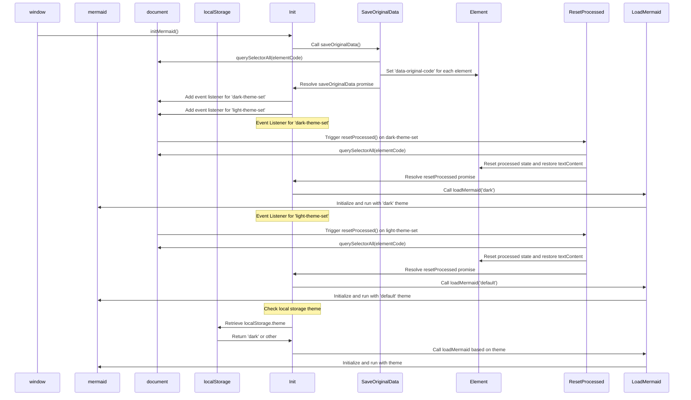

# Αλλαγή θεμάτων για τη Γοργόνα

<!--category-- Mermaid, Markdown, Javascript -->
<datetime class="hidden">2024-08-26T20:36</datetime>

## Εισαγωγή

Χρησιμοποιώ το Mermaid.js για να δημιουργήσω τα διαγράμματα ναρκωτικών που βλέπετε σε μερικές θέσεις. Σαν αυτό από κάτω.
Ωστόσο, κάτι που με ενόχλησε είναι ότι δεν ήταν αντιδραστικό στην αλλαγή θεμάτων (σκοτεινό / φως) και φαινόταν να υπάρχουν πολύ ανεπαρκείς πληροφορίες εκεί έξω για την επίτευξη αυτού.

Αυτό είναι το αποτέλεσμα μερικών ωρών σκάψιμο και προσπαθεί να καταλάβει πώς να το κάνει αυτό.

[TOC]

## Το Διάγραμμα



## Το Πρόβλημα

Το θέμα είναι ότι πρέπει να αρχικοποιήσεις την Γοργόνα για να βάλεις το θέμα, και δεν μπορείς να το αλλάξεις μετά από αυτό. ΠΩΣ αν θέλετε να το επανεκκινήσετε σε ένα ήδη δημιουργημένο διάγραμμα; δεν μπορεί να ξανακάνει το διάγραμμα καθώς τα δεδομένα δεν αποθηκεύονται στο DOM.

## Η Λύση

Έτσι, μετά το σκάψιμο πολλών και προσπαθώντας να βρω πώς να το κάνω αυτό, βρήκα μια λύση σε [αυτό το άρθρο έκδοσης GitHub](https://github.com/mermaid-js/mermaid/issues/1945)

Ωστόσο, είχε ακόμη μερικά ζητήματα, έτσι έπρεπε να το τροποποιήσω λίγο για να το κάνω να λειτουργήσει.

### Θέματα

Αυτή η ιστοσελίδα βασίζεται σε ένα θέμα Tailwind που ήρθε με ένα αρκετά τρομερό διακόπτη θέμα.

Θα δείτε ότι αυτό είναι κάνει διάφορα πράγματα γύρω από την αλλαγή του θέματος, που το θέμα για ό, τι είναι αποθηκευμένο στην τοπική αποθήκευση, αλλάζοντας ένα ζευγάρι stylesheers για simplemde & highlight.js και στη συνέχεια την εφαρμογή του θέματος.

```javascript
export  function globalSetup() {
    const lightStylesheet = document.getElementById('light-mode');
    const darkStylesheet = document.getElementById('dark-mode');
    const simpleMdeDarkStylesheet = document.getElementById('simplemde-dark');
    const simpleMdeLightStylesheet = document.getElementById('simplemde-light');
    return {
        isMobileMenuOpen: false,
        isDarkMode: false,
        // Function to initialize the theme based on localStorage or system preference
        themeInit() {
            if (
                localStorage.theme === "dark" ||
                (!("theme" in localStorage) &&
                    window.matchMedia("(prefers-color-scheme: dark)").matches)
            ) {
                localStorage.theme = "dark";
                document.documentElement.classList.add("dark");
                document.documentElement.classList.remove("light");
                this.isDarkMode = true;
              
                this.applyTheme(); // Apply dark theme stylesheets
            } else {
                localStorage.theme = "base";
                document.documentElement.classList.remove("dark");
                document.documentElement.classList.add("light");
                this.isDarkMode = false;
                this.applyTheme(); // Apply light theme stylesheets
            }
        },

        // Function to switch the theme and update the stylesheets accordingly
        themeSwitch() {
            if (localStorage.theme === "dark") {
                localStorage.theme = "light";
                document.body.dispatchEvent(new CustomEvent('light-theme-set'));
                document.documentElement.classList.remove("dark");
                document.documentElement.classList.add("light");
                this.isDarkMode = false;
            } else {
                localStorage.theme = "dark";
                document.body.dispatchEvent(new CustomEvent('dark-theme-set'));
                document.documentElement.classList.add("dark");
                document.documentElement.classList.remove("light");
                this.isDarkMode = true;
            }
            this.applyTheme(); // Apply the theme stylesheets after switching
        },

        // Function to apply the appropriate stylesheets based on isDarkMode
        applyTheme() {
         
            if (this.isDarkMode) {
                // Enable dark mode stylesheets
                lightStylesheet.disabled = true;
                darkStylesheet.disabled = false;
                simpleMdeLightStylesheet.disabled = true;
                simpleMdeDarkStylesheet.disabled = false;
            } else {
                // Enable light mode stylesheets
                lightStylesheet.disabled = false;
                darkStylesheet.disabled = true;
                simpleMdeLightStylesheet.disabled = false;
                simpleMdeDarkStylesheet.disabled = true;
            }
        }
    };
}
```

## Ρύθμιση

Οι κύριες προσθήκες για τον διακόπτη θέματος της Γοργόνας είναι οι εξής:

```javascript
  document.body.dispatchEvent(new CustomEvent('dark-theme-set'));
    document.body.dispatchEvent(new CustomEvent('light-theme-set'));
```

Αυτά τα δύο γεγονότα χρησιμοποιούνται στο εξάρτημα μας ThemeSwitcher για να επανεκκινήσουν τα διαγράμματα Γοργόνας.

### OnLoad / htmx:afterSwap

Στο............................................................................................................................................................................................................................................................................................................................................................................................................................................................................................................................. `main.js` Αρχείο που ρύθμισα τον διακόπτη θέματος. Εισάγω επίσης το `mdeswitch` αρχείο που περιέχει τον κωδικό για την αλλαγή θεμάτων.

```javascript
import "./mdeswitch";
addEventListener("DOMContentLoaded", () => {
    window.initMermaid();
});
addEventListener('htmx:afterSwap', function(evt) {
    window.initMermaid();
});
```

## MDESwtich

Αυτό είναι το αρχείο που περιέχει τον κωδικό για την αλλαγή των θεμάτων για την Γοργόνα.
(Το φρικτό [διάγραμμα ανωτέρω](#the-diagram) δείχνει την ακολουθία των γεγονότων που συμβαίνουν όταν το θέμα αλλάζει)

```javascript
(function(window){
    'use strict'

    const elementCode = 'div.mermaid'
    const loadMermaid = function(theme) {
        window.mermaid.initialize({theme})
        window.mermaid.run()
    }
    const saveOriginalData = function(){
        return new Promise((resolve, reject) => {
            try {
                var els = document.querySelectorAll(elementCode),
                    count = els.length;
                if(!els || count ===0 ) resolve ();
                els.forEach(element => {
                    element.setAttribute('data-original-code',encodeURIComponent( element.textContent));
                    count--
                    if(count == 0){
                        resolve()
                    }
                });
            } catch (error) {
                reject(error)
            }
        })
    }
    const resetProcessed = function(){
        return new Promise((resolve, reject) => {
            try {
                var els = document.querySelectorAll(elementCode),
                    count = els.length;
                if(!els || count ===0 ) resolve ();
                els.forEach(element => {
                    if(element.getAttribute('data-original-code') != null){
                        element.removeAttribute('data-processed')
                        element.textContent =decodeURIComponent( element.getAttribute('data-original-code'));
                    }
                    count--
                    if(count == 0){
                        resolve()
                    }
                });
            } catch (error) {
                reject(error)
            }
        })
    }

    const init = ()=>{

        saveOriginalData()
            .catch( console.error )
        document.body.addEventListener('dark-theme-set', ()=>{
            resetProcessed()
                .then(() =>{
                    loadMermaid('dark');
                    console.log("dark theme set")})
                .catch(console.error)
        })
        document.body.addEventListener('light-theme-set', ()=>{
            resetProcessed()
                .then(() =>{
                    loadMermaid('default');
                    console.log("dark theme set")})
                .catch(console.error)
        })
        let isDarkMode = localStorage.theme === 'dark';
        if(isDarkMode) {
            loadMermaid('dark');
        }
        else{
            loadMermaid('default')
        }

    }
    window.initMermaid = init
})(window);
```

Πάει κάπως από κάτω προς τα πάνω εδώ.

1. `init` - λειτουργία είναι η κύρια λειτουργία που ονομάζεται όταν η σελίδα είναι φορτωμένη.

Αρχικά σώζει το αρχικό περιεχόμενο των διαγραμμάτων της Γοργόνας· αυτό ήταν ένα θέμα στην έκδοση που το αντιγράφω, χρησιμοποίησαν το "innerHTML" που δεν λειτούργησε για μένα, καθώς ορισμένα διαγράμματα βασίζονται σε νέες γραμμές από τις οποίες ταινία.

Στη συνέχεια προσθέτει δύο ακροατές εκδηλώσεων για την `dark-theme-set` και `light-theme-set` Γεγονότα. Όταν αυτά τα γεγονότα απολύονται επαναφέρει τα επεξεργασμένα δεδομένα και στη συνέχεια επανακινεί τα διαγράμματα Γοργόνας με το νέο θέμα.

Στη συνέχεια ελέγχει την τοπική αποθήκευση για το θέμα και αρχικοποιεί τα διαγράμματα Γοργόνας με το κατάλληλο θέμα.

```javascript
let isDarkMode = localStorage.theme === 'dark';
        if(isDarkMode) {
            loadMermaid('dark');
         }
         else{
             loadMermaid('default')
         }
```

### Αποθήκευση πρωτότυπων δεδομένων

Το κλειδί για όλο αυτό το πράγμα είναι η αποθήκευση στη συνέχεια την αποκατάσταση του περιεχομένου που περιέχεται στην απόδοση `<div class="mermaid"><div>` Που περιέχουν το σημάδι γοργόνας από τις θέσεις μας.

Θα δείτε αυτό ακριβώς δημιουργεί μια υπόσχεση ότι βρόχοι μέσα από όλα τα στοιχεία και αποθηκεύει το αρχικό περιεχόμενο σε ένα `data-original-code` γνώριμη ιδιότητα.

```javascript
    const saveOriginalData = function(){
        return new Promise((resolve, reject) => {
            try {
                var els = document.querySelectorAll(elementCode),
                    count = els.length;
                if(!els || count ===0 ) resolve ();
                els.forEach(element => {
                    element.setAttribute('data-original-code',encodeURIComponent(element.textContent))
                    count--
                    if(count == 0){
                        resolve()
                    }
                });
            } catch (error) {
                reject(error)
            }
        })
    }
```

`resetProcessed` είναι το ίδιο, εκτός από το αντίστροφο, όπου παίρνει το σημάδι από το `data-original-code` Το αποδίδω και το επαναφέρω στο στοιχείο.
Σημείωσέ το επίσης. `encodeURIComponent` την αξία που λέω ότι κάποιες χορδές δεν ήταν αποθηκευμένες σωστά.

### Init@ info: whatsthis

Τώρα έχουμε όλα αυτά τα δεδομένα μπορούμε να επανεκκινήσουμε γοργόνα για να εφαρμόσουμε το νέο μας θέμα και να ανασυνθέσουμε το διάγραμμα SVG στην έξοδο HTML μας.

```javascript
 const loadMermaid = function(theme) {
        window.mermaid.initialize({theme})
        window.mermaid.run()
    }
```

## Συμπέρασμα

Αυτό ήταν ένα κομμάτι του πόνου για να καταλάβω, αλλά είμαι ευτυχής που το έκανα. Ελπίζω αυτό να βοηθήσει κάποιον άλλο εκεί έξω που προσπαθεί να κάνει το ίδιο πράγμα.