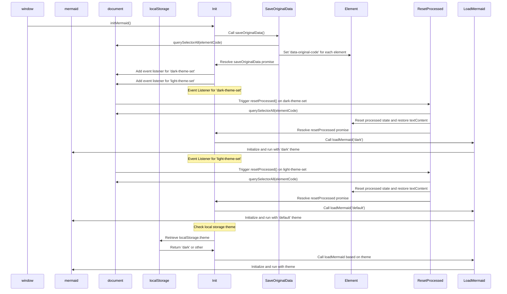

# Cambiar temas por Sirena

<!--category-- Mermaid, Markdown, Javascript -->
<datetime class="hidden">2024-08-26T20:36</datetime>

## Introducción

Utilizo Mermaid.js para crear los diagramas de drogas que ves en unos pocos posts. Como el de abajo.
Sin embargo, algo que me molestó es que no era reactivo al cambio de temas (oscuridad/luz) y parecía haber muy poca información al respecto.

Este es el resultado de unas horas de excavación y tratando de averiguar cómo hacer esto.

[TOC]

## El diagrama



## El problema

El problema es que necesitas inicializar Sirena para establecer el tema, y no puedes cambiarlo después de eso. NO obstante, si quieres volver a iniciarlo en un diagrama ya creado, no puede rehacer el diagrama ya que los datos no se almacenan en el DOM.

## La solución

Así que después de MUCHA excavación y tratando de averiguar cómo hacer esto, encontré una solución en [este número de GitHub](https://github.com/mermaid-js/mermaid/issues/1945)

Sin embargo todavía tenía algunos problemas, así que tuve que modificarlo un poco para que funcionara.

### Temas

Este sitio está basado en un tema de Coilwind que vino con un interruptor de tema bastante terrible.

Verás que esto es hacer varias cosas alrededor de cambiar el tema, establecer el tema para lo que se almacena en el almacenamiento local, cambiar un par de estilos para simplemde & highlight.js y luego aplicar el tema.

```javascript
export  function globalSetup() {
    const lightStylesheet = document.getElementById('light-mode');
    const darkStylesheet = document.getElementById('dark-mode');
    const simpleMdeDarkStylesheet = document.getElementById('simplemde-dark');
    const simpleMdeLightStylesheet = document.getElementById('simplemde-light');
    return {
        isMobileMenuOpen: false,
        isDarkMode: false,
        // Function to initialize the theme based on localStorage or system preference
        themeInit() {
            if (
                localStorage.theme === "dark" ||
                (!("theme" in localStorage) &&
                    window.matchMedia("(prefers-color-scheme: dark)").matches)
            ) {
                localStorage.theme = "dark";
                document.documentElement.classList.add("dark");
                document.documentElement.classList.remove("light");
                this.isDarkMode = true;
              
                this.applyTheme(); // Apply dark theme stylesheets
            } else {
                localStorage.theme = "base";
                document.documentElement.classList.remove("dark");
                document.documentElement.classList.add("light");
                this.isDarkMode = false;
                this.applyTheme(); // Apply light theme stylesheets
            }
        },

        // Function to switch the theme and update the stylesheets accordingly
        themeSwitch() {
            if (localStorage.theme === "dark") {
                localStorage.theme = "light";
                document.body.dispatchEvent(new CustomEvent('light-theme-set'));
                document.documentElement.classList.remove("dark");
                document.documentElement.classList.add("light");
                this.isDarkMode = false;
            } else {
                localStorage.theme = "dark";
                document.body.dispatchEvent(new CustomEvent('dark-theme-set'));
                document.documentElement.classList.add("dark");
                document.documentElement.classList.remove("light");
                this.isDarkMode = true;
            }
            this.applyTheme(); // Apply the theme stylesheets after switching
        },

        // Function to apply the appropriate stylesheets based on isDarkMode
        applyTheme() {
         
            if (this.isDarkMode) {
                // Enable dark mode stylesheets
                lightStylesheet.disabled = true;
                darkStylesheet.disabled = false;
                simpleMdeLightStylesheet.disabled = true;
                simpleMdeDarkStylesheet.disabled = false;
            } else {
                // Enable light mode stylesheets
                lightStylesheet.disabled = false;
                darkStylesheet.disabled = true;
                simpleMdeLightStylesheet.disabled = false;
                simpleMdeDarkStylesheet.disabled = true;
            }
        }
    };
}
```

## Configuración

Las principales adiciones para el conmutador de temas de Sirena son las siguientes:

```javascript
  document.body.dispatchEvent(new CustomEvent('dark-theme-set'));
    document.body.dispatchEvent(new CustomEvent('light-theme-set'));
```

Estos dos eventos se utilizan en nuestro componente ThemeSwitcher para reiniciar los diagramas de Sirena.

### OnLoad / htmx:afterSwap

En mi `main.js` Fichero configuro el conmutador de temas. También importo el `mdeswitch` archivo que contiene el código para los temas de conmutación.

```javascript
import "./mdeswitch";
addEventListener("DOMContentLoaded", () => {
    window.initMermaid();
});
addEventListener('htmx:afterSwap', function(evt) {
    window.initMermaid();
});
```

## MDESwtich

Este es el archivo que contiene el código para cambiar los temas de Mermaid.
(La horrible [diagrama anterior](#the-diagram) muestra la secuencia de eventos que suceden cuando se cambia el tema)

```javascript
(function(window){
    'use strict'

    const elementCode = 'div.mermaid'
    const loadMermaid = function(theme) {
        window.mermaid.initialize({theme})
        window.mermaid.run()
    }
    const saveOriginalData = function(){
        return new Promise((resolve, reject) => {
            try {
                var els = document.querySelectorAll(elementCode),
                    count = els.length;
                if(!els || count ===0 ) resolve ();
                els.forEach(element => {
                    element.setAttribute('data-original-code',encodeURIComponent( element.textContent));
                    count--
                    if(count == 0){
                        resolve()
                    }
                });
            } catch (error) {
                reject(error)
            }
        })
    }
    const resetProcessed = function(){
        return new Promise((resolve, reject) => {
            try {
                var els = document.querySelectorAll(elementCode),
                    count = els.length;
                if(!els || count ===0 ) resolve ();
                els.forEach(element => {
                    if(element.getAttribute('data-original-code') != null){
                        element.removeAttribute('data-processed')
                        element.textContent =decodeURIComponent( element.getAttribute('data-original-code'));
                    }
                    count--
                    if(count == 0){
                        resolve()
                    }
                });
            } catch (error) {
                reject(error)
            }
        })
    }

    const init = ()=>{

        saveOriginalData()
            .catch( console.error )
        document.body.addEventListener('dark-theme-set', ()=>{
            resetProcessed()
                .then(() =>{
                    loadMermaid('dark');
                    console.log("dark theme set")})
                .catch(console.error)
        })
        document.body.addEventListener('light-theme-set', ()=>{
            resetProcessed()
                .then(() =>{
                    loadMermaid('default');
                    console.log("dark theme set")})
                .catch(console.error)
        })
        let isDarkMode = localStorage.theme === 'dark';
        if(isDarkMode) {
            loadMermaid('dark');
        }
        else{
            loadMermaid('default')
        }

    }
    window.initMermaid = init
})(window);
```

Va un poco de abajo a arriba aquí.

1. `init` - función es la función principal que se llama cuando se carga la página.

Primero guarda el contenido original de los diagramas de Sirena; este fue un problema en la versión de la que lo copié, usaron 'innerHTML' que no funcionó para mí, ya que algunos diagramas dependen de las nuevas líneas que se tiran.

A continuación, añade dos oyentes de eventos para el `dark-theme-set` y `light-theme-set` Acontecimientos. Cuando se disparan estos eventos, se reinician los datos procesados y luego se reinician los diagramas de Sirena con el nuevo tema.

A continuación, comprueba el almacenamiento local para el tema y inicializa los diagramas de Sirena con el tema apropiado.

```javascript
let isDarkMode = localStorage.theme === 'dark';
        if(isDarkMode) {
            loadMermaid('dark');
         }
         else{
             loadMermaid('default')
         }
```

### Guardar datos originales

La clave de todo esto es almacenar y luego restaurar el contenido contenido en el renderizado `<div class="mermaid"><div>` que contienen la marca de sirena de nuestros puestos.

Verás que esto sólo establece una Promesa que pasa a través de todos los elementos y almacena el contenido original en un `data-original-code` atributo.

```javascript
    const saveOriginalData = function(){
        return new Promise((resolve, reject) => {
            try {
                var els = document.querySelectorAll(elementCode),
                    count = els.length;
                if(!els || count ===0 ) resolve ();
                els.forEach(element => {
                    element.setAttribute('data-original-code',encodeURIComponent(element.textContent))
                    count--
                    if(count == 0){
                        resolve()
                    }
                });
            } catch (error) {
                reject(error)
            }
        })
    }
```

`resetProcessed` es el mismo excepto en reversa donde toma el marcado de la `data-original-code` atribuyéndolo de nuevo al elemento.
Nótese también `encodeURIComponent` el valor como foud que algunas cadenas no estaban siendo almacenadas correctamente.

### Init

Ahora tenemos todos estos datos que podemos reinicializar sirena para aplicar nuestro nuevo tema y volver a renderizar el diagrama SVG en nuestra salida HTML.

```javascript
 const loadMermaid = function(theme) {
        window.mermaid.initialize({theme})
        window.mermaid.run()
    }
```

## Conclusión

Fue un poco difícil de entender, pero me alegro de haberlo hecho. Espero que esto ayude a alguien más por ahí que está tratando de hacer lo mismo.