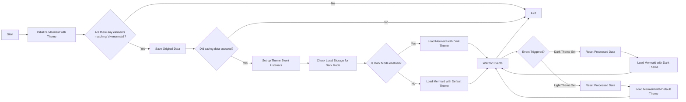

# Teemojen vaihtaminen merenneidolle (Päivitetty)

<!--category-- Mermaid, Markdown, Javascript -->
<datetime class="hidden">2024-08-29T05:00</datetime>

## Johdanto

Käytän Mermaid.js luoda huumeita kaavioita näet muutamassa viestissä. Kuten alla.
Minua kuitenkin ärsytti se, että se ei reagoinut teemojen vaihtamiseen (pimeä/kevyt) ja sen saavuttamisesta näytti olevan hyvin vähän tietoa.

Tämä on seurausta muutaman tunnin kaivamisesta ja yrittämisestä selvittää, miten se tehdään.

Mdeswitcherin lähde löytyy täältä:
[Mdeswitcher.js](https://github.com/scottgal/mostlylucidweb/blob/main/Mostlylucid/src/js/mdeswitch.js).

**<span style="color:green"> HUOMAUTUS: Olen päivittänyt tätä merkittävästi.</span>**

[TÄYTÄNTÖÖNPANO

## Kaavio



## Ongelma

Ongelmana on, että merenneito pitää alustaa teemaan, eikä sitä voi muuttaa sen jälkeen. Jos haluat kuitenkin käynnistää sen uudelleen jo luodulla kaaviolla, se ei voi tehdä kaaviota uudelleen, koska dataa ei tallenneta DOM:iin.

## Ratkaisu

Joten sen jälkeen, kun oli kaivanut paljon ja yrittänyt selvittää, miten tämä tehdään, löysin ratkaisun [tämä GitHub-julkaisun postaus](https://github.com/mermaid-js/mermaid/issues/1945)

Sillä oli kuitenkin vielä muutama ongelma, joten minun oli muokattava sitä hieman, jotta se toimisi.

### Teemat

Sivusto perustuu Tailwind-teemaan, johon tuli aika karmea teemavaihtaja.

Huomaat, että tämä tekee erilaisia juttuja teeman vaihtamisen ympärillä, asettaa teeman paikalliseen tallennukseen, vaihtaa pari tyyliä simppeliin & fashion.js:ään ja sitten soveltaa teemaa.

```javascript
export  function globalSetup() {
    const lightStylesheet = document.getElementById('light-mode');
    const darkStylesheet = document.getElementById('dark-mode');
    const simpleMdeDarkStylesheet = document.getElementById('simplemde-dark');
    const simpleMdeLightStylesheet = document.getElementById('simplemde-light');
    return {
        isMobileMenuOpen: false,
        isDarkMode: false,
        // Function to initialize the theme based on localStorage or system preference
        themeInit() {
            if (
                localStorage.theme === "dark" ||
                (!("theme" in localStorage) &&
                    window.matchMedia("(prefers-color-scheme: dark)").matches)
            ) {
                localStorage.theme = "dark";
                document.documentElement.classList.add("dark");
                document.documentElement.classList.remove("light");
                this.isDarkMode = true;
              
                this.applyTheme(); // Apply dark theme stylesheets
            } else {
                localStorage.theme = "base";
                document.documentElement.classList.remove("dark");
                document.documentElement.classList.add("light");
                this.isDarkMode = false;
                this.applyTheme(); // Apply light theme stylesheets
            }
        },

        // Function to switch the theme and update the stylesheets accordingly
        themeSwitch() {
            if (localStorage.theme === "dark") {
                localStorage.theme = "light";
                document.body.dispatchEvent(new CustomEvent('light-theme-set'));
                document.documentElement.classList.remove("dark");
                document.documentElement.classList.add("light");
                this.isDarkMode = false;
            } else {
                localStorage.theme = "dark";
                document.body.dispatchEvent(new CustomEvent('dark-theme-set'));
                document.documentElement.classList.add("dark");
                document.documentElement.classList.remove("light");
                this.isDarkMode = true;
            }
            this.applyTheme(); // Apply the theme stylesheets after switching
        },

        // Function to apply the appropriate stylesheets based on isDarkMode
        applyTheme() {
         
            if (this.isDarkMode) {
                // Enable dark mode stylesheets
                lightStylesheet.disabled = true;
                darkStylesheet.disabled = false;
                simpleMdeLightStylesheet.disabled = true;
                simpleMdeDarkStylesheet.disabled = false;
            } else {
                // Enable light mode stylesheets
                lightStylesheet.disabled = false;
                darkStylesheet.disabled = true;
                simpleMdeLightStylesheet.disabled = false;
                simpleMdeDarkStylesheet.disabled = true;
            }
        }
    };
}
```

## Asetukset

Merenneidon teemavaihtajan tärkeimmät lisät ovat seuraavat:

```javascript
  document.body.dispatchEvent(new CustomEvent('dark-theme-set'));
    document.body.dispatchEvent(new CustomEvent('light-theme-set'));
```

Näitä kahta tapahtumaa käytetään ThemeSwitcher-komponentissamme merenneitokaavioiden uudelleenaloittamisessa.

### OnLoad / htmx:afterSwap

Omassa `main.js` Tiedoston asetin teemanvaihtajan. Tuon myös `mdeswitch` Tiedosto, joka sisältää koodin teemojen vaihtamiseen.

```javascript
//Important: Memraid will ALWAYS intialize on window.onload, so we need to make sure we disable this behaviour:
import mermaid from "mermaid";

window.mermaid=mermaid;
mermaid.initialize({startOnLoad:false});

window.mermaidinit = function() {
    mermaid.initialize({ startOnLoad: false });
    try {
        window.initMermaid().then(r => console.log('Mermaid initialized'));
    } catch (e) {
        console.error('Failed to initialize Mermaid:', e);
    }

}

document.body.addEventListener('htmx:afterSwap', function(evt) {
    mermaidinit();
    //This should be called after the mermaid diagrams have been rendered.
    hljs.highlightAll();
});

window.onload = function(ev) {
    if(document.readyState === 'complete') {
        mermaidinit();
        hljs.highlightAll();
    }
};
```

## MDESwtich

Tämä on tiedosto, joka sisältää koodin teemojen vaihtamiseksi merenneidolle.
(Kammottavia [yllä oleva kaavio](#the-diagram) näyttää tapahtumasarjan, joka tapahtuu, kun teema on vaihdettu)

```javascript
(function(window) {
    'use strict';

    const elementCode = 'div.mermaid';

    const loadMermaid = async (theme) => {

        mermaid.initialize({startOnLoad: false, theme: theme });
        console.log("Loading mermaid with theme:", theme);
        await mermaid.run({
            querySelector: elementCode,
        });
    };

    const saveOriginalData = async () => {
        try {
            console.log("Saving original data");
            const elements = document.querySelectorAll(elementCode);
            const count = elements.length;

            if (count === 0) return;

            const promises = Array.from(elements).map((element) => {
                if (element.getAttribute('data-processed') != null) {
                    console.log("Element already processed");
                    return;
                }
                element.setAttribute('data-original-code', element.innerHTML);
            });

            await Promise.all(promises);
        } catch (error) {
            console.error(error);
            throw error;
        }
    };

    const resetProcessed = async () => {
        try {
            console.log("Resetting processed data");
            const elements = document.querySelectorAll(elementCode);
            const count = elements.length;

            if (count === 0) return;

            const promises = Array.from(elements).map((element) => {
                if (element.getAttribute('data-original-code') != null) {
                    element.removeAttribute('data-processed');
                    element.innerHTML = element.getAttribute('data-original-code');
                }
                else {
                    console.log("Element already reset");
                }
            });

            await Promise.all(promises);
        } catch (error) {
            console.error(error);
            throw error;
        }
    };

    window.initMermaid = async () => {
        const mermaidElements = document.querySelectorAll(elementCode);
        if (mermaidElements.length === 0) return;

        try {
            await saveOriginalData();
        } catch (error) {
            console.error("Error saving original data:", error);
            return; // Early exit if saveOriginalData fails
        }

        const handleDarkThemeSet = async () => {
            try {
                await resetProcessed();
                await loadMermaid('dark');
                console.log("Dark theme set");
            } catch (error) {
                console.error("Error during dark theme set:", error);
            }
        };

        const handleLightThemeSet = async () => {
            try {
                await resetProcessed();
                await loadMermaid('default');
                console.log("Light theme set");
            } catch (error) {
                console.error("Error during light theme set:", error);
            }
        };
        document.body.removeEventListener('dark-theme-set', handleDarkThemeSet);
        document.body.removeEventListener('light-theme-set', handleLightThemeSet);
        document.body.addEventListener('dark-theme-set', handleDarkThemeSet);
        document.body.addEventListener('light-theme-set', handleLightThemeSet);

        const isDarkMode = localStorage.theme === 'dark';
        await loadMermaid(isDarkMode ? 'dark' : 'default').then(r => console.log('Initial load complete'));


    };

})(window);
```

Alhaalta huipulle.

1. `init` - Funktio on päätoiminto, jota kutsutaan, kun sivu on ladattu.

Se tallentaa ensin Merenneidon kaavioiden alkuperäisen sisällön; tämä oli kysymys versiossa, josta kopioin sen, he käyttivät "sisäHTML:ää", joka ei toiminut minulle, koska jotkut diagrammit luottavat uusiin riveihin, jotka riisuvat.

Sen jälkeen siihen lisätään kaksi tapahtuman kuuntelijaa. `dark-theme-set` sekä `light-theme-set` tapahtumat. Kun nämä tapahtumat käynnistetään, se nollaa prosessoidun datan ja käynnistää merenneidon kaaviot uudelleen uudella teemalla.

Sen jälkeen se tarkistaa teeman paikallisen tallennuksen ja alustelee Merenneidon kaaviot sopivalla teemalla.

```javascript
let isDarkMode = localStorage.theme === 'dark';
        if(isDarkMode) {
            loadMermaid('dark');
         }
         else{
             loadMermaid('default')
         }
```

### Tallenna alkuperäiset tiedot

Avain tähän on tallentaa ja palauttaa sitten renderoidun sisällön sisältö. `<div class="mermaid"><div>` jotka sisältävät merenneitomarginaaleja sivuiltamme.

Huomaat, että tämä vain muodostaa Promise, joka yhdistää kaikki elementit ja tallentaa alkuperäisen sisällön `data-original-code` Ominaisuus.

```javascript
    const saveOriginalData = async () => {
    try {
        console.log("Saving original data");
        const elements = document.querySelectorAll(elementCode);
        const count = elements.length;

        if (count === 0) return;

        const promises = Array.from(elements).map((element) => {
            if (element.getAttribute('data-processed') != null) {
                console.log("Element already processed");
                return;
            }
            element.setAttribute('data-original-code', element.innerHTML);
        });

        await Promise.all(promises);
    } catch (error) {
        console.error(error);
        throw error;
    }
};
```

`resetProcessed` on sama paitsi käänteisessä, jossa se ottaa korotuksen `data-original-code` Määrittele ja aseta se takaisin elementille.

### Initiaatio

Nyt meillä on kaikki tämä data, jonka voimme käynnistää merenneidon uudelleen, jotta voimme soveltaa uutta teemaamme ja palauttaa SVG-kaavion HTML-tuotteeseen.

```javascript
    const elementCode = 'div.mermaid';

const loadMermaid = async (theme) => {

    mermaid.initialize({startOnLoad: false, theme: theme });
    console.log("Loading mermaid with theme:", theme);
    await mermaid.run({
        querySelector: elementCode,
    });
};
```

## Johtopäätöksenä

Tätä oli vaikea selvittää, mutta olen iloinen, että selvitin. Toivon, että tämä auttaa jotakuta toista, joka yrittää samaa.