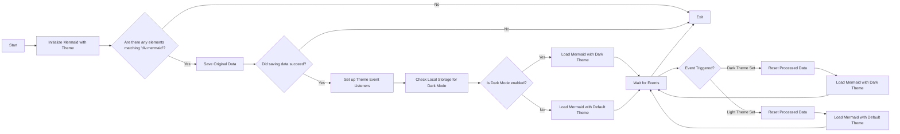

# Thèmes de commutation pour sirène (mise à jour)

<!--category-- Mermaid, Markdown, Javascript -->
<datetime class="hidden">2024-08-29T05:00</datetime>

## Présentation

J'utilise Mermaid.js pour créer les diagrammes de dope que vous voyez dans quelques messages. Comme celui ci-dessous.
Cependant, quelque chose qui m'a ennuyé, c'est qu'il n'a pas été réactif au changement de thèmes (dark/light) et qu'il semblait y avoir de très mauvaises informations là-bas sur la réalisation de ceci.

C'est le résultat de quelques heures de fouille et d'essayer de comprendre comment faire cela.

Vous pouvez trouver la source pour mdeswitcher ici:
[mdeswitcher.js](https://github.com/scottgal/mostlylucidweb/blob/main/Mostlylucid/src/js/mdeswitch.js).

**<span style="color:green"> NOTE: J'ai mis à jour ce point de manière substantielle.</span>**

[TOC]

## Le diagramme



## Le problème

Le problème est que vous devez initialiser Sirmaid pour définir le thème, et vous ne pouvez pas le changer après cela. HOWEVER si vous voulez le réinitialiser sur un diagramme déjà créé ; il ne peut pas refaire le diagramme car les données ne sont pas stockées dans le DOM.

## La solution

Donc, après que MUCH ait creusé et essayé de comprendre comment faire cela, j'ai trouvé une solution dans [ce message d'émission GitHub](https://github.com/mermaid-js/mermaid/issues/1945)

Cependant, il avait encore quelques problèmes, donc j'ai dû le modifier un peu pour le faire fonctionner.

### Thèmes

Ce site est basé sur un thème Tailwind qui est venu avec un changement de thème assez terrible.

Vous verrez que c'est fait diverses choses autour de la commutation du thème, de définir le thème pour ce qui est stocké dans le stockage local, de changer un couple de styles pour simplemde & surlignement.js puis d'appliquer le thème.

```javascript
export  function globalSetup() {
    const lightStylesheet = document.getElementById('light-mode');
    const darkStylesheet = document.getElementById('dark-mode');
    const simpleMdeDarkStylesheet = document.getElementById('simplemde-dark');
    const simpleMdeLightStylesheet = document.getElementById('simplemde-light');
    return {
        isMobileMenuOpen: false,
        isDarkMode: false,
        // Function to initialize the theme based on localStorage or system preference
        themeInit() {
            if (
                localStorage.theme === "dark" ||
                (!("theme" in localStorage) &&
                    window.matchMedia("(prefers-color-scheme: dark)").matches)
            ) {
                localStorage.theme = "dark";
                document.documentElement.classList.add("dark");
                document.documentElement.classList.remove("light");
                this.isDarkMode = true;
              
                this.applyTheme(); // Apply dark theme stylesheets
            } else {
                localStorage.theme = "base";
                document.documentElement.classList.remove("dark");
                document.documentElement.classList.add("light");
                this.isDarkMode = false;
                this.applyTheme(); // Apply light theme stylesheets
            }
        },

        // Function to switch the theme and update the stylesheets accordingly
        themeSwitch() {
            if (localStorage.theme === "dark") {
                localStorage.theme = "light";
                document.body.dispatchEvent(new CustomEvent('light-theme-set'));
                document.documentElement.classList.remove("dark");
                document.documentElement.classList.add("light");
                this.isDarkMode = false;
            } else {
                localStorage.theme = "dark";
                document.body.dispatchEvent(new CustomEvent('dark-theme-set'));
                document.documentElement.classList.add("dark");
                document.documentElement.classList.remove("light");
                this.isDarkMode = true;
            }
            this.applyTheme(); // Apply the theme stylesheets after switching
        },

        // Function to apply the appropriate stylesheets based on isDarkMode
        applyTheme() {
         
            if (this.isDarkMode) {
                // Enable dark mode stylesheets
                lightStylesheet.disabled = true;
                darkStylesheet.disabled = false;
                simpleMdeLightStylesheet.disabled = true;
                simpleMdeDarkStylesheet.disabled = false;
            } else {
                // Enable light mode stylesheets
                lightStylesheet.disabled = false;
                darkStylesheet.disabled = true;
                simpleMdeLightStylesheet.disabled = false;
                simpleMdeDarkStylesheet.disabled = true;
            }
        }
    };
}
```

## Configuration

Les principaux ajouts pour le commutateur de thème Sirène sont les suivants:

```javascript
  document.body.dispatchEvent(new CustomEvent('dark-theme-set'));
    document.body.dispatchEvent(new CustomEvent('light-theme-set'));
```

Ces deux événements sont utilisés dans notre composant ThemeSwitcher pour réinitialiser les diagrammes de Sirène.

### OnLoad / htmx:afterSwap

Dans mon `main.js` fichier J'ai configuré le commutateur de thème. J'importe aussi les `mdeswitch` fichier qui contient le code pour le changement de thèmes.

```javascript
//Important: Memraid will ALWAYS intialize on window.onload, so we need to make sure we disable this behaviour:
import mermaid from "mermaid";

window.mermaid=mermaid;
mermaid.initialize({startOnLoad:false});

window.mermaidinit = function() {
    mermaid.initialize({ startOnLoad: false });
    try {
        window.initMermaid().then(r => console.log('Mermaid initialized'));
    } catch (e) {
        console.error('Failed to initialize Mermaid:', e);
    }

}

document.body.addEventListener('htmx:afterSwap', function(evt) {
    mermaidinit();
    //This should be called after the mermaid diagrams have been rendered.
    hljs.highlightAll();
});

window.onload = function(ev) {
    if(document.readyState === 'complete') {
        mermaidinit();
        hljs.highlightAll();
    }
};
```

## MDESwtich

C'est le fichier qui contient le code pour changer les thèmes pour Mermaid.
(L'horrible [schéma ci-dessus](#the-diagram) montre la séquence d'événements qui se produisent lorsque le thème est commuté)

```javascript
(function(window) {
    'use strict';

    const elementCode = 'div.mermaid';

    const loadMermaid = async (theme) => {

        mermaid.initialize({startOnLoad: false, theme: theme });
        console.log("Loading mermaid with theme:", theme);
        await mermaid.run({
            querySelector: elementCode,
        });
    };

    const saveOriginalData = async () => {
        try {
            console.log("Saving original data");
            const elements = document.querySelectorAll(elementCode);
            const count = elements.length;

            if (count === 0) return;

            const promises = Array.from(elements).map((element) => {
                if (element.getAttribute('data-processed') != null) {
                    console.log("Element already processed");
                    return;
                }
                element.setAttribute('data-original-code', element.innerHTML);
            });

            await Promise.all(promises);
        } catch (error) {
            console.error(error);
            throw error;
        }
    };

    const resetProcessed = async () => {
        try {
            console.log("Resetting processed data");
            const elements = document.querySelectorAll(elementCode);
            const count = elements.length;

            if (count === 0) return;

            const promises = Array.from(elements).map((element) => {
                if (element.getAttribute('data-original-code') != null) {
                    element.removeAttribute('data-processed');
                    element.innerHTML = element.getAttribute('data-original-code');
                }
                else {
                    console.log("Element already reset");
                }
            });

            await Promise.all(promises);
        } catch (error) {
            console.error(error);
            throw error;
        }
    };

    window.initMermaid = async () => {
        const mermaidElements = document.querySelectorAll(elementCode);
        if (mermaidElements.length === 0) return;

        try {
            await saveOriginalData();
        } catch (error) {
            console.error("Error saving original data:", error);
            return; // Early exit if saveOriginalData fails
        }

        const handleDarkThemeSet = async () => {
            try {
                await resetProcessed();
                await loadMermaid('dark');
                console.log("Dark theme set");
            } catch (error) {
                console.error("Error during dark theme set:", error);
            }
        };

        const handleLightThemeSet = async () => {
            try {
                await resetProcessed();
                await loadMermaid('default');
                console.log("Light theme set");
            } catch (error) {
                console.error("Error during light theme set:", error);
            }
        };
        document.body.removeEventListener('dark-theme-set', handleDarkThemeSet);
        document.body.removeEventListener('light-theme-set', handleLightThemeSet);
        document.body.addEventListener('dark-theme-set', handleDarkThemeSet);
        document.body.addEventListener('light-theme-set', handleLightThemeSet);

        const isDarkMode = localStorage.theme === 'dark';
        await loadMermaid(isDarkMode ? 'dark' : 'default').then(r => console.log('Initial load complete'));


    };

})(window);
```

Je vais un peu en haut.

1. `init` - fonction est la fonction principale qui est appelée lorsque la page est chargée.

Il enregistre d'abord le contenu original des diagrammes de Sirène; c'était un problème dans la version que je l'ai copiée à partir, ils ont utilisé 'innerHTML' qui ne fonctionne pas pour moi comme certains diagrammes comptent sur les nouvelles lignes que ces bandes.

Il ajoute ensuite deux auditeurs de l'événement pour le `dark-theme-set` et `light-theme-set` les événements. Lorsque ces événements sont déclenchés, il réinitialise les données traitées puis réinitialise les diagrammes de Sirène avec le nouveau thème.

Il vérifie ensuite le stockage local pour le thème et initialise les diagrammes de Sirène avec le thème approprié.

```javascript
let isDarkMode = localStorage.theme === 'dark';
        if(isDarkMode) {
            loadMermaid('dark');
         }
         else{
             loadMermaid('default')
         }
```

### Enregistrer les données originales

La clé de cette chose est de stocker puis de restaurer le contenu contenu contenu dans le rendu `<div class="mermaid"><div>` qui contiennent le balisage de sirène de nos postes.

Vous verrez cela juste mettre en place une Promesse qui en boucle à travers tous les éléments et stocke le contenu original dans un `data-original-code` attribut.

```javascript
    const saveOriginalData = async () => {
    try {
        console.log("Saving original data");
        const elements = document.querySelectorAll(elementCode);
        const count = elements.length;

        if (count === 0) return;

        const promises = Array.from(elements).map((element) => {
            if (element.getAttribute('data-processed') != null) {
                console.log("Element already processed");
                return;
            }
            element.setAttribute('data-original-code', element.innerHTML);
        });

        await Promise.all(promises);
    } catch (error) {
        console.error(error);
        throw error;
    }
};
```

`resetProcessed` est la même, sauf à l'inverse où il prend le balisage de la `data-original-code` attribut et le remet à l'élément.

### Init

Maintenant, nous avons toutes ces données que nous pouvons réinitialiser sirène pour appliquer notre nouveau thème et remettre le diagramme SVG dans notre sortie HTML.

```javascript
    const elementCode = 'div.mermaid';

const loadMermaid = async (theme) => {

    mermaid.initialize({startOnLoad: false, theme: theme });
    console.log("Loading mermaid with theme:", theme);
    await mermaid.run({
        querySelector: elementCode,
    });
};
```

## En conclusion

C'était un peu difficile à comprendre, mais je suis content de l'avoir fait. J'espère que cela aidera quelqu'un d'autre qui essaie de faire la même chose.