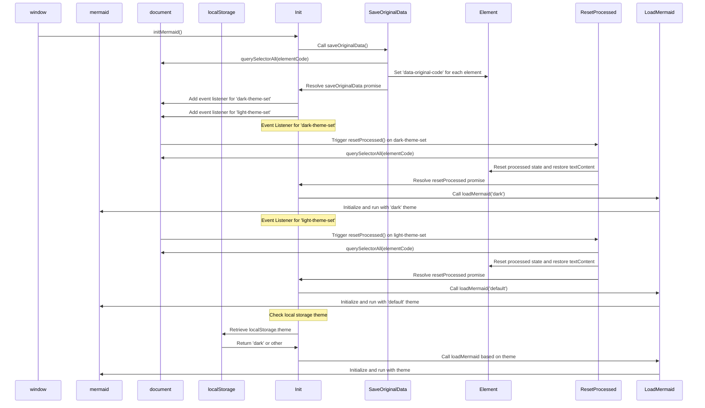

# मेरशी के लिए प्रसंग स्विच किया जा रहा है

<!--category-- Mermaid, Markdown, Javascript -->
<datetime class="hidden">2024- 0. 3126टी20:36</datetime>

## परिचय

मैं मेरशी का उपयोग करें डोप्ट्स आप कुछ पोस्ट में देख सकते हैं। नीचे से एक की तरह.
लेकिन कुछ है जो मुझे परेशान करता है कि यह प्रसंगों में स्विच करने के लिए प्रतिक्रिया नहीं थी और वहाँ इस प्राप्त करने पर बहुत गरीब जानकारी हो रही थी.

यह खुदाई के कुछ घंटों का परिणाम है और यह कैसे पता लगाने की कोशिश कर रहे हैं पता लगाने की कोशिश कर रहे हैं.

[विषय

## आरेख



## समस्या

मुद्दा यह है कि आपको मेरशी को विषय नियत करने के लिए प्रारंभ करना होगा, और आप उसे उस के बाद बदल नहीं सकते. कैसे कभी आप इसे पहले से बनाई गई आरेख पर फिर से व्यवस्थित करना चाहते हैं, यह आरेख को वापस नहीं कर सकता चूंकि डाटा डोम में भंडारित नहीं है.

## हल

तो खुदाई करने और यह कैसे करने की कोशिश करने के बाद, मुझे एक समाधान मिला [इस GiB मुद्दा को पोस्ट करें](https://github.com/mermaid-js/mermaid/issues/1945)

लेकिन मेरे पास अब भी कुछ बातें थीं, इसलिए मुझे इसे काम करने के लिए थोड़ा - बहुत फेरबदल करना पड़ा ।

### प्रसंग

यह साइट एक टाइटल प्रसंग पर आधारित है जो एक बहुत ही भयानक प्रसंग स्विचर के साथ आया था.

आप देखेंगे कि यह विषय स्विच करने के लिए चारों ओर विविध सामान करता है, विषय को निर्धारित करने के लिए स्थानीय भंडार में क्या रखा है, और कैसे Thmiders के एक जोड़े को परिवर्तित और फिर विषय को लागू करने के लिए।

```javascript
export  function globalSetup() {
    const lightStylesheet = document.getElementById('light-mode');
    const darkStylesheet = document.getElementById('dark-mode');
    const simpleMdeDarkStylesheet = document.getElementById('simplemde-dark');
    const simpleMdeLightStylesheet = document.getElementById('simplemde-light');
    return {
        isMobileMenuOpen: false,
        isDarkMode: false,
        // Function to initialize the theme based on localStorage or system preference
        themeInit() {
            if (
                localStorage.theme === "dark" ||
                (!("theme" in localStorage) &&
                    window.matchMedia("(prefers-color-scheme: dark)").matches)
            ) {
                localStorage.theme = "dark";
                document.documentElement.classList.add("dark");
                document.documentElement.classList.remove("light");
                this.isDarkMode = true;
              
                this.applyTheme(); // Apply dark theme stylesheets
            } else {
                localStorage.theme = "base";
                document.documentElement.classList.remove("dark");
                document.documentElement.classList.add("light");
                this.isDarkMode = false;
                this.applyTheme(); // Apply light theme stylesheets
            }
        },

        // Function to switch the theme and update the stylesheets accordingly
        themeSwitch() {
            if (localStorage.theme === "dark") {
                localStorage.theme = "light";
                document.body.dispatchEvent(new CustomEvent('light-theme-set'));
                document.documentElement.classList.remove("dark");
                document.documentElement.classList.add("light");
                this.isDarkMode = false;
            } else {
                localStorage.theme = "dark";
                document.body.dispatchEvent(new CustomEvent('dark-theme-set'));
                document.documentElement.classList.add("dark");
                document.documentElement.classList.remove("light");
                this.isDarkMode = true;
            }
            this.applyTheme(); // Apply the theme stylesheets after switching
        },

        // Function to apply the appropriate stylesheets based on isDarkMode
        applyTheme() {
         
            if (this.isDarkMode) {
                // Enable dark mode stylesheets
                lightStylesheet.disabled = true;
                darkStylesheet.disabled = false;
                simpleMdeLightStylesheet.disabled = true;
                simpleMdeDarkStylesheet.disabled = false;
            } else {
                // Enable light mode stylesheets
                lightStylesheet.disabled = false;
                darkStylesheet.disabled = true;
                simpleMdeLightStylesheet.disabled = false;
                simpleMdeDarkStylesheet.disabled = true;
            }
        }
    };
}
```

## सेटअप

मेकरी प्रसंग स्विचर के लिए मुख्य योग निम्न है:

```javascript
  document.body.dispatchEvent(new CustomEvent('dark-theme-set'));
    document.body.dispatchEvent(new CustomEvent('light-theme-set'));
```

इन दोनों घटनाओं का प्रयोग हमारे प्रसंग स्विचर घटकों में किया जाता है जिसे मेरशी आरेखों को फिर से बदलने के लिए किया जाता है ।

### लोड करने पर / उड़वेक्स: के पश्चात्

मेरे में `main.js` फ़ाइल मैं प्रसंग स्विचर सेटअप करता हूँ. मैं भी आयात करता हूँ `mdeswitch` प्रसंगों को स्विच करने हेतु कोड युक्त फ़ाइल.

```javascript
import "./mdeswitch";
addEventListener("DOMContentLoaded", () => {
    window.initMermaid();
});
addEventListener('htmx:afterSwap', function(evt) {
    window.initMermaid();
});
```

## MDEXPENext %s

यह फ़ाइल है जो कि मेकर के प्रसंगों को स्विच करने के लिए कोड रखता है.
(वह भयंकर) [ऊपर आरेख](#the-diagram) घटनाएँ जो हो रही हैं का अनुक्रम दिखाता है कि जब प्रसंग बन्द हो जाता है (b)

```javascript
(function(window){
    'use strict'

    const elementCode = 'div.mermaid'
    const loadMermaid = function(theme) {
        window.mermaid.initialize({theme})
        window.mermaid.run()
    }
    const saveOriginalData = function(){
        return new Promise((resolve, reject) => {
            try {
                var els = document.querySelectorAll(elementCode),
                    count = els.length;
                if(!els || count ===0 ) resolve ();
                els.forEach(element => {
                    element.setAttribute('data-original-code',encodeURIComponent( element.textContent));
                    count--
                    if(count == 0){
                        resolve()
                    }
                });
            } catch (error) {
                reject(error)
            }
        })
    }
    const resetProcessed = function(){
        return new Promise((resolve, reject) => {
            try {
                var els = document.querySelectorAll(elementCode),
                    count = els.length;
                if(!els || count ===0 ) resolve ();
                els.forEach(element => {
                    if(element.getAttribute('data-original-code') != null){
                        element.removeAttribute('data-processed')
                        element.textContent =decodeURIComponent( element.getAttribute('data-original-code'));
                    }
                    count--
                    if(count == 0){
                        resolve()
                    }
                });
            } catch (error) {
                reject(error)
            }
        })
    }

    const init = ()=>{

        saveOriginalData()
            .catch( console.error )
        document.body.addEventListener('dark-theme-set', ()=>{
            resetProcessed()
                .then(() =>{
                    loadMermaid('dark');
                    console.log("dark theme set")})
                .catch(console.error)
        })
        document.body.addEventListener('light-theme-set', ()=>{
            resetProcessed()
                .then(() =>{
                    loadMermaid('default');
                    console.log("dark theme set")})
                .catch(console.error)
        })
        let isDarkMode = localStorage.theme === 'dark';
        if(isDarkMode) {
            loadMermaid('dark');
        }
        else{
            loadMermaid('default')
        }

    }
    window.initMermaid = init
})(window);
```

यहाँ पर नीचे एक तरह से नीचे जा रहे हैं.

1. `init` - फंक्शन मुख्य फंक्शन है जो जब पृष्ठ लोड होता है.

यह सबसे पहले Mervutiver डायग्राम के मूल सामग्री को बचाता है, यह संस्करण में एक मुद्दा था मैं इसे से प्रतिलिपि बनाई थी, वे 'मारम' का प्रयोग किया था जो मेरे लिए कुछ आरेखों के रूप में काम नहीं किया था के रूप में कि ले जाया जाता है।

उसके बाद वह दो घटना सुननेवालों को बताती है `dark-theme-set` और `light-theme-set` घटनाएँ । जब इन घटनाओं को निकाला जाता है तब प्रक्रिया के डाटा फिर से उभरता है और नए विषय के साथ मेरशी आरेखों का पुनःविचार करता है ।

फिर यह उस विषय के लिए स्थानीय भंडार की जाँच करता है और मेरौत चित्र को उपयुक्‍त विषय के साथ प्रारंभ करता है ।

```javascript
let isDarkMode = localStorage.theme === 'dark';
        if(isDarkMode) {
            loadMermaid('dark');
         }
         else{
             loadMermaid('default')
         }
```

### मूल डाटा सहेजें

इस पूरी चीज का कुंजी फिर दिए गए विषयवस्तु को जमा करने पर है `<div class="mermaid"><div>` हमारे पोस्ट से मुझेरीट मार्कअप है.

आप यह सिर्फ एक वादा है कि सभी तत्वों के माध्यम से लूप एक वादा अप देखेंगे और एक में मूल सामग्री जमा `data-original-code` गुण.

```javascript
    const saveOriginalData = function(){
        return new Promise((resolve, reject) => {
            try {
                var els = document.querySelectorAll(elementCode),
                    count = els.length;
                if(!els || count ===0 ) resolve ();
                els.forEach(element => {
                    element.setAttribute('data-original-code',encodeURIComponent(element.textContent))
                    count--
                    if(count == 0){
                        resolve()
                    }
                });
            } catch (error) {
                reject(error)
            }
        })
    }
```

`resetProcessed` उसी के उलट जहाँ से मार्कअप लेता है वहीं दूसरी ही बात है `data-original-code` गुण और इसे तत्व में वापस सेट करें.
इसे भी नोट करें `encodeURIComponent` मूल्य के रूप में मैं कोई वाक्यांश सही तरह से भंडारित नहीं किया जा रहा था कि के रूप में.

### इनिट

अब हमारे पास यह सब डेटा है...... हम अपने नए प्रसंग लागू करने के लिए मुझे फिर से साझा कर सकते हैं...... और एसवीजी डायग्राम को हमारे एचटीएमएल आउटपुट में फिर से दें.

```javascript
 const loadMermaid = function(theme) {
        window.mermaid.initialize({theme})
        window.mermaid.run()
    }
```

## ऑन्टियम

यह पता लगाने के लिए एक दर्द का एक सा था, लेकिन मैं खुश हूँ कि मैंने किया. मुझे आशा है कि यह कोई और बाहर किसी को मदद करता है जो एक ही बात करने की कोशिश कर रहा है।