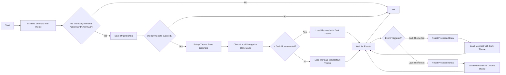

# Switching themes for Mermaid (Aggiornato)

<!--category-- Mermaid, Markdown, Javascript -->
<datetime class="hidden">2024-08-29T05:00</datetime>

## Introduzione

Uso Mermaid.js per creare i diagrammi di droga che vedete in alcuni post. Come quella qui sotto.
Tuttavia qualcosa che mi ha infastidito è che non è stato reattivo al cambiamento di temi (scuro/luce) e ci sembrava essere molto scarse informazioni là fuori sul raggiungimento di questo.

Questo è il risultato di alcune ore di scavare e cercare di capire come fare.

Puoi trovare la sorgente per mdeswitcher qui:
[mdeswitcher.js](https://github.com/scottgal/mostlylucidweb/blob/main/Mostlylucid/src/js/mdeswitch.js).

**<span style="color:green"> NOTA: Ho aggiornato questo sostanzialmente.</span>**

[TOC]

## Il diagramma



## Il problema

Il problema è che è necessario inizializzare Sirenetta per impostare il tema, e non è possibile cambiare dopo che. Tuttavia, se si desidera reinizializzare su un diagramma già creato, non è possibile rifare il diagramma poiché i dati non sono memorizzati nel DOM.

## La soluzione

Quindi dopo MOLTO scavare e cercare di capire come fare questo, ho trovato una soluzione in [questo post su GitHub](https://github.com/mermaid-js/mermaid/issues/1945)

Tuttavia ha avuto ancora alcuni problemi, quindi ho dovuto modificarlo un po 'per farlo funzionare.

### Temi

Questo sito è basato su un tema Tailwind che è venuto con uno switcher tema abbastanza terribile.

Vedrete che questo è fare varie cose intorno a cambiare il tema, impostare il tema per ciò che è memorizzato nello storage locale, cambiare un paio di stylesheers per simplemde & highlight.js e quindi applicare il tema.

```javascript
export  function globalSetup() {
    const lightStylesheet = document.getElementById('light-mode');
    const darkStylesheet = document.getElementById('dark-mode');
    const simpleMdeDarkStylesheet = document.getElementById('simplemde-dark');
    const simpleMdeLightStylesheet = document.getElementById('simplemde-light');
    return {
        isMobileMenuOpen: false,
        isDarkMode: false,
        // Function to initialize the theme based on localStorage or system preference
        themeInit() {
            if (
                localStorage.theme === "dark" ||
                (!("theme" in localStorage) &&
                    window.matchMedia("(prefers-color-scheme: dark)").matches)
            ) {
                localStorage.theme = "dark";
                document.documentElement.classList.add("dark");
                document.documentElement.classList.remove("light");
                this.isDarkMode = true;
              
                this.applyTheme(); // Apply dark theme stylesheets
            } else {
                localStorage.theme = "base";
                document.documentElement.classList.remove("dark");
                document.documentElement.classList.add("light");
                this.isDarkMode = false;
                this.applyTheme(); // Apply light theme stylesheets
            }
        },

        // Function to switch the theme and update the stylesheets accordingly
        themeSwitch() {
            if (localStorage.theme === "dark") {
                localStorage.theme = "light";
                document.body.dispatchEvent(new CustomEvent('light-theme-set'));
                document.documentElement.classList.remove("dark");
                document.documentElement.classList.add("light");
                this.isDarkMode = false;
            } else {
                localStorage.theme = "dark";
                document.body.dispatchEvent(new CustomEvent('dark-theme-set'));
                document.documentElement.classList.add("dark");
                document.documentElement.classList.remove("light");
                this.isDarkMode = true;
            }
            this.applyTheme(); // Apply the theme stylesheets after switching
        },

        // Function to apply the appropriate stylesheets based on isDarkMode
        applyTheme() {
         
            if (this.isDarkMode) {
                // Enable dark mode stylesheets
                lightStylesheet.disabled = true;
                darkStylesheet.disabled = false;
                simpleMdeLightStylesheet.disabled = true;
                simpleMdeDarkStylesheet.disabled = false;
            } else {
                // Enable light mode stylesheets
                lightStylesheet.disabled = false;
                darkStylesheet.disabled = true;
                simpleMdeLightStylesheet.disabled = false;
                simpleMdeDarkStylesheet.disabled = true;
            }
        }
    };
}
```

## Configurazione

Le principali aggiunte per lo switcher tema Mermaid sono le seguenti:

```javascript
  document.body.dispatchEvent(new CustomEvent('dark-theme-set'));
    document.body.dispatchEvent(new CustomEvent('light-theme-set'));
```

Questi due eventi sono utilizzati nel nostro componente ThemeSwitcher per riinizializzare i diagrammi della Sirenetta.

### OnLoad / htmx:afterSwap

Nella mia `main.js` file Ho impostato lo switcher tema. Importo anche il `mdeswitch` file che contiene il codice per cambiare i temi.

```javascript
//Important: Memraid will ALWAYS intialize on window.onload, so we need to make sure we disable this behaviour:
import mermaid from "mermaid";

window.mermaid=mermaid;
mermaid.initialize({startOnLoad:false});

window.mermaidinit = function() {
    mermaid.initialize({ startOnLoad: false });
    try {
        window.initMermaid().then(r => console.log('Mermaid initialized'));
    } catch (e) {
        console.error('Failed to initialize Mermaid:', e);
    }

}

document.body.addEventListener('htmx:afterSwap', function(evt) {
    mermaidinit();
    //This should be called after the mermaid diagrams have been rendered.
    hljs.highlightAll();
});

window.onload = function(ev) {
    if(document.readyState === 'complete') {
        mermaidinit();
        hljs.highlightAll();
    }
};
```

## MDESwtichCity name (optional, probably does not need a translation)

Questo è il file che contiene il codice per cambiare i temi per la Sirenetta.
(L'orribile [diagramma sopra](#the-diagram) mostra la sequenza degli eventi che accadono quando il tema è commutato)

```javascript
(function(window) {
    'use strict';

    const elementCode = 'div.mermaid';

    const loadMermaid = async (theme) => {

        mermaid.initialize({startOnLoad: false, theme: theme });
        console.log("Loading mermaid with theme:", theme);
        await mermaid.run({
            querySelector: elementCode,
        });
    };

    const saveOriginalData = async () => {
        try {
            console.log("Saving original data");
            const elements = document.querySelectorAll(elementCode);
            const count = elements.length;

            if (count === 0) return;

            const promises = Array.from(elements).map((element) => {
                if (element.getAttribute('data-processed') != null) {
                    console.log("Element already processed");
                    return;
                }
                element.setAttribute('data-original-code', element.innerHTML);
            });

            await Promise.all(promises);
        } catch (error) {
            console.error(error);
            throw error;
        }
    };

    const resetProcessed = async () => {
        try {
            console.log("Resetting processed data");
            const elements = document.querySelectorAll(elementCode);
            const count = elements.length;

            if (count === 0) return;

            const promises = Array.from(elements).map((element) => {
                if (element.getAttribute('data-original-code') != null) {
                    element.removeAttribute('data-processed');
                    element.innerHTML = element.getAttribute('data-original-code');
                }
                else {
                    console.log("Element already reset");
                }
            });

            await Promise.all(promises);
        } catch (error) {
            console.error(error);
            throw error;
        }
    };

    window.initMermaid = async () => {
        const mermaidElements = document.querySelectorAll(elementCode);
        if (mermaidElements.length === 0) return;

        try {
            await saveOriginalData();
        } catch (error) {
            console.error("Error saving original data:", error);
            return; // Early exit if saveOriginalData fails
        }

        const handleDarkThemeSet = async () => {
            try {
                await resetProcessed();
                await loadMermaid('dark');
                console.log("Dark theme set");
            } catch (error) {
                console.error("Error during dark theme set:", error);
            }
        };

        const handleLightThemeSet = async () => {
            try {
                await resetProcessed();
                await loadMermaid('default');
                console.log("Light theme set");
            } catch (error) {
                console.error("Error during light theme set:", error);
            }
        };
        document.body.removeEventListener('dark-theme-set', handleDarkThemeSet);
        document.body.removeEventListener('light-theme-set', handleLightThemeSet);
        document.body.addEventListener('dark-theme-set', handleDarkThemeSet);
        document.body.addEventListener('light-theme-set', handleLightThemeSet);

        const isDarkMode = localStorage.theme === 'dark';
        await loadMermaid(isDarkMode ? 'dark' : 'default').then(r => console.log('Initial load complete'));


    };

})(window);
```

Sta andando un po' in basso fino in cima.

1. `init` - funzione è la funzione principale che viene chiamata quando la pagina è caricata.

In primo luogo salva il contenuto originale dei diagrammi della Sirenetta; questo era un problema nella versione da cui l'ho copiato, hanno usato 'innerHTML' che non ha funzionato per me come alcuni diagrammi si basano su newlines che quelle strisce.

Poi aggiunge due ascoltatori di eventi per il `dark-theme-set` e `light-theme-set` eventi. Quando questi eventi vengono licenziati reimposta i dati elaborati e poi reinizializza i diagrammi della Sirenetta con il nuovo tema.

Controlla quindi l'archiviazione locale per il tema e inizializza i diagrammi della Sirenetta con il tema appropriato.

```javascript
let isDarkMode = localStorage.theme === 'dark';
        if(isDarkMode) {
            loadMermaid('dark');
         }
         else{
             loadMermaid('default')
         }
```

### Salva dati originali

La chiave di tutto questo è memorizzare poi ripristinare il contenuto contenuto nel rendering `<div class="mermaid"><div>` che contengono il marchio della sirena dai nostri posti.

Vedrete questo solo impostare una promessa che loop attraverso tutti gli elementi e memorizza il contenuto originale in un `data-original-code` attributo.

```javascript
    const saveOriginalData = async () => {
    try {
        console.log("Saving original data");
        const elements = document.querySelectorAll(elementCode);
        const count = elements.length;

        if (count === 0) return;

        const promises = Array.from(elements).map((element) => {
            if (element.getAttribute('data-processed') != null) {
                console.log("Element already processed");
                return;
            }
            element.setAttribute('data-original-code', element.innerHTML);
        });

        await Promise.all(promises);
    } catch (error) {
        console.error(error);
        throw error;
    }
};
```

`resetProcessed` è lo stesso, tranne nel caso in cui inverso prende il markup dal `data-original-code` attributo e lo riporta all'elemento.

### Init

Ora abbiamo tutti questi dati che possiamo riinizializzare la sirena per applicare il nostro nuovo tema e restituire il diagramma SVG nel nostro output HTML.

```javascript
    const elementCode = 'div.mermaid';

const loadMermaid = async (theme) => {

    mermaid.initialize({startOnLoad: false, theme: theme });
    console.log("Loading mermaid with theme:", theme);
    await mermaid.run({
        querySelector: elementCode,
    });
};
```

## In conclusione

E' stato un po' un dolore da capire, ma sono felice di averlo fatto. Spero che questo aiuti qualcun altro là fuori che sta cercando di fare la stessa cosa.