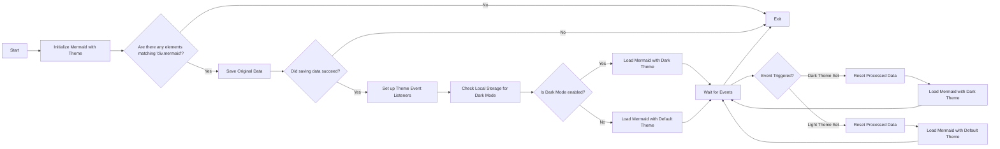

# Thema's voor Mermaid wijzigen (Bijgewerkt)

<!--category-- Mermaid, Markdown, Javascript -->
<datetime class="hidden">2024-08-29T05:00</datetime>

## Inleiding

Ik gebruik Mermaid.js om de dope diagrammen te maken die je in een paar berichten ziet. Zoals die onderaan.
Maar iets wat me ergerde is dat het niet reageerde op het veranderen van thema's (donker/licht) en er leek zeer slechte informatie te zijn over het bereiken van dit.

Dit is het resultaat van een paar uur graven en proberen uit te zoeken hoe dit te doen.

Hier vindt u de broncode voor mdeswitcher:
[mdeswitcher.js](https://github.com/scottgal/mostlylucidweb/blob/main/Mostlylucid/src/js/mdeswitch.js).

**<span style="color:green"> OPMERKING: Ik heb dit aanzienlijk bijgewerkt.</span>**

[TOC]

## Het diagram



## Het probleem

Het probleem is dat je Mermaid moet initialiseren om het thema in te stellen, en je kunt het daarna niet veranderen. Hoe dan ook als je het opnieuw wilt initialiseren op een reeds aangemaakt diagram; het kan het diagram niet opnieuw doen omdat de gegevens niet in de DOM worden opgeslagen.

## De oplossing

Dus na Much graven en proberen uit te zoeken hoe dit te doen, vond ik een oplossing in [deze GitHub nummer post](https://github.com/mermaid-js/mermaid/issues/1945)

Maar het had nog een paar problemen, dus ik moest het een beetje aanpassen om het aan het werk te krijgen.

### Thema's

Deze site is gebaseerd op een Tailwind thema dat kwam met een vrij verschrikkelijke thema switcher.

Je zult zien dat dit verschillende dingen doet rond het veranderen van het thema, het instellen van het thema voor wat is opgeslagen in de lokale opslag, het veranderen van een paar stylesheers voor simplemde & highlight.js en vervolgens het toepassen van het thema.

```javascript
export  function globalSetup() {
    const lightStylesheet = document.getElementById('light-mode');
    const darkStylesheet = document.getElementById('dark-mode');
    const simpleMdeDarkStylesheet = document.getElementById('simplemde-dark');
    const simpleMdeLightStylesheet = document.getElementById('simplemde-light');
    return {
        isMobileMenuOpen: false,
        isDarkMode: false,
        // Function to initialize the theme based on localStorage or system preference
        themeInit() {
            if (
                localStorage.theme === "dark" ||
                (!("theme" in localStorage) &&
                    window.matchMedia("(prefers-color-scheme: dark)").matches)
            ) {
                localStorage.theme = "dark";
                document.documentElement.classList.add("dark");
                document.documentElement.classList.remove("light");
                this.isDarkMode = true;
              
                this.applyTheme(); // Apply dark theme stylesheets
            } else {
                localStorage.theme = "base";
                document.documentElement.classList.remove("dark");
                document.documentElement.classList.add("light");
                this.isDarkMode = false;
                this.applyTheme(); // Apply light theme stylesheets
            }
        },

        // Function to switch the theme and update the stylesheets accordingly
        themeSwitch() {
            if (localStorage.theme === "dark") {
                localStorage.theme = "light";
                document.body.dispatchEvent(new CustomEvent('light-theme-set'));
                document.documentElement.classList.remove("dark");
                document.documentElement.classList.add("light");
                this.isDarkMode = false;
            } else {
                localStorage.theme = "dark";
                document.body.dispatchEvent(new CustomEvent('dark-theme-set'));
                document.documentElement.classList.add("dark");
                document.documentElement.classList.remove("light");
                this.isDarkMode = true;
            }
            this.applyTheme(); // Apply the theme stylesheets after switching
        },

        // Function to apply the appropriate stylesheets based on isDarkMode
        applyTheme() {
         
            if (this.isDarkMode) {
                // Enable dark mode stylesheets
                lightStylesheet.disabled = true;
                darkStylesheet.disabled = false;
                simpleMdeLightStylesheet.disabled = true;
                simpleMdeDarkStylesheet.disabled = false;
            } else {
                // Enable light mode stylesheets
                lightStylesheet.disabled = false;
                darkStylesheet.disabled = true;
                simpleMdeLightStylesheet.disabled = false;
                simpleMdeDarkStylesheet.disabled = true;
            }
        }
    };
}
```

## Instellen

De belangrijkste toevoegingen voor de Mermaid thema switcher zijn de volgende:

```javascript
  document.body.dispatchEvent(new CustomEvent('dark-theme-set'));
    document.body.dispatchEvent(new CustomEvent('light-theme-set'));
```

Deze twee gebeurtenissen worden gebruikt in onze ThemeSwitcher component om de Mermaid diagrammen te herinitialiseren.

### OnLoad / htmx:afterSwap

In mijn `main.js` bestand Ik heb de thema switcher ingesteld. Ik importeer ook de `mdeswitch` bestand dat de code voor het schakelen van thema's bevat.

```javascript
//Important: Memraid will ALWAYS intialize on window.onload, so we need to make sure we disable this behaviour:
import mermaid from "mermaid";

window.mermaid=mermaid;
mermaid.initialize({startOnLoad:false});

window.mermaidinit = function() {
    mermaid.initialize({ startOnLoad: false });
    try {
        window.initMermaid().then(r => console.log('Mermaid initialized'));
    } catch (e) {
        console.error('Failed to initialize Mermaid:', e);
    }

}

document.body.addEventListener('htmx:afterSwap', function(evt) {
    mermaidinit();
    //This should be called after the mermaid diagrams have been rendered.
    hljs.highlightAll();
});

window.onload = function(ev) {
    if(document.readyState === 'complete') {
        mermaidinit();
        hljs.highlightAll();
    }
};
```

## MDESwtich

Dit is het bestand dat de code bevat voor het schakelen van de thema's voor Mermaid.
(De verschrikkelijke) [diagram boven](#the-diagram) toont de volgorde van gebeurtenissen die gebeuren wanneer het thema is geschakeld)

```javascript
(function(window) {
    'use strict';

    const elementCode = 'div.mermaid';

    const loadMermaid = async (theme) => {

        mermaid.initialize({startOnLoad: false, theme: theme });
        console.log("Loading mermaid with theme:", theme);
        await mermaid.run({
            querySelector: elementCode,
        });
    };

    const saveOriginalData = async () => {
        try {
            console.log("Saving original data");
            const elements = document.querySelectorAll(elementCode);
            const count = elements.length;

            if (count === 0) return;

            const promises = Array.from(elements).map((element) => {
                if (element.getAttribute('data-processed') != null) {
                    console.log("Element already processed");
                    return;
                }
                element.setAttribute('data-original-code', element.innerHTML);
            });

            await Promise.all(promises);
        } catch (error) {
            console.error(error);
            throw error;
        }
    };

    const resetProcessed = async () => {
        try {
            console.log("Resetting processed data");
            const elements = document.querySelectorAll(elementCode);
            const count = elements.length;

            if (count === 0) return;

            const promises = Array.from(elements).map((element) => {
                if (element.getAttribute('data-original-code') != null) {
                    element.removeAttribute('data-processed');
                    element.innerHTML = element.getAttribute('data-original-code');
                }
                else {
                    console.log("Element already reset");
                }
            });

            await Promise.all(promises);
        } catch (error) {
            console.error(error);
            throw error;
        }
    };

    window.initMermaid = async () => {
        const mermaidElements = document.querySelectorAll(elementCode);
        if (mermaidElements.length === 0) return;

        try {
            await saveOriginalData();
        } catch (error) {
            console.error("Error saving original data:", error);
            return; // Early exit if saveOriginalData fails
        }

        const handleDarkThemeSet = async () => {
            try {
                await resetProcessed();
                await loadMermaid('dark');
                console.log("Dark theme set");
            } catch (error) {
                console.error("Error during dark theme set:", error);
            }
        };

        const handleLightThemeSet = async () => {
            try {
                await resetProcessed();
                await loadMermaid('default');
                console.log("Light theme set");
            } catch (error) {
                console.error("Error during light theme set:", error);
            }
        };
        document.body.removeEventListener('dark-theme-set', handleDarkThemeSet);
        document.body.removeEventListener('light-theme-set', handleLightThemeSet);
        document.body.addEventListener('dark-theme-set', handleDarkThemeSet);
        document.body.addEventListener('light-theme-set', handleLightThemeSet);

        const isDarkMode = localStorage.theme === 'dark';
        await loadMermaid(isDarkMode ? 'dark' : 'default').then(r => console.log('Initial load complete'));


    };

})(window);
```

Ik ga hier van onder naar boven.

1. `init` - functie is de belangrijkste functie die wordt aangeroepen wanneer de pagina wordt geladen.

Het slaat eerst de oorspronkelijke inhoud van de Mermaid diagrammen op; dit was een probleem in de versie waaruit ik het kopieerde, ze gebruikten 'innerHTML' die niet voor mij werkte als sommige diagrammen vertrouwen op nieuwe lijnen die dat strips.

Het voegt dan twee gebeurtenis luisteraars voor de `dark-theme-set` en `light-theme-set` gebeurtenissen. Wanneer deze gebeurtenissen worden afgevuurd resetten de verwerkte gegevens en vervolgens opnieuw initialiseren van de Zeemeermin diagrammen met het nieuwe thema.

Het controleert vervolgens de lokale opslag voor het thema en initialiseert de Zeemeermin diagrammen met het juiste thema.

```javascript
let isDarkMode = localStorage.theme === 'dark';
        if(isDarkMode) {
            loadMermaid('dark');
         }
         else{
             loadMermaid('default')
         }
```

### Originele gegevens opslaan

De sleutel tot dit hele ding is opslaan dan het herstellen van de inhoud in de weergegeven `<div class="mermaid"><div>` die de zeemeermin markering van onze posten bevatten.

Je zult zien dat dit gewoon een Belofte opzet die door alle elementen loopt en de originele inhoud opslaat in een `data-original-code` attribuut.

```javascript
    const saveOriginalData = async () => {
    try {
        console.log("Saving original data");
        const elements = document.querySelectorAll(elementCode);
        const count = elements.length;

        if (count === 0) return;

        const promises = Array.from(elements).map((element) => {
            if (element.getAttribute('data-processed') != null) {
                console.log("Element already processed");
                return;
            }
            element.setAttribute('data-original-code', element.innerHTML);
        });

        await Promise.all(promises);
    } catch (error) {
        console.error(error);
        throw error;
    }
};
```

`resetProcessed` is hetzelfde, behalve in omgekeerde waar het neemt de markup van de `data-original-code` attribuut en zet het terug naar het element.

### Init

Nu hebben we al deze gegevens die we kunnen herinitialiseren zeemeermin om ons nieuwe thema toe te passen en het SVG diagram in onze HTML-uitvoer te herschrijven.

```javascript
    const elementCode = 'div.mermaid';

const loadMermaid = async (theme) => {

    mermaid.initialize({startOnLoad: false, theme: theme });
    console.log("Loading mermaid with theme:", theme);
    await mermaid.run({
        querySelector: elementCode,
    });
};
```

## Conclusie

Dit was een beetje vervelend om uit te zoeken, maar ik ben blij dat ik het deed. Ik hoop dat dit iemand helpt die hetzelfde probeert te doen.