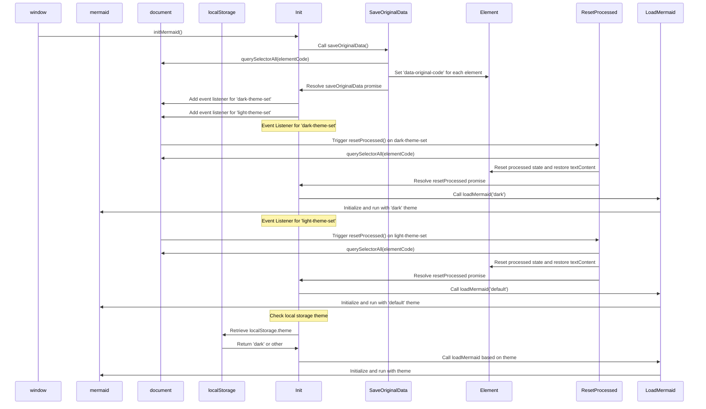

# Byta tema för sjöjungfru

<!--category-- Mermaid, Markdown, Javascript -->
<datetime class="hidden">Förbehåll IIIA-PT-38</datetime>

## Inledning

Jag använder Mermaid.js för att skapa knarkdiagram du ser i några inlägg. Som den där nere.
Men något som irriterade mig är att det inte var reaktivt att byta teman (mörk/ljus) och det verkade finnas mycket dålig information ute om att uppnå detta.

Detta är resultatet av några timmars grävande och försök att räkna ut hur man gör detta.

[TOC]

## Diagrammet



## Problemet

Problemet är att du måste initiera Mermaid att ställa in temat, och du kan inte ändra det efter det. HUR som helst om du vill återinitiera det på ett redan skapat diagram; det kan inte göra om diagrammet eftersom data inte lagras i DOM.

## Lösningen

Så efter MYCKET gräva och försöka räkna ut hur man gör detta, hittade jag en lösning i [detta GitHub nummer inlägg](https://github.com/mermaid-js/mermaid/issues/1945)

Men det hade fortfarande några problem, så jag var tvungen att ändra det lite för att få det att fungera.

### Teman

Denna webbplats är baserad på en Tailwind tema som kom med en ganska hemsk tema switcher.

Du kommer att se att detta gör olika saker runt att byta tema, ställa in temat för vad som lagras i lokal lagring, ändra ett par stilar för simplemde & highlight.js och sedan tillämpa temat.

```javascript
export  function globalSetup() {
    const lightStylesheet = document.getElementById('light-mode');
    const darkStylesheet = document.getElementById('dark-mode');
    const simpleMdeDarkStylesheet = document.getElementById('simplemde-dark');
    const simpleMdeLightStylesheet = document.getElementById('simplemde-light');
    return {
        isMobileMenuOpen: false,
        isDarkMode: false,
        // Function to initialize the theme based on localStorage or system preference
        themeInit() {
            if (
                localStorage.theme === "dark" ||
                (!("theme" in localStorage) &&
                    window.matchMedia("(prefers-color-scheme: dark)").matches)
            ) {
                localStorage.theme = "dark";
                document.documentElement.classList.add("dark");
                document.documentElement.classList.remove("light");
                this.isDarkMode = true;
              
                this.applyTheme(); // Apply dark theme stylesheets
            } else {
                localStorage.theme = "base";
                document.documentElement.classList.remove("dark");
                document.documentElement.classList.add("light");
                this.isDarkMode = false;
                this.applyTheme(); // Apply light theme stylesheets
            }
        },

        // Function to switch the theme and update the stylesheets accordingly
        themeSwitch() {
            if (localStorage.theme === "dark") {
                localStorage.theme = "light";
                document.body.dispatchEvent(new CustomEvent('light-theme-set'));
                document.documentElement.classList.remove("dark");
                document.documentElement.classList.add("light");
                this.isDarkMode = false;
            } else {
                localStorage.theme = "dark";
                document.body.dispatchEvent(new CustomEvent('dark-theme-set'));
                document.documentElement.classList.add("dark");
                document.documentElement.classList.remove("light");
                this.isDarkMode = true;
            }
            this.applyTheme(); // Apply the theme stylesheets after switching
        },

        // Function to apply the appropriate stylesheets based on isDarkMode
        applyTheme() {
         
            if (this.isDarkMode) {
                // Enable dark mode stylesheets
                lightStylesheet.disabled = true;
                darkStylesheet.disabled = false;
                simpleMdeLightStylesheet.disabled = true;
                simpleMdeDarkStylesheet.disabled = false;
            } else {
                // Enable light mode stylesheets
                lightStylesheet.disabled = false;
                darkStylesheet.disabled = true;
                simpleMdeLightStylesheet.disabled = false;
                simpleMdeDarkStylesheet.disabled = true;
            }
        }
    };
}
```

## Ställ in

De viktigaste tilläggen för Mermaid tema switcher är följande:

```javascript
  document.body.dispatchEvent(new CustomEvent('dark-theme-set'));
    document.body.dispatchEvent(new CustomEvent('light-theme-set'));
```

Dessa två händelser används i vår ThemeSwitcher komponent för att återinitiera Mermaid diagram.

### OnLoad/htmx:efter Swap

I min `main.js` fil Jag ställer in temaomkopplaren. Jag importerar också `mdeswitch` fil som innehåller koden för att byta teman.

```javascript
import "./mdeswitch";
addEventListener("DOMContentLoaded", () => {
    window.initMermaid();
});
addEventListener('htmx:afterSwap', function(evt) {
    window.initMermaid();
});
```

## MDESwtich Ordförande

Detta är filen som innehåller koden för att byta teman för Mermaid.
(De fruktansvärda [diagram ovan](#the-diagram) visar sekvensen av händelser som inträffar när temat ändras)

```javascript
(function(window){
    'use strict'

    const elementCode = 'div.mermaid'
    const loadMermaid = function(theme) {
        window.mermaid.initialize({theme})
        window.mermaid.run()
    }
    const saveOriginalData = function(){
        return new Promise((resolve, reject) => {
            try {
                var els = document.querySelectorAll(elementCode),
                    count = els.length;
                if(!els || count ===0 ) resolve ();
                els.forEach(element => {
                    element.setAttribute('data-original-code',encodeURIComponent( element.textContent));
                    count--
                    if(count == 0){
                        resolve()
                    }
                });
            } catch (error) {
                reject(error)
            }
        })
    }
    const resetProcessed = function(){
        return new Promise((resolve, reject) => {
            try {
                var els = document.querySelectorAll(elementCode),
                    count = els.length;
                if(!els || count ===0 ) resolve ();
                els.forEach(element => {
                    if(element.getAttribute('data-original-code') != null){
                        element.removeAttribute('data-processed')
                        element.textContent =decodeURIComponent( element.getAttribute('data-original-code'));
                    }
                    count--
                    if(count == 0){
                        resolve()
                    }
                });
            } catch (error) {
                reject(error)
            }
        })
    }

    const init = ()=>{

        saveOriginalData()
            .catch( console.error )
        document.body.addEventListener('dark-theme-set', ()=>{
            resetProcessed()
                .then(() =>{
                    loadMermaid('dark');
                    console.log("dark theme set")})
                .catch(console.error)
        })
        document.body.addEventListener('light-theme-set', ()=>{
            resetProcessed()
                .then(() =>{
                    loadMermaid('default');
                    console.log("dark theme set")})
                .catch(console.error)
        })
        let isDarkMode = localStorage.theme === 'dark';
        if(isDarkMode) {
            loadMermaid('dark');
        }
        else{
            loadMermaid('default')
        }

    }
    window.initMermaid = init
})(window);
```

Går ner till toppen här.

1. `init` - funktionen är huvudfunktionen som kallas när sidan laddas.

Det sparar först det ursprungliga innehållet i Mermaid diagram; Detta var ett problem i den version jag kopierade det från, de använde "innerHTML" som inte fungerade för mig som vissa diagram förlitar sig på nya linjer som att remsor.

Det lägger sedan till två evenemang lyssnare för `dark-theme-set` och `light-theme-set` händelser. När dessa händelser avfyras återställs den bearbetade datan och återinitierar sedan Mermaid-diagrammet med det nya temat.

Det kontrollerar sedan den lokala lagringen för temat och initierar Mermaid diagram med lämplig tema.

```javascript
let isDarkMode = localStorage.theme === 'dark';
        if(isDarkMode) {
            loadMermaid('dark');
         }
         else{
             loadMermaid('default')
         }
```

### Spara originaldata

Nyckeln till hela denna sak är att lagra sedan återställa innehållet i den renderade `<div class="mermaid"><div>` som innehåller sjöjungfrun markup från våra poster.

Du kommer att se detta bara sätter upp ett löfte som slingor genom alla element och lagrar det ursprungliga innehållet i en `data-original-code` Egenskap.

```javascript
    const saveOriginalData = function(){
        return new Promise((resolve, reject) => {
            try {
                var els = document.querySelectorAll(elementCode),
                    count = els.length;
                if(!els || count ===0 ) resolve ();
                els.forEach(element => {
                    element.setAttribute('data-original-code',encodeURIComponent(element.textContent))
                    count--
                    if(count == 0){
                        resolve()
                    }
                });
            } catch (error) {
                reject(error)
            }
        })
    }
```

`resetProcessed` är samma utom i omvänd riktning där det tar pålägg från `data-original-code` attribut och ställer tillbaka det till elementet.
Lägg också märke till det `encodeURIComponent` Värdet av att vissa strängar inte lagrades korrekt.

### Påbörjad

Nu har vi alla dessa data vi kan återinitiera sjöjungfru för att tillämpa vårt nya tema och rendera SVG diagrammet i vår HTML-utgång.

```javascript
 const loadMermaid = function(theme) {
        window.mermaid.initialize({theme})
        window.mermaid.run()
    }
```

## Slutsatser

Det här var lite jobbigt att lista ut, men jag är glad att jag gjorde det. Jag hoppas att detta hjälper någon annan som försöker göra samma sak.