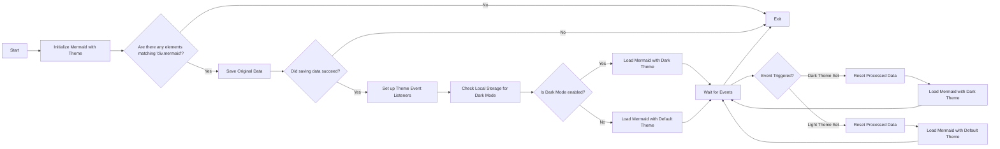

# Перемикання тем для Mer покоївки (Updided)

<!--category-- Mermaid, Markdown, Javascript -->
<datetime class="hidden">2024- 08- 29T05: 00</datetime>

## Вступ

Я використовую Mer покоївку.js, щоб створити схеми наркотиків, які ви бачите в декількох повідомленнях. Як та, що знизу.
Проте мене дратувало те, що це не було реагуючим до перемикання тем (темно/світло) і здавалося, що там була дуже погана інформація про це.

Це результат кількох годин копання і спроби з'ясувати, як це зробити.

Тут ви можете знайти джерело для mdeswitcher:
[mdeswizer.js](https://github.com/scottgal/mostlylucidweb/blob/main/Mostlylucid/src/js/mdeswitch.js).

**<span style="color:green"> ЩО МОЖНА ЗРОБИТИ.</span>**

[TOC]

## Діаграма



## Проблема

Проблема в тому, що вам потрібно ініціалізувати Mer покоївку, щоб встановити тему, і ви не можете її після цього змінити. ЯК ЖЕ, якщо ви хочете відновити її на вже створеній діаграмі, вона не зможе повторити діаграму, оскільки дані не зберігаються в DOM.

## Розв'язання

Тож після того, як я багато копав і намагався зрозуміти, як це зробити, я знайшов рішення в [повідомлення про випуск цього випуску GitHub](https://github.com/mermaid-js/mermaid/issues/1945)

Як би там не було, у мене все ще було кілька проблем, тож мені потрібно було трохи змінити їх, щоб вони працювали.

### Теми

Цей сайт засновано на темі Tailwind, яка постачається досить жахливим перемикачем тем.

Ви побачите, що це виконує різноманітні функції навколо перемикання теми, встановлення теми для того, що зберігається у локальному сховищі, зміни декількох стилів для простого підсвічування і підсвічування.js, а потім застосування теми.

```javascript
export  function globalSetup() {
    const lightStylesheet = document.getElementById('light-mode');
    const darkStylesheet = document.getElementById('dark-mode');
    const simpleMdeDarkStylesheet = document.getElementById('simplemde-dark');
    const simpleMdeLightStylesheet = document.getElementById('simplemde-light');
    return {
        isMobileMenuOpen: false,
        isDarkMode: false,
        // Function to initialize the theme based on localStorage or system preference
        themeInit() {
            if (
                localStorage.theme === "dark" ||
                (!("theme" in localStorage) &&
                    window.matchMedia("(prefers-color-scheme: dark)").matches)
            ) {
                localStorage.theme = "dark";
                document.documentElement.classList.add("dark");
                document.documentElement.classList.remove("light");
                this.isDarkMode = true;
              
                this.applyTheme(); // Apply dark theme stylesheets
            } else {
                localStorage.theme = "base";
                document.documentElement.classList.remove("dark");
                document.documentElement.classList.add("light");
                this.isDarkMode = false;
                this.applyTheme(); // Apply light theme stylesheets
            }
        },

        // Function to switch the theme and update the stylesheets accordingly
        themeSwitch() {
            if (localStorage.theme === "dark") {
                localStorage.theme = "light";
                document.body.dispatchEvent(new CustomEvent('light-theme-set'));
                document.documentElement.classList.remove("dark");
                document.documentElement.classList.add("light");
                this.isDarkMode = false;
            } else {
                localStorage.theme = "dark";
                document.body.dispatchEvent(new CustomEvent('dark-theme-set'));
                document.documentElement.classList.add("dark");
                document.documentElement.classList.remove("light");
                this.isDarkMode = true;
            }
            this.applyTheme(); // Apply the theme stylesheets after switching
        },

        // Function to apply the appropriate stylesheets based on isDarkMode
        applyTheme() {
         
            if (this.isDarkMode) {
                // Enable dark mode stylesheets
                lightStylesheet.disabled = true;
                darkStylesheet.disabled = false;
                simpleMdeLightStylesheet.disabled = true;
                simpleMdeDarkStylesheet.disabled = false;
            } else {
                // Enable light mode stylesheets
                lightStylesheet.disabled = false;
                darkStylesheet.disabled = true;
                simpleMdeLightStylesheet.disabled = false;
                simpleMdeDarkStylesheet.disabled = true;
            }
        }
    };
}
```

## Налаштування

Основними додатками перемикача теми Mercanow є такі:

```javascript
  document.body.dispatchEvent(new CustomEvent('dark-theme-set'));
    document.body.dispatchEvent(new CustomEvent('light-theme-set'));
```

Ці дві події використовуються у нашому компоненті "ThemeSwitcher" для відновлення діаграм Мерпокоївки.

### OnLoad / htmx: afterSwap

В моєму `main.js` файл, який я налаштую перемикач тем. Я також імпортую `mdeswitch` файл, у якому міститься код перемикання тем.

```javascript
//Important: Memraid will ALWAYS intialize on window.onload, so we need to make sure we disable this behaviour:
import mermaid from "mermaid";

window.mermaid=mermaid;
mermaid.initialize({startOnLoad:false});

window.mermaidinit = function() {
    mermaid.initialize({ startOnLoad: false });
    try {
        window.initMermaid().then(r => console.log('Mermaid initialized'));
    } catch (e) {
        console.error('Failed to initialize Mermaid:', e);
    }

}

document.body.addEventListener('htmx:afterSwap', function(evt) {
    mermaidinit();
    //This should be called after the mermaid diagrams have been rendered.
    hljs.highlightAll();
});

window.onload = function(ev) {
    if(document.readyState === 'complete') {
        mermaidinit();
        hljs.highlightAll();
    }
};
```

## MDESwich

Це файл, у якому міститься код для перемикання тем для Mer покоївки.
(The dreaking) [діаграма вище](#the-diagram) показує послідовність подій, які відбуваються під час перемикання теми)

```javascript
(function(window) {
    'use strict';

    const elementCode = 'div.mermaid';

    const loadMermaid = async (theme) => {

        mermaid.initialize({startOnLoad: false, theme: theme });
        console.log("Loading mermaid with theme:", theme);
        await mermaid.run({
            querySelector: elementCode,
        });
    };

    const saveOriginalData = async () => {
        try {
            console.log("Saving original data");
            const elements = document.querySelectorAll(elementCode);
            const count = elements.length;

            if (count === 0) return;

            const promises = Array.from(elements).map((element) => {
                if (element.getAttribute('data-processed') != null) {
                    console.log("Element already processed");
                    return;
                }
                element.setAttribute('data-original-code', element.innerHTML);
            });

            await Promise.all(promises);
        } catch (error) {
            console.error(error);
            throw error;
        }
    };

    const resetProcessed = async () => {
        try {
            console.log("Resetting processed data");
            const elements = document.querySelectorAll(elementCode);
            const count = elements.length;

            if (count === 0) return;

            const promises = Array.from(elements).map((element) => {
                if (element.getAttribute('data-original-code') != null) {
                    element.removeAttribute('data-processed');
                    element.innerHTML = element.getAttribute('data-original-code');
                }
                else {
                    console.log("Element already reset");
                }
            });

            await Promise.all(promises);
        } catch (error) {
            console.error(error);
            throw error;
        }
    };

    window.initMermaid = async () => {
        const mermaidElements = document.querySelectorAll(elementCode);
        if (mermaidElements.length === 0) return;

        try {
            await saveOriginalData();
        } catch (error) {
            console.error("Error saving original data:", error);
            return; // Early exit if saveOriginalData fails
        }

        const handleDarkThemeSet = async () => {
            try {
                await resetProcessed();
                await loadMermaid('dark');
                console.log("Dark theme set");
            } catch (error) {
                console.error("Error during dark theme set:", error);
            }
        };

        const handleLightThemeSet = async () => {
            try {
                await resetProcessed();
                await loadMermaid('default');
                console.log("Light theme set");
            } catch (error) {
                console.error("Error during light theme set:", error);
            }
        };
        document.body.removeEventListener('dark-theme-set', handleDarkThemeSet);
        document.body.removeEventListener('light-theme-set', handleLightThemeSet);
        document.body.addEventListener('dark-theme-set', handleDarkThemeSet);
        document.body.addEventListener('light-theme-set', handleLightThemeSet);

        const isDarkMode = localStorage.theme === 'dark';
        await loadMermaid(isDarkMode ? 'dark' : 'default').then(r => console.log('Initial load complete'));


    };

})(window);
```

Йдучи трохи знизу сюди.

1. `init` - функція є основною функцією, яка викликається під час завантаження сторінки.

Спочатку він зберігає оригінальний зміст діаграм Мернір; це була проблема у версії, з якої я переписав її, вони використовували "природну HTML," яка не спрацювала для мене, як деякі діаграми покладаються на нові лінії, з яких вона складається.

Тоді вона додає дві події для слухачів `dark-theme-set` і `light-theme-set` події. Коли ці події буде звільнено, програма відновить оброблені дані, а потім відновить діаграму Мерпокої на нову тему.

Потім він перевіряє місцеве зберігання цієї теми і започатковує діаграми " Мернір " відповідною темою.

```javascript
let isDarkMode = localStorage.theme === 'dark';
        if(isDarkMode) {
            loadMermaid('dark');
         }
         else{
             loadMermaid('default')
         }
```

### Зберегти початкові дані

Ключем до всього цього є збереження, а потім відновлення вмісту, що міститься у відтворенні `<div class="mermaid"><div>` де є розмітка русалки з наших постів.

Ви побачите, що це просто встановлює обіцянку, яка проходить через всі елементи і зберігає оригінальний зміст в `data-original-code` атрибут.

```javascript
    const saveOriginalData = async () => {
    try {
        console.log("Saving original data");
        const elements = document.querySelectorAll(elementCode);
        const count = elements.length;

        if (count === 0) return;

        const promises = Array.from(elements).map((element) => {
            if (element.getAttribute('data-processed') != null) {
                console.log("Element already processed");
                return;
            }
            element.setAttribute('data-original-code', element.innerHTML);
        });

        await Promise.all(promises);
    } catch (error) {
        console.error(error);
        throw error;
    }
};
```

`resetProcessed` те саме, хіба що навпаки, де він забирає розмітку з `data-original-code` атрибут і повертає його елементу.

### Ініціалізація

Тепер ми маємо всі ці дані, ми можемо відновити покоївку, щоб застосувати нашу нову тему і переробити діаграму SVG до нашого виводу HTML.

```javascript
    const elementCode = 'div.mermaid';

const loadMermaid = async (theme) => {

    mermaid.initialize({startOnLoad: false, theme: theme });
    console.log("Loading mermaid with theme:", theme);
    await mermaid.run({
        querySelector: elementCode,
    });
};
```

## Включення

Было немного больно разобраться, но я рада, что сделала это. Надеюсь, это поможет кому-то еще, кто пытается сделать то же самое.