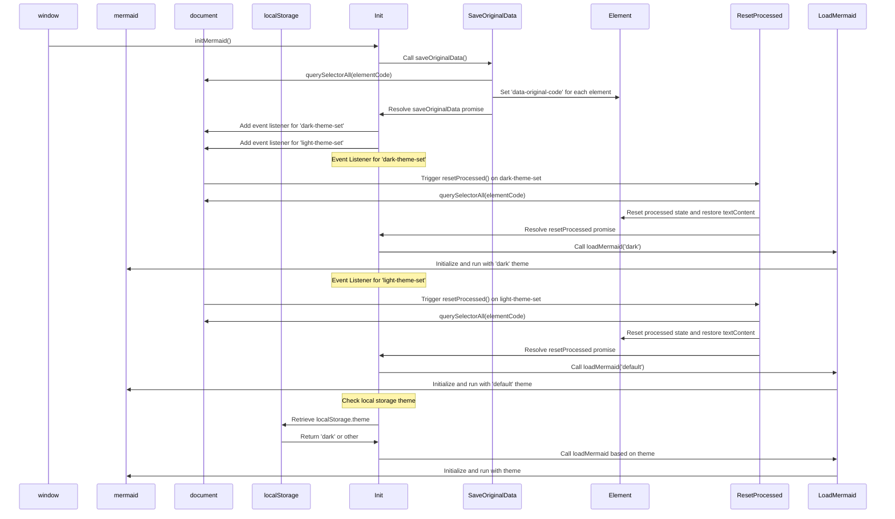

# 为美人鱼切换主题

<!--category-- Mermaid, Markdown, Javascript -->
<datetime class="hidden">2024-008-26T20:36</datetime>

## 一. 导言 导言 导言 导言 导言 导言 一,导言 导言 导言 导言 导言 导言

我用美人鱼.js 来制作你从几篇文章中看到的涂料图。 就像下面那个
但令我不快的是, 改变主题(黑暗/光明)并非被动反应, 并且对于实现这一点似乎知之甚少。

这是数小时挖掘的结果, 并试图找出如何做到这一点。

**<span style="color:red"> 注:这不可靠。 我还在想为什么</span>**

[技选委

## 图表图



## 问题

问题是,你需要初始化美人鱼 来设定主题, 在那之后你不能改变它。 如果您想要在已经创建的图表上重新重新重新重新激活它, 它无法重做该图表, 因为数据没有存储在 DOM 中 。

## 解决方案

因此,在进行大量挖掘并试图找出如何做到这一点之后,我找到了一个解决方案, [这个GitHub发行站](https://github.com/mermaid-js/mermaid/issues/1945)

然而,它仍有几个问题,所以我不得不修改一下,使之发挥作用。

### 主题主题

这个网站基于一个尾风主题, 这个主题有一个非常可怕的主题切换器。

您会看到, 这是围绕主题转换的不同内容, 设置本地存储存储内容的主题, 改变一些简单的样式和亮点, 然后应用主题 。

```javascript
export  function globalSetup() {
    const lightStylesheet = document.getElementById('light-mode');
    const darkStylesheet = document.getElementById('dark-mode');
    const simpleMdeDarkStylesheet = document.getElementById('simplemde-dark');
    const simpleMdeLightStylesheet = document.getElementById('simplemde-light');
    return {
        isMobileMenuOpen: false,
        isDarkMode: false,
        // Function to initialize the theme based on localStorage or system preference
        themeInit() {
            if (
                localStorage.theme === "dark" ||
                (!("theme" in localStorage) &&
                    window.matchMedia("(prefers-color-scheme: dark)").matches)
            ) {
                localStorage.theme = "dark";
                document.documentElement.classList.add("dark");
                document.documentElement.classList.remove("light");
                this.isDarkMode = true;
              
                this.applyTheme(); // Apply dark theme stylesheets
            } else {
                localStorage.theme = "base";
                document.documentElement.classList.remove("dark");
                document.documentElement.classList.add("light");
                this.isDarkMode = false;
                this.applyTheme(); // Apply light theme stylesheets
            }
        },

        // Function to switch the theme and update the stylesheets accordingly
        themeSwitch() {
            if (localStorage.theme === "dark") {
                localStorage.theme = "light";
                document.body.dispatchEvent(new CustomEvent('light-theme-set'));
                document.documentElement.classList.remove("dark");
                document.documentElement.classList.add("light");
                this.isDarkMode = false;
            } else {
                localStorage.theme = "dark";
                document.body.dispatchEvent(new CustomEvent('dark-theme-set'));
                document.documentElement.classList.add("dark");
                document.documentElement.classList.remove("light");
                this.isDarkMode = true;
            }
            this.applyTheme(); // Apply the theme stylesheets after switching
        },

        // Function to apply the appropriate stylesheets based on isDarkMode
        applyTheme() {
         
            if (this.isDarkMode) {
                // Enable dark mode stylesheets
                lightStylesheet.disabled = true;
                darkStylesheet.disabled = false;
                simpleMdeLightStylesheet.disabled = true;
                simpleMdeDarkStylesheet.disabled = false;
            } else {
                // Enable light mode stylesheets
                lightStylesheet.disabled = false;
                darkStylesheet.disabled = true;
                simpleMdeLightStylesheet.disabled = false;
                simpleMdeDarkStylesheet.disabled = true;
            }
        }
    };
}
```

## 设置设置设置设置设置设置设置

美人鱼主题交换器的主要增添如下:

```javascript
  document.body.dispatchEvent(new CustomEvent('dark-theme-set'));
    document.body.dispatchEvent(new CustomEvent('light-theme-set'));
```

利用这两个事件来重新激活美人鱼图

### 在Load/ htmx: 后Swap

在我的 `main.js` 文件 我设置了主题切换器 。 我也进口 `mdeswitch` 文件包含切换主题的代码。

```javascript
import "./mdeswitch";
addEventListener("DOMContentLoaded", () => {
    window.initMermaid();
});
addEventListener('htmx:afterSwap', function(evt) {
    window.initMermaid();
});
```

## 社会发展部

这是包含转换美人鱼主题代码的代码的文件 。
(恐怖的 [上图图](#the-diagram) 显示主题被切换时发生事件的序列)

```javascript
(function(window){
    'use strict'

    const elementCode = 'div.mermaid'
    const loadMermaid = function(theme) {
        window.mermaid.initialize({theme})
        window.mermaid.run()
    }
    const saveOriginalData = function(){
        return new Promise((resolve, reject) => {
            try {
                var els = document.querySelectorAll(elementCode),
                    count = els.length;
                if(!els || count ===0 ) resolve ();
                els.forEach(element => {
                    element.setAttribute('data-original-code',encodeURIComponent( element.textContent));
                    count--
                    if(count == 0){
                        resolve()
                    }
                });
            } catch (error) {
                reject(error)
            }
        })
    }
    const resetProcessed = function(){
        return new Promise((resolve, reject) => {
            try {
                var els = document.querySelectorAll(elementCode),
                    count = els.length;
                if(!els || count ===0 ) resolve ();
                els.forEach(element => {
                    if(element.getAttribute('data-original-code') != null){
                        element.removeAttribute('data-processed')
                        element.textContent =decodeURIComponent( element.getAttribute('data-original-code'));
                    }
                    count--
                    if(count == 0){
                        resolve()
                    }
                });
            } catch (error) {
                reject(error)
            }
        })
    }

    const init = ()=>{

        saveOriginalData()
            .catch( console.error )
        document.body.addEventListener('dark-theme-set', ()=>{
            resetProcessed()
                .then(() =>{
                    loadMermaid('dark');
                    console.log("dark theme set")})
                .catch(console.error)
        })
        document.body.addEventListener('light-theme-set', ()=>{
            resetProcessed()
                .then(() =>{
                    loadMermaid('default');
                    console.log("dark theme set")})
                .catch(console.error)
        })
        let isDarkMode = localStorage.theme === 'dark';
        if(isDarkMode) {
            loadMermaid('dark');
        }
        else{
            loadMermaid('default')
        }

    }
    window.initMermaid = init
})(window);
```

有点下到这里的顶部。

1. `init` - 函数是装入页面时被调用的主要函数。

它首先保存了美人鱼图表的原始内容; 在我复制的版本中,这是个问题, 他们使用了“内置HTML”, 对我没用, 因为有些图表依赖那些条纹的新线。

然后,《古兰经》又增加两个倾听者。 `dark-theme-set` 和 `light-theme-set` 活动。 当发生这些事件时,它会重置经过处理的数据,然后用新主题重新激活美人鱼图。

然后它检查主题的本地存储,并用适当的主题初始化美人鱼图。

```javascript
let isDarkMode = localStorage.theme === 'dark';
        if(isDarkMode) {
            loadMermaid('dark');
         }
         else{
             loadMermaid('default')
         }
```

### 保存原始数据

这整个事情的关键是 储存 然后恢复 内容包含在翻譯 `<div class="mermaid"><div>` 里面装着我们岗位上的美人鱼标记

你会看到,这只是建立了一个承诺 环绕所有元素 并存储原始内容在 `data-original-code` 属性。

```javascript
    const saveOriginalData = function(){
        return new Promise((resolve, reject) => {
            try {
                var els = document.querySelectorAll(elementCode),
                    count = els.length;
                if(!els || count ===0 ) resolve ();
                els.forEach(element => {
                    element.setAttribute('data-original-code',encodeURIComponent(element.textContent))
                    count--
                    if(count == 0){
                        resolve()
                    }
                });
            } catch (error) {
                reject(error)
            }
        })
    }
```

`resetProcessed` 是相同的,但反向则不在此列。 `data-original-code` 并将其属性设置为元素。
也注意到它 `encodeURIComponent` 我冒出一些字符串没有被正确存储的值 。

### 开进

现在我们有了所有这些数据 我们可以重新激活美人鱼 来应用我们的新主题 并将SVG图重新输入到我们的 HTML 输出中。

```javascript
 const loadMermaid = function(theme) {
        window.mermaid.initialize({theme})
        window.mermaid.run()
    }
```

## 在结论结论中

很难弄明白 但我很高兴我做到了 我希望这能帮助那些 试图做同样事情的人。