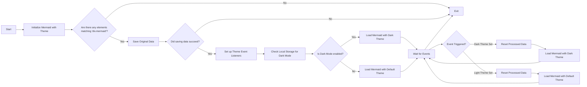

# 切换美人鱼主题( 更新)

<!--category-- Mermaid, Markdown, Javascript -->
<datetime class="hidden">2024-008-29-05:00</datetime>

## 一. 导言 导言 导言 导言 导言 导言 一,导言 导言 导言 导言 导言 导言

我用美人鱼.js 来制作你从几篇文章中看到的涂料图。 就像下面那个
但令我不快的是, 改变主题(黑暗/光明)并非被动反应, 并且对于实现这一点似乎知之甚少。

这是数小时挖掘的结果, 并试图找出如何做到这一点。

您可以在此找到开发者的来源 :
[mdesgerer.js.js](https://github.com/scottgal/mostlylucidweb/blob/main/Mostlylucid/src/js/mdeswitch.js).

**<span style="color:green"> 注:我已对此作了重大更新。</span>**

[技选委

## 图表图



## 问题

问题是,你需要初始化美人鱼 来设定主题, 在那之后你不能改变它。 如果您想要在已经创建的图表上重新重新重新重新激活它, 它无法重做该图表, 因为数据没有存储在 DOM 中 。

## 解决方案

因此,在进行大量挖掘并试图找出如何做到这一点之后,我找到了一个解决方案, [这个GitHub发行站](https://github.com/mermaid-js/mermaid/issues/1945)

然而,它仍有几个问题,所以我不得不修改一下,使之发挥作用。

### 主题主题

这个网站基于一个尾风主题, 这个主题有一个非常可怕的主题切换器。

您会看到, 这是围绕主题转换的不同内容, 设置本地存储存储内容的主题, 改变一些简单的样式和亮点, 然后应用主题 。

```javascript
export  function globalSetup() {
    const lightStylesheet = document.getElementById('light-mode');
    const darkStylesheet = document.getElementById('dark-mode');
    const simpleMdeDarkStylesheet = document.getElementById('simplemde-dark');
    const simpleMdeLightStylesheet = document.getElementById('simplemde-light');
    return {
        isMobileMenuOpen: false,
        isDarkMode: false,
        // Function to initialize the theme based on localStorage or system preference
        themeInit() {
            if (
                localStorage.theme === "dark" ||
                (!("theme" in localStorage) &&
                    window.matchMedia("(prefers-color-scheme: dark)").matches)
            ) {
                localStorage.theme = "dark";
                document.documentElement.classList.add("dark");
                document.documentElement.classList.remove("light");
                this.isDarkMode = true;
              
                this.applyTheme(); // Apply dark theme stylesheets
            } else {
                localStorage.theme = "base";
                document.documentElement.classList.remove("dark");
                document.documentElement.classList.add("light");
                this.isDarkMode = false;
                this.applyTheme(); // Apply light theme stylesheets
            }
        },

        // Function to switch the theme and update the stylesheets accordingly
        themeSwitch() {
            if (localStorage.theme === "dark") {
                localStorage.theme = "light";
                document.body.dispatchEvent(new CustomEvent('light-theme-set'));
                document.documentElement.classList.remove("dark");
                document.documentElement.classList.add("light");
                this.isDarkMode = false;
            } else {
                localStorage.theme = "dark";
                document.body.dispatchEvent(new CustomEvent('dark-theme-set'));
                document.documentElement.classList.add("dark");
                document.documentElement.classList.remove("light");
                this.isDarkMode = true;
            }
            this.applyTheme(); // Apply the theme stylesheets after switching
        },

        // Function to apply the appropriate stylesheets based on isDarkMode
        applyTheme() {
         
            if (this.isDarkMode) {
                // Enable dark mode stylesheets
                lightStylesheet.disabled = true;
                darkStylesheet.disabled = false;
                simpleMdeLightStylesheet.disabled = true;
                simpleMdeDarkStylesheet.disabled = false;
            } else {
                // Enable light mode stylesheets
                lightStylesheet.disabled = false;
                darkStylesheet.disabled = true;
                simpleMdeLightStylesheet.disabled = false;
                simpleMdeDarkStylesheet.disabled = true;
            }
        }
    };
}
```

## 设置设置设置设置设置设置设置

美人鱼主题交换器的主要增添如下:

```javascript
  document.body.dispatchEvent(new CustomEvent('dark-theme-set'));
    document.body.dispatchEvent(new CustomEvent('light-theme-set'));
```

利用这两个事件来重新激活美人鱼图

### 在Load/ htmx: 后Swap

在我的 `main.js` 文件 我设置了主题切换器 。 我也进口 `mdeswitch` 文件包含切换主题的代码。

```javascript
//Important: Memraid will ALWAYS intialize on window.onload, so we need to make sure we disable this behaviour:
import mermaid from "mermaid";

window.mermaid=mermaid;
mermaid.initialize({startOnLoad:false});

window.mermaidinit = function() {
    mermaid.initialize({ startOnLoad: false });
    try {
        window.initMermaid().then(r => console.log('Mermaid initialized'));
    } catch (e) {
        console.error('Failed to initialize Mermaid:', e);
    }

}

document.body.addEventListener('htmx:afterSwap', function(evt) {
    mermaidinit();
    //This should be called after the mermaid diagrams have been rendered.
    hljs.highlightAll();
});

window.onload = function(ev) {
    if(document.readyState === 'complete') {
        mermaidinit();
        hljs.highlightAll();
    }
};
```

## 社会发展部

这是包含转换美人鱼主题代码的代码的文件 。
(恐怖的 [上图图](#the-diagram) 显示主题被切换时发生事件的序列)

```javascript
(function(window) {
    'use strict';

    const elementCode = 'div.mermaid';

    const loadMermaid = async (theme) => {

        mermaid.initialize({startOnLoad: false, theme: theme });
        console.log("Loading mermaid with theme:", theme);
        await mermaid.run({
            querySelector: elementCode,
        });
    };

    const saveOriginalData = async () => {
        try {
            console.log("Saving original data");
            const elements = document.querySelectorAll(elementCode);
            const count = elements.length;

            if (count === 0) return;

            const promises = Array.from(elements).map((element) => {
                if (element.getAttribute('data-processed') != null) {
                    console.log("Element already processed");
                    return;
                }
                element.setAttribute('data-original-code', element.innerHTML);
            });

            await Promise.all(promises);
        } catch (error) {
            console.error(error);
            throw error;
        }
    };

    const resetProcessed = async () => {
        try {
            console.log("Resetting processed data");
            const elements = document.querySelectorAll(elementCode);
            const count = elements.length;

            if (count === 0) return;

            const promises = Array.from(elements).map((element) => {
                if (element.getAttribute('data-original-code') != null) {
                    element.removeAttribute('data-processed');
                    element.innerHTML = element.getAttribute('data-original-code');
                }
                else {
                    console.log("Element already reset");
                }
            });

            await Promise.all(promises);
        } catch (error) {
            console.error(error);
            throw error;
        }
    };

    window.initMermaid = async () => {
        const mermaidElements = document.querySelectorAll(elementCode);
        if (mermaidElements.length === 0) return;

        try {
            await saveOriginalData();
        } catch (error) {
            console.error("Error saving original data:", error);
            return; // Early exit if saveOriginalData fails
        }

        const handleDarkThemeSet = async () => {
            try {
                await resetProcessed();
                await loadMermaid('dark');
                console.log("Dark theme set");
            } catch (error) {
                console.error("Error during dark theme set:", error);
            }
        };

        const handleLightThemeSet = async () => {
            try {
                await resetProcessed();
                await loadMermaid('default');
                console.log("Light theme set");
            } catch (error) {
                console.error("Error during light theme set:", error);
            }
        };
        document.body.removeEventListener('dark-theme-set', handleDarkThemeSet);
        document.body.removeEventListener('light-theme-set', handleLightThemeSet);
        document.body.addEventListener('dark-theme-set', handleDarkThemeSet);
        document.body.addEventListener('light-theme-set', handleLightThemeSet);

        const isDarkMode = localStorage.theme === 'dark';
        await loadMermaid(isDarkMode ? 'dark' : 'default').then(r => console.log('Initial load complete'));


    };

})(window);
```

有点下到这里的顶部。

1. `init` - 函数是装入页面时被调用的主要函数。

它首先保存了美人鱼图表的原始内容; 在我复制的版本中,这是个问题, 他们使用了“内置HTML”, 对我没用, 因为有些图表依赖那些条纹的新线。

然后,《古兰经》又增加两个倾听者。 `dark-theme-set` 和 `light-theme-set` 活动。 当发生这些事件时,它会重置经过处理的数据,然后用新主题重新激活美人鱼图。

然后它检查主题的本地存储,并用适当的主题初始化美人鱼图。

```javascript
let isDarkMode = localStorage.theme === 'dark';
        if(isDarkMode) {
            loadMermaid('dark');
         }
         else{
             loadMermaid('default')
         }
```

### 保存原始数据

这整个事情的关键是 储存 然后恢复 内容包含在翻譯 `<div class="mermaid"><div>` 里面装着我们岗位上的美人鱼标记

你会看到,这只是建立了一个承诺 环绕所有元素 并存储原始内容在 `data-original-code` 属性。

```javascript
    const saveOriginalData = async () => {
    try {
        console.log("Saving original data");
        const elements = document.querySelectorAll(elementCode);
        const count = elements.length;

        if (count === 0) return;

        const promises = Array.from(elements).map((element) => {
            if (element.getAttribute('data-processed') != null) {
                console.log("Element already processed");
                return;
            }
            element.setAttribute('data-original-code', element.innerHTML);
        });

        await Promise.all(promises);
    } catch (error) {
        console.error(error);
        throw error;
    }
};
```

`resetProcessed` 是相同的,但反向则不在此列。 `data-original-code` 并将其属性设置为元素。

### 开进

现在我们有了所有这些数据 我们可以重新激活美人鱼 来应用我们的新主题 并将SVG图重新输入到我们的 HTML 输出中。

```javascript
    const elementCode = 'div.mermaid';

const loadMermaid = async (theme) => {

    mermaid.initialize({startOnLoad: false, theme: theme });
    console.log("Loading mermaid with theme:", theme);
    await mermaid.run({
        querySelector: elementCode,
    });
};
```

## 在结论结论中

很难弄明白 但我很高兴我做到了 我希望这能帮助那些 试图做同样事情的人。