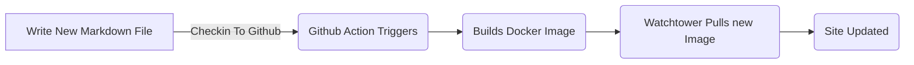

# Markdownin käyttäminen bloggaamiseen

<!--category-- ASP.NET, Markdown -->
<datetime class="hidden">2024-08-02T17:00</datetime>

## Johdanto

Markdown on kevyt merkintäkieli, jolla voit lisätä tekstidokumentteihin muotoiluelementtejä. John Gruberin vuonna 2004 perustama Markdown on nyt yksi maailman suosituimmista markkakielistä.

Tällä sivustolla käytän erittäin yksinkertaista lähestymistapaa bloggaamiseen, kun olen aiemmin yrittänyt ja epäonnistunut blogin ylläpitämisessä, halusin tehdä viestien kirjoittamisen ja julkaisemisen mahdollisimman helpoksi. Käytän markownin kirjoittaakseni viestini ja tällä sivustolla on yksi palvelu, jossa käytetään [Markdig](https://github.com/xoofx/markdig) Muuntaa markown HTML:ksi.

[TÄYTÄNTÖÖNPANO

## Miksei Static Site -generaattoria?

Sanalla sanoen yksinkertaisuus. Tästä ei tule huipputason liikennesivustoa, käytän ASP.NET OutPutCachea sivujen välimuistiin enkä päivitä sitä kovin usein. Halusin pitää työmaan mahdollisimman yksinkertaisena, eikä sen tarvitse huolehtia staattisen työmaageneraattorin ylimenoista sekä rakennusprosessin että työmaan monimutkaisuuden kannalta.

Selvyyden vuoksi: staattiset generaattorit kuten [Hugo](https://gohugo.io/) / [Jekyll](https://jekyllrb.com/) jne. voi olla hyvä ratkaisu monille sivustoille, mutta tälle halusin pitää sen niin yksinkertaisena *Minulle* mahdollisuuksien mukaan. Olen 25-vuotias ASP.NET-veteraani, joten ymmärrä se läpikotaisin. Tämä sivuston suunnittelu lisää monimutkaisuutta; minulla on näkemyksiä, palveluita, ohjaimia ja paljon manuaalista HTML & CSS:ää, mutta olen tyytyväinen siihen.

## Miksei tietokantaa?

1. Suunnittelun yksinkertaisuus; Tietokannat ovat tehokkaita tietojen tallennusjärjestelmiä (ja lisään yhden kommentoitavaksi lähiaikoina), mutta ne lisäävät myös monimutkaisuutta. Myöhemmille *oikein* käytä tietokantoja erityisesti ASP.NET-sovelluksessa, johon lisäät paljon koodia, riippumatta siitä, käytätkö sitä [EF-ydin](https://learn.microsoft.com/en-us/ef/core/), [Dopper](https://github.com/DapperLib/Dapper) tai raaka SQL ADO.NETillä. Halusin pitää sivuston mahdollisimman yksinkertaisena *alkuun*.
2. Päivityksen ja käyttöönoton helppous. Sivuston on tarkoitus osoittaa, kuinka yksinkertaista Docker & Docker Composite -sivuston käyttö voi olla. Voin päivittää sivuston tarkistamalla uuden koodin (sisältäen sisällön) GitHubille, joka toimii toimintona, rakentaa kuvan ja sitten Vartiotornin menetelmä docker compose -tiedostossani päivittää sivuston kuvan automaattisesti. Tämä on hyvin yksinkertainen tapa päivittää sivustoa, ja halusin pitää sen sellaisena.
3. Suoritan kaksoiskappaleita; koska minulla on ZERO-tietoja, jotka eivät kuulu docker-kuvaan, se tarkoittaa, että voin helposti ajaa tarkkoja kaksoiskappaleita paikallisesti (pienessä Ubuntu-rykelmässäni täällä kotona). Tämä on hyvä tapa testata muutoksia dockerilla (esim. [kun tein ImageSharp-muutoksia](/blog/imagesharpwithdocker) ) ennen niiden lähettämistä live-sivustolle.
4. Koska en halunnut! Halusin nähdä, miten pitkälle pystyin yksinkertaisella työmaasuunnittelulla, ja toistaiseksi olen siihen melko tyytyväinen.

## Miten kirjoitat viestisi?

Pudotan vain uuden Md-tiedoston Markdown-kansioon, ja sivusto poimii sen ja renderöi sen (kun muistan käyttää sen sisällönä, tämä varmistaa, että se on avattavissa ulostulotiedostoissa!)

Kun sitten kirjaudun GitHub-sivustolle, Toiminta kulkee ja sivustoa päivitetään. Yksinkertaista!




## Miten kuviin lisätään kuvia?

Koska lisäsin kuvan juuri tähän, näytän, miten tein sen. Lisäsin kuvan vain www-root- ja articleimages-kansioon ja viittasin siihen markdown-tiedostossa näin:

```markdown

```

Sitten lisään Markdig-putkeeni laajennuksen, joka kirjoittaa nämä oikeaksi URL-osoitteeksi (kaikki yksinkertaisuudesta). [Katso laajennuksen lähdekoodi täältä.](https://github.com/scottgal/mostlylucidweb/blob/main/Mostlylucid/MarkDigExtensions/ImgExtension.cs)

```csharp
using Markdig;
using Markdig.Renderers;
using Markdig.Syntax;
using Markdig.Syntax.Inlines;

namespace Mostlylucid.MarkDigExtensions;

public class ImgExtension : IMarkdownExtension
{
    public void Setup(MarkdownPipelineBuilder pipeline)
    {
        pipeline.DocumentProcessed += ChangeImgPath;
    }

    public void Setup(MarkdownPipeline pipeline, IMarkdownRenderer renderer)
    {
    }

    public void ChangeImgPath(MarkdownDocument document)
    {
        foreach (var link in document.Descendants<LinkInline>())
            if (link.IsImage)
                link.Url = "/articleimages/" + link.Url;
    }
}
```

## Blogipalvelu.

BlogService on yksinkertainen palvelu, joka lukee markown-tiedostot Markdown-kansiosta ja muuntaa ne HTML:ksi Markdigin avulla.

Tämän lähde on kokonaisuudessaan alla ja [täällä](https://github.com/scottgal/mostlylucidweb/blob/main/Mostlylucid/Services/BlogService.cs).

<details>
<summary>Click to see the source code for the BlogService</summary>
```csharp

using System.Globalization;
using System.Text.RegularExpressions;
using Markdig;
using Microsoft.Extensions.Caching.Memory;
using Mostlylucid.MarkDigExtensions;
using Mostlylucid.Models.Blog;

namespace Mostlylucid.Services;

public class BlogService
{
private const string Path = "Markdown";
private const string CacheKey = "Categories";

    private static readonly Regex DateRegex = new(
        @"<datetime class=""hidden"">(\d{4}-\d{2}-\d{2}T\d{2}:\d{2})</datetime>",
        RegexOptions.Compiled | RegexOptions.IgnoreCase | RegexOptions.NonBacktracking);

    private static readonly Regex WordCoountRegex = new(@"\b\w+\b",
        RegexOptions.Compiled | RegexOptions.Multiline | RegexOptions.IgnoreCase | RegexOptions.NonBacktracking);

    private static readonly Regex CategoryRegex = new(@"<!--\s*category\s*--\s*([^,]+?)\s*(?:,\s*([^,]+?)\s*)?-->",
        RegexOptions.Compiled | RegexOptions.Singleline);

    private readonly ILogger<BlogService> _logger;

    private readonly IMemoryCache _memoryCache;

    private readonly MarkdownPipeline pipeline;

    public BlogService(IMemoryCache memoryCache, ILogger<BlogService> logger)
    {
        _logger = logger;
        _memoryCache = memoryCache;
        pipeline = new MarkdownPipelineBuilder().UseAdvancedExtensions().Use<ImgExtension>().Build();
        ListCategories();
    }


    private Dictionary<string, List<string>> GetFromCache()
    {
        return _memoryCache.Get<Dictionary<string, List<string>>>(CacheKey) ?? new Dictionary<string, List<string>>();
    }

    private void SetCache(Dictionary<string, List<string>> categories)
    {
        _memoryCache.Set(CacheKey, categories, new MemoryCacheEntryOptions
        {
            AbsoluteExpirationRelativeToNow = TimeSpan.FromHours(12)
        });
    }

    private void ListCategories()
    {
        var cacheCats = GetFromCache();
        var pages = Directory.GetFiles("Markdown", "*.md");
        var count = 0;

        foreach (var page in pages)
        {
            var pageAlreadyAdded = cacheCats.Values.Any(x => x.Contains(page));

            if (pageAlreadyAdded) continue;


            var text = File.ReadAllText(page);
            var categories = GetCategories(text);
            if (!categories.Any()) continue;
            count++;
            foreach (var category in categories)
                if (cacheCats.TryGetValue(category, out var pagesList))
                {
                    pagesList.Add(page);
                    cacheCats[category] = pagesList;
                    _logger.LogInformation("Added category {Category} for {Page}", category, page);
                }
                else
                {
                    cacheCats.Add(category, new List<string> { page });
                    _logger.LogInformation("Created category {Category} for {Page}", category, page);
                }
        }

        if (count > 0) SetCache(cacheCats);
    }

    public List<string> GetCategories()
    {
        var cacheCats = GetFromCache();
        return cacheCats.Keys.ToList();
    }


    public List<PostListModel> GetPostsByCategory(string category)
    {
        var pages = GetFromCache()[category];
        return GetPosts(pages.ToArray());
    }

    public BlogPostViewModel? GetPost(string postName)
    {
        try
        {
            var path = System.IO.Path.Combine(Path, postName + ".md");
            var page = GetPage(path, true);
            return new BlogPostViewModel
            {
                Categories = page.categories, WordCount = WordCount(page.restOfTheLines), Content = page.processed,
                PublishedDate = page.publishDate, Slug = page.slug, Title = page.title
            };
        }
        catch (Exception e)
        {
            _logger.LogError(e, "Error getting post {PostName}", postName);
            return null;
        }
    }

    private int WordCount(string text)
    {
        return WordCoountRegex.Matches(text).Count;
    }


    private string GetSlug(string fileName)
    {
        var slug = System.IO.Path.GetFileNameWithoutExtension(fileName);
        return slug.ToLowerInvariant();
    }

    private static string[] GetCategories(string markdownText)
    {
        var matches = CategoryRegex.Matches(markdownText);
        var categories = matches
            .SelectMany(match => match.Groups.Cast<Group>()
                .Skip(1) // Skip the entire match group
                .Where(group => group.Success) // Ensure the group matched
                .Select(group => group.Value.Trim()))
            .ToArray();
        return categories;
    }

    public (string title, string slug, DateTime publishDate, string processed, string[] categories, string
        restOfTheLines) GetPage(string page, bool html)
    {
        var fileInfo = new FileInfo(page);

        // Ensure the file exists
        if (!fileInfo.Exists) throw new FileNotFoundException("The specified file does not exist.", page);

        // Read all lines from the file
        var lines = File.ReadAllLines(page);

        // Get the title from the first line
        var title = lines.Length > 0 ? Markdown.ToPlainText(lines[0].Trim()) : string.Empty;

        // Concatenate the rest of the lines with newline characters
        var restOfTheLines = string.Join(Environment.NewLine, lines.Skip(1));

        // Extract categories from the text
        var categories = GetCategories(restOfTheLines);

        var publishedDate = fileInfo.CreationTime;
        var publishDate = DateRegex.Match(restOfTheLines).Groups[1].Value;
        if (!string.IsNullOrWhiteSpace(publishDate))
            publishedDate = DateTime.ParseExact(publishDate, "yyyy-MM-ddTHH:mm", CultureInfo.InvariantCulture);

        // Remove category tags from the text
        restOfTheLines = CategoryRegex.Replace(restOfTheLines, "");
        restOfTheLines = DateRegex.Replace(restOfTheLines, "");
        // Process the rest of the lines as either HTML or plain text
        var processed =
            html ? Markdown.ToHtml(restOfTheLines, pipeline) : Markdown.ToPlainText(restOfTheLines, pipeline);

        // Generate the slug from the page filename
        var slug = GetSlug(page);


        // Return the parsed and processed content
        return (title, slug, publishedDate, processed, categories, restOfTheLines);
    }

    public List<PostListModel> GetPosts(string[] pages)
    {
        List<PostListModel> pageModels = new();

        foreach (var page in pages)
        {
            var pageInfo = GetPage(page, false);

            var summary = Markdown.ToPlainText(pageInfo.restOfTheLines).Substring(0, 100) + "...";
            pageModels.Add(new PostListModel
            {
                Categories = pageInfo.categories, Title = pageInfo.title,
                Slug = pageInfo.slug, WordCount = WordCount(pageInfo.restOfTheLines),
                PublishedDate = pageInfo.publishDate, Summary = summary
            });
        }

        pageModels = pageModels.OrderByDescending(x => x.PublishedDate).ToList();
        return pageModels;
    }


    public List<PostListModel> GetPostsForFiles()
    {
        var pages = Directory.GetFiles("Markdown", "*.md");
        return GetPosts(pages);
    }
}
```

</details>
Kuten näette, tässä on muutamia elementtejä:

### Tiedostojen käsittely

Koodi, jolla markown-tiedostot käsitellään HTML:ään, on melko yksinkertainen, käytän Markdigin kirjastoa muuntamaan markownin HTML:ksi ja sitten käytän muutamia säännöllisiä lausekkeita poimiakseni luokat ja julkaistun päivämäärän markown-tiedostosta.

GetPage-menetelmää käytetään markdown-tiedoston sisällön poistoon, siinä on muutama vaihe:

1. Ottaa otsikko pois
   Konventissa käytän postin otsikkona markown-tiedoston ensimmäistä riviä. Joten voin vain tehdä:

```csharp
        var lines = File.ReadAllLines(page);

        // Get the title from the first line
        var title = lines.Length > 0 ? Markdown.ToPlainText(lines[0].Trim()) : string.Empty;
```

Koska otsikko on prefixed with "#" Käytän Markdown.ToPlainText-menetelmää poistaakseni "#" otsikosta.

2. Ottaa pois kategoriat
   Jokaisessa viestissä voi olla jopa kaksi kategoriaa, jotka tämä menetelmä poistaa, ja sitten poistan tagin markdown-tiedostosta.

```csharp
// Concatenate the rest of the lines with newline characters
        var restOfTheLines = string.Join(Environment.NewLine, lines.Skip(1));

        // Extract categories from the text
        var categories = GetCategories(restOfTheLines);

   // Remove category tags from the text
        restOfTheLines = CategoryRegex.Replace(restOfTheLines, "");

```

GetCategories-menetelmässä käytetään säännöllistä lauseketta, jolla kategoriat poimitaan markdown-tiedostosta.

```csharp
    private static readonly Regex CategoryRegex = new(@"<!--\s*category\s*--\s*([^,]+?)\s*(?:,\s*([^,]+?)\s*)?-->",
        RegexOptions.Compiled | RegexOptions.Singleline);

    private static string[] GetCategories(string markdownText)
    {
        var matches = CategoryRegex.Matches(markdownText);
        var categories = matches
            .SelectMany(match => match.Groups.Cast<Group>()
                .Skip(1) // Skip the entire match group
                .Where(group => group.Success) // Ensure the group matched
                .Select(group => group.Value.Trim()))
            .ToArray();
        return categories;
        
        
    }
```

3. Peru julkaistu päivä
   Sitten poistan päivämäärän viestistä (I WAS watching the Created date, mutta se, miten käytän tätä kokonaista docker-kuvaa, tarkoittaa, että tästä ei ole enää hyötyä), joten en käytä säännöllistä lauseketta.
   Tämä jäsentää tagin siinä muodossa, joka on kussakin Md-tiedostossa.

```razor
 <datetime class="hidden">2024-08-02T17:00</datetime>
```

```csharp
     private static readonly Regex DateRegex = new(
        @"<datetime class=""hidden"">(\d{4}-\d{2}-\d{2}T\d{2}:\d{2})</datetime>",
        RegexOptions.Compiled | RegexOptions.IgnoreCase | RegexOptions.NonBacktracking);
     
           var publishedDate = fileInfo.CreationTime;
        var publishDate = DateRegex.Match(restOfTheLines).Groups[1].Value;
        if (!string.IsNullOrWhiteSpace(publishDate))
            publishedDate = DateTime.ParseExact(publishDate, "yyyy-MM-ddTHH:mm", CultureInfo.InvariantCulture);

     
        restOfTheLines = DateRegex.Replace(restOfTheLines, "");
```

4. Pura sisältö
   Itse asiassa sisällön saaminen on melko yksinkertaista, ja siinä käytetään putkea (edellä mainittua kuvatunnisteen vaihtamista varten) ja annetaan minulle valinnaisesti selkeä teksti viestiluetteloon tai HTML varsinaiseen viestiin.

```csharp
    pipeline = new MarkdownPipelineBuilder().UseAdvancedExtensions().Use<ImgExtension>().Build();
    
   var processed =
            html ? Markdown.ToHtml(restOfTheLines, pipeline) : Markdown.ToPlainText(restOfTheLines, pipeline);
```

5. "Hölmöä"
   Tämä on yksinkertaisesti tiedoston nimi ilman päätettä:
   
   ```csharp
       private string GetSlug(string fileName)
       {
           var slug = System.IO.Path.GetFileNameWithoutExtension(fileName);
           return slug.ToLowerInvariant();
       }
   ```

6. Palauta sisältö
   Nyt meillä on sivusisältöä, jonka voimme näyttää blogia varten!

<details>
<summary> The GetPage Method</summary>
```csharp
public (string title, string slug, DateTime publishDate, string processed, string[] categories, string
        restOfTheLines) GetPage(string page, bool html)
    {
        var fileInfo = new FileInfo(page);

        // Ensure the file exists
        if (!fileInfo.Exists) throw new FileNotFoundException("The specified file does not exist.", page);

        // Read all lines from the file
        var lines = File.ReadAllLines(page);

        // Get the title from the first line
        var title = lines.Length > 0 ? Markdown.ToPlainText(lines[0].Trim()) : string.Empty;

        // Concatenate the rest of the lines with newline characters
        var restOfTheLines = string.Join(Environment.NewLine, lines.Skip(1));

        // Extract categories from the text
        var categories = GetCategories(restOfTheLines);

        var publishedDate = fileInfo.CreationTime;
        var publishDate = DateRegex.Match(restOfTheLines).Groups[1].Value;
        if (!string.IsNullOrWhiteSpace(publishDate))
            publishedDate = DateTime.ParseExact(publishDate, "yyyy-MM-ddTHH:mm", CultureInfo.InvariantCulture);

        // Remove category tags from the text
        restOfTheLines = CategoryRegex.Replace(restOfTheLines, "");
        restOfTheLines = DateRegex.Replace(restOfTheLines, "");
        // Process the rest of the lines as either HTML or plain text
        var processed =
            html ? Markdown.ToHtml(restOfTheLines, pipeline) : Markdown.ToPlainText(restOfTheLines, pipeline);

        // Generate the slug from the page filename
        var slug = GetSlug(page);


        // Return the parsed and processed content
        return (title, slug, publishedDate, processed, categories, restOfTheLines);
    }
```

</details>
Alla oleva koodi näyttää, kuinka luon listan blogikirjoituksista, se käyttää `GetPage(page, false)` menetelmä otsikon, kategorioiden, julkaistun päivämäärän ja käsiteltyjen sisältöjen poimimiseksi.

```csharp
     public List<PostListModel> GetPosts(string[] pages)
    {
        List<PostListModel> pageModels = new();

        foreach (var page in pages)
        {
            var pageInfo = GetPage(page, false);

            var summary = Markdown.ToPlainText(pageInfo.restOfTheLines).Substring(0, 100) + "...";
            pageModels.Add(new PostListModel
            {
                Categories = pageInfo.categories, Title = pageInfo.title,
                Slug = pageInfo.slug, WordCount = WordCount(pageInfo.restOfTheLines),
                PublishedDate = pageInfo.publishDate, Summary = summary
            });
        }

        pageModels = pageModels.OrderByDescending(x => x.PublishedDate).ToList();
        return pageModels;
    }


    public List<PostListModel> GetPostsForFiles()
    {
        var pages = Directory.GetFiles("Markdown", "*.md");
        return GetPosts(pages);
    }
```