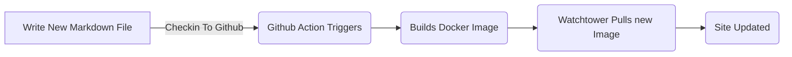

# Utilisation de Markdown pour Blogging

<!--category-- ASP.NET, Markdown -->
<datetime class="hidden">2024-08-02T17:00</datetime>

## Présentation

Markdown est un langage de balisage léger que vous pouvez utiliser pour ajouter des éléments de formatage aux documents texte. Créé par John Gruber en 2004, Markdown est maintenant l'une des langues de balisage les plus populaires au monde.

Sur ce site, j'utilise une approche super simple de blogging, après avoir essayé et échoué à maintenir un blog dans le passé, je voulais le rendre aussi facile que possible d'écrire et de publier des messages. J'utilise balisage pour écrire mes messages et ce site a un seul service en utilisant [Marqueur](https://github.com/xoofx/markdig) pour convertir le balisage en HTML.

[TOC]

## Pourquoi pas un générateur de site statique?

En un mot de simplicité. Ce ne sera pas un site de très haut trafic, j'utilise ASP.NET OutPutCache pour mettre en cache les pages et je ne vais pas le mettre à jour si souvent. Je voulais garder le site aussi simple que possible et ne pas avoir à m'inquiéter des frais généraux d'un générateur de site statique tant en ce qui concerne le processus de construction que la complexité du site.

Pour clarifier; générateurs de site statiques comme [Hugo](https://gohugo.io/) / [Jekyll](https://jekyllrb.com/) etc... peut être une bonne solution pour de nombreux sites mais pour celui-ci je voulais le garder aussi simple *pour moi* autant que possible. Je suis un vétéran de 25 ans ASP.NET donc comprenez-le à l'intérieur et à l'extérieur. Cette conception de site ajoute de la complexité; j'ai des vues, des services, des contrôleurs et un LOT de HTML et CSS manuel, mais je suis à l'aise avec cela.

## Pourquoi pas une base de données?

1. Simplicité de la conception; Les bases de données sont des systèmes puissants pour le stockage des données (et j'en ajouterai un pour les commentaires sous peu) mais elles ajoutent aussi de la complexité. Pour *correctement* utiliser des bases de données en particulier dans une application ASP.NET vous ajoutez un LOT de code, peu importe si vous utilisez [EF Noyau](https://learn.microsoft.com/en-us/ef/core/), [Détonateur](https://github.com/DapperLib/Dapper) ou SQL brut avec ADO.NET. Je voulais garder le site aussi simple que possible *pour commencer par*.
2. Facilité de mise à jour et de déploiement. Ce site est destiné à démontrer comment simple Docker & Docker Compose peut être d'exécuter un site. Je peux mettre à jour le site en vérifiant le nouveau code (y compris le contenu) de GitHub, l'Action exécute, construit l'image puis la méthode de La Tour de Garde dans mon docker compose le fichier met à jour l'image du site automatiquement. C'est une façon très simple de mettre à jour un site et je voulais le garder de cette façon.
3. Exécuter des doublons; comme j'ai des données ZERO qui ne sont pas dans l'image de la docker, cela signifie que je peux exécuter des doublons exacts localement (sur mon petit cluster Ubuntu ici à la maison). C'est une excellente façon de tester les changements avec le docker (p. ex., [quand j'ai fait les changements ImageSharp](/blog/imagesharpwithdocker) ) avant de les déployer sur le site en direct.
4. Parce que je ne voulais pas! Je voulais voir jusqu'où je pouvais aller avec un simple design de site et jusqu'à présent je suis plutôt heureux avec elle.

## Comment écrivez-vous vos messages?

Je dépose simplement un nouveau fichier.md dans le dossier Markdown et le site le récupère et le rend (lorsque je me souviens de le mettre sous forme de contenu, cela garantit qu'il est disponible dans les fichiers de sortie! )

Puis, lorsque je vérifie le site à GitHub, l'action tourne et le site est mis à jour. C'est simple!




## Comment ajouter des images?

Puisque je viens d'ajouter l'image ici, je vais vous montrer comment je l'ai fait. J'ai simplement ajouté l'image dans le dossier wwwroot/articleimages et je l'ai référencé dans le fichier balisage comme ceci:

```markdown

```

J'ajoute ensuite une extension à mon pipeline Markdig qui les réécrit à l'URL correcte (tout au sujet de la simplicité). [Voir ici le code source pour l'extension.](https://github.com/scottgal/mostlylucidweb/blob/main/Mostlylucid/MarkDigExtensions/ImgExtension.cs)

```csharp
using Markdig;
using Markdig.Renderers;
using Markdig.Syntax;
using Markdig.Syntax.Inlines;

namespace Mostlylucid.MarkDigExtensions;

public class ImgExtension : IMarkdownExtension
{
    public void Setup(MarkdownPipelineBuilder pipeline)
    {
        pipeline.DocumentProcessed += ChangeImgPath;
    }

    public void Setup(MarkdownPipeline pipeline, IMarkdownRenderer renderer)
    {
    }

    public void ChangeImgPath(MarkdownDocument document)
    {
        foreach (var link in document.Descendants<LinkInline>())
            if (link.IsImage)
                link.Url = "/articleimages/" + link.Url;
    }
}
```

## Le BlogService.

Le BlogService est un service simple qui lit les fichiers de balisage à partir du dossier Markdown et les convertit en HTML à l'aide de Markdig.

La source complète pour cela est ci-dessous et [Ici.](https://github.com/scottgal/mostlylucidweb/blob/main/Mostlylucid/Services/BlogService.cs).

<details>
<summary>Click to see the source code for the BlogService</summary>
```csharp

using System.Globalization;
using System.Text.RegularExpressions;
using Markdig;
using Microsoft.Extensions.Caching.Memory;
using Mostlylucid.MarkDigExtensions;
using Mostlylucid.Models.Blog;

namespace Mostlylucid.Services;

public class BlogService
{
private const string Path = "Markdown";
private const string CacheKey = "Categories";

    private static readonly Regex DateRegex = new(
        @"<datetime class=""hidden"">(\d{4}-\d{2}-\d{2}T\d{2}:\d{2})</datetime>",
        RegexOptions.Compiled | RegexOptions.IgnoreCase | RegexOptions.NonBacktracking);

    private static readonly Regex WordCoountRegex = new(@"\b\w+\b",
        RegexOptions.Compiled | RegexOptions.Multiline | RegexOptions.IgnoreCase | RegexOptions.NonBacktracking);

    private static readonly Regex CategoryRegex = new(@"<!--\s*category\s*--\s*([^,]+?)\s*(?:,\s*([^,]+?)\s*)?-->",
        RegexOptions.Compiled | RegexOptions.Singleline);

    private readonly ILogger<BlogService> _logger;

    private readonly IMemoryCache _memoryCache;

    private readonly MarkdownPipeline pipeline;

    public BlogService(IMemoryCache memoryCache, ILogger<BlogService> logger)
    {
        _logger = logger;
        _memoryCache = memoryCache;
        pipeline = new MarkdownPipelineBuilder().UseAdvancedExtensions().Use<ImgExtension>().Build();
        ListCategories();
    }


    private Dictionary<string, List<string>> GetFromCache()
    {
        return _memoryCache.Get<Dictionary<string, List<string>>>(CacheKey) ?? new Dictionary<string, List<string>>();
    }

    private void SetCache(Dictionary<string, List<string>> categories)
    {
        _memoryCache.Set(CacheKey, categories, new MemoryCacheEntryOptions
        {
            AbsoluteExpirationRelativeToNow = TimeSpan.FromHours(12)
        });
    }

    private void ListCategories()
    {
        var cacheCats = GetFromCache();
        var pages = Directory.GetFiles("Markdown", "*.md");
        var count = 0;

        foreach (var page in pages)
        {
            var pageAlreadyAdded = cacheCats.Values.Any(x => x.Contains(page));

            if (pageAlreadyAdded) continue;


            var text = File.ReadAllText(page);
            var categories = GetCategories(text);
            if (!categories.Any()) continue;
            count++;
            foreach (var category in categories)
                if (cacheCats.TryGetValue(category, out var pagesList))
                {
                    pagesList.Add(page);
                    cacheCats[category] = pagesList;
                    _logger.LogInformation("Added category {Category} for {Page}", category, page);
                }
                else
                {
                    cacheCats.Add(category, new List<string> { page });
                    _logger.LogInformation("Created category {Category} for {Page}", category, page);
                }
        }

        if (count > 0) SetCache(cacheCats);
    }

    public List<string> GetCategories()
    {
        var cacheCats = GetFromCache();
        return cacheCats.Keys.ToList();
    }


    public List<PostListModel> GetPostsByCategory(string category)
    {
        var pages = GetFromCache()[category];
        return GetPosts(pages.ToArray());
    }

    public BlogPostViewModel? GetPost(string postName)
    {
        try
        {
            var path = System.IO.Path.Combine(Path, postName + ".md");
            var page = GetPage(path, true);
            return new BlogPostViewModel
            {
                Categories = page.categories, WordCount = WordCount(page.restOfTheLines), Content = page.processed,
                PublishedDate = page.publishDate, Slug = page.slug, Title = page.title
            };
        }
        catch (Exception e)
        {
            _logger.LogError(e, "Error getting post {PostName}", postName);
            return null;
        }
    }

    private int WordCount(string text)
    {
        return WordCoountRegex.Matches(text).Count;
    }


    private string GetSlug(string fileName)
    {
        var slug = System.IO.Path.GetFileNameWithoutExtension(fileName);
        return slug.ToLowerInvariant();
    }

    private static string[] GetCategories(string markdownText)
    {
        var matches = CategoryRegex.Matches(markdownText);
        var categories = matches
            .SelectMany(match => match.Groups.Cast<Group>()
                .Skip(1) // Skip the entire match group
                .Where(group => group.Success) // Ensure the group matched
                .Select(group => group.Value.Trim()))
            .ToArray();
        return categories;
    }

    public (string title, string slug, DateTime publishDate, string processed, string[] categories, string
        restOfTheLines) GetPage(string page, bool html)
    {
        var fileInfo = new FileInfo(page);

        // Ensure the file exists
        if (!fileInfo.Exists) throw new FileNotFoundException("The specified file does not exist.", page);

        // Read all lines from the file
        var lines = File.ReadAllLines(page);

        // Get the title from the first line
        var title = lines.Length > 0 ? Markdown.ToPlainText(lines[0].Trim()) : string.Empty;

        // Concatenate the rest of the lines with newline characters
        var restOfTheLines = string.Join(Environment.NewLine, lines.Skip(1));

        // Extract categories from the text
        var categories = GetCategories(restOfTheLines);

        var publishedDate = fileInfo.CreationTime;
        var publishDate = DateRegex.Match(restOfTheLines).Groups[1].Value;
        if (!string.IsNullOrWhiteSpace(publishDate))
            publishedDate = DateTime.ParseExact(publishDate, "yyyy-MM-ddTHH:mm", CultureInfo.InvariantCulture);

        // Remove category tags from the text
        restOfTheLines = CategoryRegex.Replace(restOfTheLines, "");
        restOfTheLines = DateRegex.Replace(restOfTheLines, "");
        // Process the rest of the lines as either HTML or plain text
        var processed =
            html ? Markdown.ToHtml(restOfTheLines, pipeline) : Markdown.ToPlainText(restOfTheLines, pipeline);

        // Generate the slug from the page filename
        var slug = GetSlug(page);


        // Return the parsed and processed content
        return (title, slug, publishedDate, processed, categories, restOfTheLines);
    }

    public List<PostListModel> GetPosts(string[] pages)
    {
        List<PostListModel> pageModels = new();

        foreach (var page in pages)
        {
            var pageInfo = GetPage(page, false);

            var summary = Markdown.ToPlainText(pageInfo.restOfTheLines).Substring(0, 100) + "...";
            pageModels.Add(new PostListModel
            {
                Categories = pageInfo.categories, Title = pageInfo.title,
                Slug = pageInfo.slug, WordCount = WordCount(pageInfo.restOfTheLines),
                PublishedDate = pageInfo.publishDate, Summary = summary
            });
        }

        pageModels = pageModels.OrderByDescending(x => x.PublishedDate).ToList();
        return pageModels;
    }


    public List<PostListModel> GetPostsForFiles()
    {
        var pages = Directory.GetFiles("Markdown", "*.md");
        return GetPosts(pages);
    }
}
```

</details>
Comme vous pouvez le voir, il y a quelques éléments :

### Traitement des fichiers

Le code pour traiter les fichiers de balisage en HTML est assez simple, j'utilise la bibliothèque Markdig pour convertir le balisage en HTML et ensuite j'utilise quelques expressions régulières pour extraire les catégories et la date publiée du fichier de balisage.

La méthode GetPage est utilisée pour extraire le contenu du fichier balisage, il a quelques étapes:

1. Extrait du titre
   Par convention, j'utilise la première ligne du fichier balisage comme titre du message. Donc je peux simplement faire:

```csharp
        var lines = File.ReadAllLines(page);

        // Get the title from the first line
        var title = lines.Length > 0 ? Markdown.ToPlainText(lines[0].Trim()) : string.Empty;
```

Comme le titre est préfixé avec "#" J'utilise la méthode Markdown.ToPlainText pour enlever le "#" du titre.

2. Extraire les catégories
   Chaque message peut avoir jusqu'à deux catégories cette méthode extrait ces puis je supprime cette balise du fichier balisage.

```csharp
// Concatenate the rest of the lines with newline characters
        var restOfTheLines = string.Join(Environment.NewLine, lines.Skip(1));

        // Extract categories from the text
        var categories = GetCategories(restOfTheLines);

   // Remove category tags from the text
        restOfTheLines = CategoryRegex.Replace(restOfTheLines, "");

```

La méthode GetCategories utilise une expression régulière pour extraire les catégories du fichier balisage.

```csharp
    private static readonly Regex CategoryRegex = new(@"<!--\s*category\s*--\s*([^,]+?)\s*(?:,\s*([^,]+?)\s*)?-->",
        RegexOptions.Compiled | RegexOptions.Singleline);

    private static string[] GetCategories(string markdownText)
    {
        var matches = CategoryRegex.Matches(markdownText);
        var categories = matches
            .SelectMany(match => match.Groups.Cast<Group>()
                .Skip(1) // Skip the entire match group
                .Where(group => group.Success) // Ensure the group matched
                .Select(group => group.Value.Trim()))
            .ToArray();
        return categories;
        
        
    }
```

3. Extraire la date publiée
   J'extrais ensuite la date du post (I WAS en utilisant la date créée mais comment je déploie ceci en utilisant une image entière de docker signifie que ce n'est plus vraiment utile) donc je n'utilise pas une expression régulière.
   Ceci analyse une balise dans la forme qui est dans chaque fichier.md.

```razor
 <datetime class="hidden">2024-08-02T17:00</datetime>
```

```csharp
     private static readonly Regex DateRegex = new(
        @"<datetime class=""hidden"">(\d{4}-\d{2}-\d{2}T\d{2}:\d{2})</datetime>",
        RegexOptions.Compiled | RegexOptions.IgnoreCase | RegexOptions.NonBacktracking);
     
           var publishedDate = fileInfo.CreationTime;
        var publishDate = DateRegex.Match(restOfTheLines).Groups[1].Value;
        if (!string.IsNullOrWhiteSpace(publishDate))
            publishedDate = DateTime.ParseExact(publishDate, "yyyy-MM-ddTHH:mm", CultureInfo.InvariantCulture);

     
        restOfTheLines = DateRegex.Replace(restOfTheLines, "");
```

4. Extraire le contenu
   En fait obtenir le contenu est assez simple cela utilise un pipeline (pour le remplacement de la balise d'image mentionné ci-dessus) puis en option me donne un texte simple pour la liste des messages ou HTML pour le message réel.

```csharp
    pipeline = new MarkdownPipelineBuilder().UseAdvancedExtensions().Use<ImgExtension>().Build();
    
   var processed =
            html ? Markdown.ToHtml(restOfTheLines, pipeline) : Markdown.ToPlainText(restOfTheLines, pipeline);
```

5. Va chercher la limace.
   Il s'agit simplement du nom du fichier sans l'extension:
   
   ```csharp
       private string GetSlug(string fileName)
       {
           var slug = System.IO.Path.GetFileNameWithoutExtension(fileName);
           return slug.ToLowerInvariant();
       }
   ```

6. Retourner le contenu
   Maintenant, nous avons du contenu de page que nous pouvons afficher pour le blog!

<details>
<summary> The GetPage Method</summary>
```csharp
public (string title, string slug, DateTime publishDate, string processed, string[] categories, string
        restOfTheLines) GetPage(string page, bool html)
    {
        var fileInfo = new FileInfo(page);

        // Ensure the file exists
        if (!fileInfo.Exists) throw new FileNotFoundException("The specified file does not exist.", page);

        // Read all lines from the file
        var lines = File.ReadAllLines(page);

        // Get the title from the first line
        var title = lines.Length > 0 ? Markdown.ToPlainText(lines[0].Trim()) : string.Empty;

        // Concatenate the rest of the lines with newline characters
        var restOfTheLines = string.Join(Environment.NewLine, lines.Skip(1));

        // Extract categories from the text
        var categories = GetCategories(restOfTheLines);

        var publishedDate = fileInfo.CreationTime;
        var publishDate = DateRegex.Match(restOfTheLines).Groups[1].Value;
        if (!string.IsNullOrWhiteSpace(publishDate))
            publishedDate = DateTime.ParseExact(publishDate, "yyyy-MM-ddTHH:mm", CultureInfo.InvariantCulture);

        // Remove category tags from the text
        restOfTheLines = CategoryRegex.Replace(restOfTheLines, "");
        restOfTheLines = DateRegex.Replace(restOfTheLines, "");
        // Process the rest of the lines as either HTML or plain text
        var processed =
            html ? Markdown.ToHtml(restOfTheLines, pipeline) : Markdown.ToPlainText(restOfTheLines, pipeline);

        // Generate the slug from the page filename
        var slug = GetSlug(page);


        // Return the parsed and processed content
        return (title, slug, publishedDate, processed, categories, restOfTheLines);
    }
```

</details>
Le code ci-dessous montre comment je génère la liste des messages de blog, il utilise le `GetPage(page, false)` méthode pour extraire le titre, les catégories, la date de publication et le contenu traité.

```csharp
     public List<PostListModel> GetPosts(string[] pages)
    {
        List<PostListModel> pageModels = new();

        foreach (var page in pages)
        {
            var pageInfo = GetPage(page, false);

            var summary = Markdown.ToPlainText(pageInfo.restOfTheLines).Substring(0, 100) + "...";
            pageModels.Add(new PostListModel
            {
                Categories = pageInfo.categories, Title = pageInfo.title,
                Slug = pageInfo.slug, WordCount = WordCount(pageInfo.restOfTheLines),
                PublishedDate = pageInfo.publishDate, Summary = summary
            });
        }

        pageModels = pageModels.OrderByDescending(x => x.PublishedDate).ToList();
        return pageModels;
    }


    public List<PostListModel> GetPostsForFiles()
    {
        var pages = Directory.GetFiles("Markdown", "*.md");
        return GetPosts(pages);
    }
```