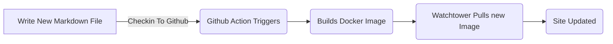

# Använda Markdown för bloggning

<!--category-- ASP.NET, Markdown -->
<datetime class="hidden">2024-08-02T17:00</datetime>

## Inledning

Markdown är ett lättviktigt markeringsspråk som du kan använda för att lägga till formateringselement i dokument med vanlig text. Skapad av John Gruber 2004, Markdown är nu ett av världens mest populära markup språk.

På denna webbplats använder jag en super enkel strategi för bloggning, efter att ha försökt och misslyckats med att underhålla en blogg i det förflutna ville jag göra det så enkelt som möjligt att skriva och publicera inlägg. Jag använder markdown för att skriva mina inlägg och denna webbplats har en enda tjänst med [Markdig Ordförande](https://github.com/xoofx/markdig) för att konvertera markeringen till HTML.

[TOC]

## Varför inte en statisk generator?

Med ett ord enkelt. Detta kommer inte att vara en super hög trafik webbplats, Jag använder ASP.NET OutPutCache att cache sidorna och jag kommer inte att uppdatera det så ofta. Jag ville hålla platsen så enkel som möjligt och inte behöva oroa sig för overhead av en statisk plats generator både när det gäller byggprocessen och komplexiteten i webbplatsen.

För att klargöra; statiska platsgeneratorer som [Hugo Ordförande](https://gohugo.io/) / [Övriga rot- och knölgrönsaker utom sockerbetor samt fraktioner av sådana fetter eller oljor, även raffinerade men inte kemiskt modifierade](https://jekyllrb.com/) etc...kan vara en bra lösning för många webbplatser men för denna jag ville hålla det så enkelt *för mig* som möjligt. Jag är en 25-årig ASP.NET veteran så förstå det inifrån och ut. Denna webbplatsdesign lägger till komplexitet; Jag har vyer, tjänster, controllers och en LOT av manuell HTML & CSS men jag är bekväm med det.

## Varför inte en databas?

1. Enkel design; Databaser är kraftfulla system för lagring av data (och jag kommer att lägga till en för kommentarer inom kort) men de lägger också till komplexitet. Till *korrekt* använda databaser särskilt i en ASP.NET-applikation du lägger till en LOT av kod, oavsett om du använder [EF-kärna](https://learn.microsoft.com/en-us/ef/core/), [Gräshoppa](https://github.com/DapperLib/Dapper) eller rå SQL med ADO.NET. Jag ville hålla webbplatsen så enkel som möjligt *till att börja med*.
2. Enkel uppdatering och installation. Denna webbplats är tänkt att visa hur enkel Docker & Docker Compose kan vara att köra en webbplats. Jag kan uppdatera webbplatsen genom att checka in ny kod (inklusive innehåll) till GitHub, åtgärden körs, bygger bilden sedan Watchtower metoden i min docker komponera fil uppdateringar webbplatsen bilden automatiskt. Detta är ett mycket enkelt sätt att uppdatera en webbplats och jag ville hålla det så.
3. Köra dubbletter; eftersom jag har ZERO data som inte finns i Docker bilden betyder det att jag kan EASILY köra exakta dubbletter lokalt (på min lilla Ubuntu kluster här hemma). Detta är ett bra sätt att testa förändringar med docker (t.ex., [när jag gjorde ändringarna i ImageSharp](/blog/imagesharpwithdocker) ) innan de sätts ut på direktsändningsplatsen.
4. För att jag inte ville! Jag ville se hur långt jag kunde komma med en enkel webbplats design och hittills är jag ganska nöjd med det.

## Hur skriver du dina inlägg?

Jag helt enkelt släppa en ny.md-fil i Markdown mappen och webbplatsen plockar upp det och gör det (när jag kommer ihåg att aet det som innehåll, Detta säkerställer att det finns i utgångsfilerna!)

Sedan när jag checkar in webbplatsen till GitHub Action körs och webbplatsen uppdateras. Enkelt!




## Hur lägger man till bilder?

Eftersom jag just lagt till bilden här, ska jag visa dig hur jag gjorde det. Jag lade helt enkelt till bilden i mappen wwwroot/artikelbilder och refererade till den i markdown-filen så här:

```markdown

```

Jag lägger sedan till en förlängning till min Markdig pipeline som skriver om dessa till rätt URL (allt om enkelhet). [Se här för källkoden för förlängningen.](https://github.com/scottgal/mostlylucidweb/blob/main/Mostlylucid/MarkDigExtensions/ImgExtension.cs)

```csharp
using Markdig;
using Markdig.Renderers;
using Markdig.Syntax;
using Markdig.Syntax.Inlines;

namespace Mostlylucid.MarkDigExtensions;

public class ImgExtension : IMarkdownExtension
{
    public void Setup(MarkdownPipelineBuilder pipeline)
    {
        pipeline.DocumentProcessed += ChangeImgPath;
    }

    public void Setup(MarkdownPipeline pipeline, IMarkdownRenderer renderer)
    {
    }

    public void ChangeImgPath(MarkdownDocument document)
    {
        foreach (var link in document.Descendants<LinkInline>())
            if (link.IsImage)
                link.Url = "/articleimages/" + link.Url;
    }
}
```

## Bloggtjänsten.

BlogService är en enkel tjänst som läser markdown-filer från Markdown mappen och konverterar dem till HTML med Markdig.

Den fullständiga källan för detta är nedan och [här](https://github.com/scottgal/mostlylucidweb/blob/main/Mostlylucid/Services/BlogService.cs).

<details>
<summary>Click to see the source code for the BlogService</summary>
```csharp

using System.Globalization;
using System.Text.RegularExpressions;
using Markdig;
using Microsoft.Extensions.Caching.Memory;
using Mostlylucid.MarkDigExtensions;
using Mostlylucid.Models.Blog;

namespace Mostlylucid.Services;

public class BlogService
{
private const string Path = "Markdown";
private const string CacheKey = "Categories";

    private static readonly Regex DateRegex = new(
        @"<datetime class=""hidden"">(\d{4}-\d{2}-\d{2}T\d{2}:\d{2})</datetime>",
        RegexOptions.Compiled | RegexOptions.IgnoreCase | RegexOptions.NonBacktracking);

    private static readonly Regex WordCoountRegex = new(@"\b\w+\b",
        RegexOptions.Compiled | RegexOptions.Multiline | RegexOptions.IgnoreCase | RegexOptions.NonBacktracking);

    private static readonly Regex CategoryRegex = new(@"<!--\s*category\s*--\s*([^,]+?)\s*(?:,\s*([^,]+?)\s*)?-->",
        RegexOptions.Compiled | RegexOptions.Singleline);

    private readonly ILogger<BlogService> _logger;

    private readonly IMemoryCache _memoryCache;

    private readonly MarkdownPipeline pipeline;

    public BlogService(IMemoryCache memoryCache, ILogger<BlogService> logger)
    {
        _logger = logger;
        _memoryCache = memoryCache;
        pipeline = new MarkdownPipelineBuilder().UseAdvancedExtensions().Use<ImgExtension>().Build();
        ListCategories();
    }


    private Dictionary<string, List<string>> GetFromCache()
    {
        return _memoryCache.Get<Dictionary<string, List<string>>>(CacheKey) ?? new Dictionary<string, List<string>>();
    }

    private void SetCache(Dictionary<string, List<string>> categories)
    {
        _memoryCache.Set(CacheKey, categories, new MemoryCacheEntryOptions
        {
            AbsoluteExpirationRelativeToNow = TimeSpan.FromHours(12)
        });
    }

    private void ListCategories()
    {
        var cacheCats = GetFromCache();
        var pages = Directory.GetFiles("Markdown", "*.md");
        var count = 0;

        foreach (var page in pages)
        {
            var pageAlreadyAdded = cacheCats.Values.Any(x => x.Contains(page));

            if (pageAlreadyAdded) continue;


            var text = File.ReadAllText(page);
            var categories = GetCategories(text);
            if (!categories.Any()) continue;
            count++;
            foreach (var category in categories)
                if (cacheCats.TryGetValue(category, out var pagesList))
                {
                    pagesList.Add(page);
                    cacheCats[category] = pagesList;
                    _logger.LogInformation("Added category {Category} for {Page}", category, page);
                }
                else
                {
                    cacheCats.Add(category, new List<string> { page });
                    _logger.LogInformation("Created category {Category} for {Page}", category, page);
                }
        }

        if (count > 0) SetCache(cacheCats);
    }

    public List<string> GetCategories()
    {
        var cacheCats = GetFromCache();
        return cacheCats.Keys.ToList();
    }


    public List<PostListModel> GetPostsByCategory(string category)
    {
        var pages = GetFromCache()[category];
        return GetPosts(pages.ToArray());
    }

    public BlogPostViewModel? GetPost(string postName)
    {
        try
        {
            var path = System.IO.Path.Combine(Path, postName + ".md");
            var page = GetPage(path, true);
            return new BlogPostViewModel
            {
                Categories = page.categories, WordCount = WordCount(page.restOfTheLines), Content = page.processed,
                PublishedDate = page.publishDate, Slug = page.slug, Title = page.title
            };
        }
        catch (Exception e)
        {
            _logger.LogError(e, "Error getting post {PostName}", postName);
            return null;
        }
    }

    private int WordCount(string text)
    {
        return WordCoountRegex.Matches(text).Count;
    }


    private string GetSlug(string fileName)
    {
        var slug = System.IO.Path.GetFileNameWithoutExtension(fileName);
        return slug.ToLowerInvariant();
    }

    private static string[] GetCategories(string markdownText)
    {
        var matches = CategoryRegex.Matches(markdownText);
        var categories = matches
            .SelectMany(match => match.Groups.Cast<Group>()
                .Skip(1) // Skip the entire match group
                .Where(group => group.Success) // Ensure the group matched
                .Select(group => group.Value.Trim()))
            .ToArray();
        return categories;
    }

    public (string title, string slug, DateTime publishDate, string processed, string[] categories, string
        restOfTheLines) GetPage(string page, bool html)
    {
        var fileInfo = new FileInfo(page);

        // Ensure the file exists
        if (!fileInfo.Exists) throw new FileNotFoundException("The specified file does not exist.", page);

        // Read all lines from the file
        var lines = File.ReadAllLines(page);

        // Get the title from the first line
        var title = lines.Length > 0 ? Markdown.ToPlainText(lines[0].Trim()) : string.Empty;

        // Concatenate the rest of the lines with newline characters
        var restOfTheLines = string.Join(Environment.NewLine, lines.Skip(1));

        // Extract categories from the text
        var categories = GetCategories(restOfTheLines);

        var publishedDate = fileInfo.CreationTime;
        var publishDate = DateRegex.Match(restOfTheLines).Groups[1].Value;
        if (!string.IsNullOrWhiteSpace(publishDate))
            publishedDate = DateTime.ParseExact(publishDate, "yyyy-MM-ddTHH:mm", CultureInfo.InvariantCulture);

        // Remove category tags from the text
        restOfTheLines = CategoryRegex.Replace(restOfTheLines, "");
        restOfTheLines = DateRegex.Replace(restOfTheLines, "");
        // Process the rest of the lines as either HTML or plain text
        var processed =
            html ? Markdown.ToHtml(restOfTheLines, pipeline) : Markdown.ToPlainText(restOfTheLines, pipeline);

        // Generate the slug from the page filename
        var slug = GetSlug(page);


        // Return the parsed and processed content
        return (title, slug, publishedDate, processed, categories, restOfTheLines);
    }

    public List<PostListModel> GetPosts(string[] pages)
    {
        List<PostListModel> pageModels = new();

        foreach (var page in pages)
        {
            var pageInfo = GetPage(page, false);

            var summary = Markdown.ToPlainText(pageInfo.restOfTheLines).Substring(0, 100) + "...";
            pageModels.Add(new PostListModel
            {
                Categories = pageInfo.categories, Title = pageInfo.title,
                Slug = pageInfo.slug, WordCount = WordCount(pageInfo.restOfTheLines),
                PublishedDate = pageInfo.publishDate, Summary = summary
            });
        }

        pageModels = pageModels.OrderByDescending(x => x.PublishedDate).ToList();
        return pageModels;
    }


    public List<PostListModel> GetPostsForFiles()
    {
        var pages = Directory.GetFiles("Markdown", "*.md");
        return GetPosts(pages);
    }
}
```

</details>
Som ni kan se har detta några element:

### Behandling av filer

Koden för att bearbeta markdown-filer till HTML är ganska enkel, Jag använder Markdig biblioteket för att konvertera markdown till HTML och sedan använder jag några reguljära uttryck för att extrahera kategorierna och det publicerade datumet från markdown-filen.

GetPage-metoden används för att extrahera innehållet i markdown-filen, den har några steg:

1. Extrahera titeln
   Enligt överenskommelse använder jag den första raden i markdown-filen som titeln på inlägget. Så jag kan helt enkelt göra:

```csharp
        var lines = File.ReadAllLines(page);

        // Get the title from the first line
        var title = lines.Length > 0 ? Markdown.ToPlainText(lines[0].Trim()) : string.Empty;
```

Eftersom titeln är prefixerad med "#" använder jag Markdown.ToPlainText metoden för att ta bort "#" från titeln.

2. Extrahera kategorierna
   Varje inlägg kan ha upp till två kategorier denna metod extraherar dessa sedan tar jag bort taggen från markdown-filen.

```csharp
// Concatenate the rest of the lines with newline characters
        var restOfTheLines = string.Join(Environment.NewLine, lines.Skip(1));

        // Extract categories from the text
        var categories = GetCategories(restOfTheLines);

   // Remove category tags from the text
        restOfTheLines = CategoryRegex.Replace(restOfTheLines, "");

```

Metoden GetCates använder ett reguljärt uttryck för att extrahera kategorierna från markdown-filen.

```csharp
    private static readonly Regex CategoryRegex = new(@"<!--\s*category\s*--\s*([^,]+?)\s*(?:,\s*([^,]+?)\s*)?-->",
        RegexOptions.Compiled | RegexOptions.Singleline);

    private static string[] GetCategories(string markdownText)
    {
        var matches = CategoryRegex.Matches(markdownText);
        var categories = matches
            .SelectMany(match => match.Groups.Cast<Group>()
                .Skip(1) // Skip the entire match group
                .Where(group => group.Success) // Ensure the group matched
                .Select(group => group.Value.Trim()))
            .ToArray();
        return categories;
        
        
    }
```

3. Extrahera det publicerade datumet
   Jag extraherar sedan datumet från inlägget (Jag använde det skapade datumet men hur jag distribuerar detta med hjälp av en hel docker bild innebär att detta inte är riktigt användbart längre) så jag använder inte ett reguljärt uttryck.
   Detta tolkar en tagg i den form som finns i varje.md-fil.

```razor
 <datetime class="hidden">2024-08-02T17:00</datetime>
```

```csharp
     private static readonly Regex DateRegex = new(
        @"<datetime class=""hidden"">(\d{4}-\d{2}-\d{2}T\d{2}:\d{2})</datetime>",
        RegexOptions.Compiled | RegexOptions.IgnoreCase | RegexOptions.NonBacktracking);
     
           var publishedDate = fileInfo.CreationTime;
        var publishDate = DateRegex.Match(restOfTheLines).Groups[1].Value;
        if (!string.IsNullOrWhiteSpace(publishDate))
            publishedDate = DateTime.ParseExact(publishDate, "yyyy-MM-ddTHH:mm", CultureInfo.InvariantCulture);

     
        restOfTheLines = DateRegex.Replace(restOfTheLines, "");
```

4. Extrahera innehållet
   Faktiskt att få innehållet är ganska enkelt detta använder en pipeline (för bild tag ersättning nämns ovan) sedan valfritt ger mig enkel text för listan över inlägg eller HTML för själva inlägget.

```csharp
    pipeline = new MarkdownPipelineBuilder().UseAdvancedExtensions().Use<ImgExtension>().Build();
    
   var processed =
            html ? Markdown.ToHtml(restOfTheLines, pipeline) : Markdown.ToPlainText(restOfTheLines, pipeline);
```

5. Hämta sluget.
   Detta är helt enkelt filnamnet utan filändelsen:
   
   ```csharp
       private string GetSlug(string fileName)
       {
           var slug = System.IO.Path.GetFileNameWithoutExtension(fileName);
           return slug.ToLowerInvariant();
       }
   ```

6. Returnera innehållet
   Nu har vi sidinnehåll som vi kan visa för bloggen!

<details>
<summary> The GetPage Method</summary>
```csharp
public (string title, string slug, DateTime publishDate, string processed, string[] categories, string
        restOfTheLines) GetPage(string page, bool html)
    {
        var fileInfo = new FileInfo(page);

        // Ensure the file exists
        if (!fileInfo.Exists) throw new FileNotFoundException("The specified file does not exist.", page);

        // Read all lines from the file
        var lines = File.ReadAllLines(page);

        // Get the title from the first line
        var title = lines.Length > 0 ? Markdown.ToPlainText(lines[0].Trim()) : string.Empty;

        // Concatenate the rest of the lines with newline characters
        var restOfTheLines = string.Join(Environment.NewLine, lines.Skip(1));

        // Extract categories from the text
        var categories = GetCategories(restOfTheLines);

        var publishedDate = fileInfo.CreationTime;
        var publishDate = DateRegex.Match(restOfTheLines).Groups[1].Value;
        if (!string.IsNullOrWhiteSpace(publishDate))
            publishedDate = DateTime.ParseExact(publishDate, "yyyy-MM-ddTHH:mm", CultureInfo.InvariantCulture);

        // Remove category tags from the text
        restOfTheLines = CategoryRegex.Replace(restOfTheLines, "");
        restOfTheLines = DateRegex.Replace(restOfTheLines, "");
        // Process the rest of the lines as either HTML or plain text
        var processed =
            html ? Markdown.ToHtml(restOfTheLines, pipeline) : Markdown.ToPlainText(restOfTheLines, pipeline);

        // Generate the slug from the page filename
        var slug = GetSlug(page);


        // Return the parsed and processed content
        return (title, slug, publishedDate, processed, categories, restOfTheLines);
    }
```

</details>
Koden nedan visar hur jag genererar listan över blogginlägg, det använder `GetPage(page, false)` Metod för att extrahera titeln, kategorierna, det publicerade datumet och det bearbetade innehållet.

```csharp
     public List<PostListModel> GetPosts(string[] pages)
    {
        List<PostListModel> pageModels = new();

        foreach (var page in pages)
        {
            var pageInfo = GetPage(page, false);

            var summary = Markdown.ToPlainText(pageInfo.restOfTheLines).Substring(0, 100) + "...";
            pageModels.Add(new PostListModel
            {
                Categories = pageInfo.categories, Title = pageInfo.title,
                Slug = pageInfo.slug, WordCount = WordCount(pageInfo.restOfTheLines),
                PublishedDate = pageInfo.publishDate, Summary = summary
            });
        }

        pageModels = pageModels.OrderByDescending(x => x.PublishedDate).ToList();
        return pageModels;
    }


    public List<PostListModel> GetPostsForFiles()
    {
        var pages = Directory.GetFiles("Markdown", "*.md");
        return GetPosts(pages);
    }
```