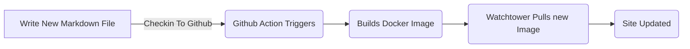

# 使用 Markdown 来博客

<!--category-- ASP.NET, Markdown -->
<datetime class="hidden">2024-008-002T17:00</datetime>

## 一. 导言 导言 导言 导言 导言 导言 一,导言 导言 导言 导言 导言 导言

标记 标记 是一种轻量级标记语言,您可以用它来将格式化元素添加到普通文本文档中。 马克唐(Markdown)于2004年由约翰·格鲁伯(John Gruber)创立,

过去我曾尝试过也未能维持博客, 希望能尽量方便地写作和发表文章。 我用标记记分写我的文章, [Markdig 马克式](https://github.com/xoofx/markdig) 将标记减法转换为 HTML。

[技选委

## 为什么不是静态站点发电机?

一字简单。 我用ASP.NET OutPutPutCache来隐藏页面, 我不会经常更新。 我本想尽量简化网站, 不必担心静态网站发电机在建设过程和复杂程度方面的管理。

澄清;静态现场发电机等 [雨雨雨](https://gohugo.io/) / [头 头 头 头 头 头 头 头 头 头 头 头 头 头 头 头 头 头 头 头 头 头 头 头 头 头 头 头 头 头 头 头 头 头 头 头 头 头 头 头 头 头 头 头 头 头 头 头 头](https://jekyllrb.com/) 等等... 可能是一个对很多网站的好解决方案... 但对于这个,我想保持简单 *对我来说* 尽可能。 我是ASP.NET25年的老兵 所以要了解它的内涵和外涵 此站点设计确实增加了复杂性; 我有视图、 服务、 控制器和手动 HTML 和 CSS 的LOT, 但我对此很满意 。

## 为什么不是数据库呢?

1. 设计简便; 数据库是数据储存的强大系统(我将很快补充一个系统供评论), 但是它们也增加了复杂性。 将 to *正确正确* 使用数据库,特别是在 ASP.NET 应用程序中使用数据库。 [EF 核心核心](https://learn.microsoft.com/en-us/ef/core/), [顶顶顶端](https://github.com/DapperLib/Dapper) 或带 ADO.NET 的原始 SQL。 我想让网站尽可能简单 *开始于*.
2. 随时更新和部署。 此站点旨在展示多克 & 多克作曲是如何运行一个站点的简单 。 我可以通过检查新代码(包括内容)更新网站到GitHub, “行动”运行, 建立图像, 这是更新网站的一个非常简单的方法,我想保持这样。
3. 正在运行重复数据; 因为我有ZERO数据, 数据不在 docker 图像中, 这意味着我可以在本地(在我家的小 Ubuntu 群集上) 运行精确的重复数据 。 这是用 docker 测试变化的好方法(例如, [当我修改图像时](/blog/imagesharpwithdocker) )在将其部署到现场之前。
4. 因为我不想! 我想看看我可以用一个简单的网站设计 达到什么程度,到目前为止,我对它非常满意。

## 您如何撰写文章?

我只是把一个新的.md文件放入 Markdown 文件夹, 网站会把它捡起来, 并把它制作成( 当我记得把它当作内容, 这样就能确保它可以在输出文件中被保存! )!

当我在GitHub检查网站时, 简单!




## 您如何添加图像?

既然我刚刚在这里添加了图像, 我会告诉你我是如何做到的。 我只是将图像添加到 wwwroot/ articleimages 文件夹中,

```markdown

```

然后,我为我的Markdig输油管添加一个扩展,将这些重写到正确的 URL (所有关于简单) 。 [参见此扩展的源代码 。](https://github.com/scottgal/mostlylucidweb/blob/main/Mostlylucid/MarkDigExtensions/ImgExtension.cs)

```csharp
using Markdig;
using Markdig.Renderers;
using Markdig.Syntax;
using Markdig.Syntax.Inlines;

namespace Mostlylucid.MarkDigExtensions;

public class ImgExtension : IMarkdownExtension
{
    public void Setup(MarkdownPipelineBuilder pipeline)
    {
        pipeline.DocumentProcessed += ChangeImgPath;
    }

    public void Setup(MarkdownPipeline pipeline, IMarkdownRenderer renderer)
    {
    }

    public void ChangeImgPath(MarkdownDocument document)
    {
        foreach (var link in document.Descendants<LinkInline>())
            if (link.IsImage)
                link.Url = "/articleimages/" + link.Url;
    }
}
```

## 博客服务。

博客服务是一个简单的服务, 从 Markdown 文件夹读取标记下载文件, 并使用 Markdig 将其转换为 HTML 。

其全部来源如下: [在这里](https://github.com/scottgal/mostlylucidweb/blob/main/Mostlylucid/Services/BlogService.cs).

<details>
<summary>Click to see the source code for the BlogService</summary>
```csharp

using System.Globalization;
using System.Text.RegularExpressions;
using Markdig;
using Microsoft.Extensions.Caching.Memory;
using Mostlylucid.MarkDigExtensions;
using Mostlylucid.Models.Blog;

namespace Mostlylucid.Services;

public class BlogService
{
private const string Path = "Markdown";
private const string CacheKey = "Categories";

    private static readonly Regex DateRegex = new(
        @"<datetime class=""hidden"">(\d{4}-\d{2}-\d{2}T\d{2}:\d{2})</datetime>",
        RegexOptions.Compiled | RegexOptions.IgnoreCase | RegexOptions.NonBacktracking);

    private static readonly Regex WordCoountRegex = new(@"\b\w+\b",
        RegexOptions.Compiled | RegexOptions.Multiline | RegexOptions.IgnoreCase | RegexOptions.NonBacktracking);

    private static readonly Regex CategoryRegex = new(@"<!--\s*category\s*--\s*([^,]+?)\s*(?:,\s*([^,]+?)\s*)?-->",
        RegexOptions.Compiled | RegexOptions.Singleline);

    private readonly ILogger<BlogService> _logger;

    private readonly IMemoryCache _memoryCache;

    private readonly MarkdownPipeline pipeline;

    public BlogService(IMemoryCache memoryCache, ILogger<BlogService> logger)
    {
        _logger = logger;
        _memoryCache = memoryCache;
        pipeline = new MarkdownPipelineBuilder().UseAdvancedExtensions().Use<ImgExtension>().Build();
        ListCategories();
    }


    private Dictionary<string, List<string>> GetFromCache()
    {
        return _memoryCache.Get<Dictionary<string, List<string>>>(CacheKey) ?? new Dictionary<string, List<string>>();
    }

    private void SetCache(Dictionary<string, List<string>> categories)
    {
        _memoryCache.Set(CacheKey, categories, new MemoryCacheEntryOptions
        {
            AbsoluteExpirationRelativeToNow = TimeSpan.FromHours(12)
        });
    }

    private void ListCategories()
    {
        var cacheCats = GetFromCache();
        var pages = Directory.GetFiles("Markdown", "*.md");
        var count = 0;

        foreach (var page in pages)
        {
            var pageAlreadyAdded = cacheCats.Values.Any(x => x.Contains(page));

            if (pageAlreadyAdded) continue;


            var text = File.ReadAllText(page);
            var categories = GetCategories(text);
            if (!categories.Any()) continue;
            count++;
            foreach (var category in categories)
                if (cacheCats.TryGetValue(category, out var pagesList))
                {
                    pagesList.Add(page);
                    cacheCats[category] = pagesList;
                    _logger.LogInformation("Added category {Category} for {Page}", category, page);
                }
                else
                {
                    cacheCats.Add(category, new List<string> { page });
                    _logger.LogInformation("Created category {Category} for {Page}", category, page);
                }
        }

        if (count > 0) SetCache(cacheCats);
    }

    public List<string> GetCategories()
    {
        var cacheCats = GetFromCache();
        return cacheCats.Keys.ToList();
    }


    public List<PostListModel> GetPostsByCategory(string category)
    {
        var pages = GetFromCache()[category];
        return GetPosts(pages.ToArray());
    }

    public BlogPostViewModel? GetPost(string postName)
    {
        try
        {
            var path = System.IO.Path.Combine(Path, postName + ".md");
            var page = GetPage(path, true);
            return new BlogPostViewModel
            {
                Categories = page.categories, WordCount = WordCount(page.restOfTheLines), Content = page.processed,
                PublishedDate = page.publishDate, Slug = page.slug, Title = page.title
            };
        }
        catch (Exception e)
        {
            _logger.LogError(e, "Error getting post {PostName}", postName);
            return null;
        }
    }

    private int WordCount(string text)
    {
        return WordCoountRegex.Matches(text).Count;
    }


    private string GetSlug(string fileName)
    {
        var slug = System.IO.Path.GetFileNameWithoutExtension(fileName);
        return slug.ToLowerInvariant();
    }

    private static string[] GetCategories(string markdownText)
    {
        var matches = CategoryRegex.Matches(markdownText);
        var categories = matches
            .SelectMany(match => match.Groups.Cast<Group>()
                .Skip(1) // Skip the entire match group
                .Where(group => group.Success) // Ensure the group matched
                .Select(group => group.Value.Trim()))
            .ToArray();
        return categories;
    }

    public (string title, string slug, DateTime publishDate, string processed, string[] categories, string
        restOfTheLines) GetPage(string page, bool html)
    {
        var fileInfo = new FileInfo(page);

        // Ensure the file exists
        if (!fileInfo.Exists) throw new FileNotFoundException("The specified file does not exist.", page);

        // Read all lines from the file
        var lines = File.ReadAllLines(page);

        // Get the title from the first line
        var title = lines.Length > 0 ? Markdown.ToPlainText(lines[0].Trim()) : string.Empty;

        // Concatenate the rest of the lines with newline characters
        var restOfTheLines = string.Join(Environment.NewLine, lines.Skip(1));

        // Extract categories from the text
        var categories = GetCategories(restOfTheLines);

        var publishedDate = fileInfo.CreationTime;
        var publishDate = DateRegex.Match(restOfTheLines).Groups[1].Value;
        if (!string.IsNullOrWhiteSpace(publishDate))
            publishedDate = DateTime.ParseExact(publishDate, "yyyy-MM-ddTHH:mm", CultureInfo.InvariantCulture);

        // Remove category tags from the text
        restOfTheLines = CategoryRegex.Replace(restOfTheLines, "");
        restOfTheLines = DateRegex.Replace(restOfTheLines, "");
        // Process the rest of the lines as either HTML or plain text
        var processed =
            html ? Markdown.ToHtml(restOfTheLines, pipeline) : Markdown.ToPlainText(restOfTheLines, pipeline);

        // Generate the slug from the page filename
        var slug = GetSlug(page);


        // Return the parsed and processed content
        return (title, slug, publishedDate, processed, categories, restOfTheLines);
    }

    public List<PostListModel> GetPosts(string[] pages)
    {
        List<PostListModel> pageModels = new();

        foreach (var page in pages)
        {
            var pageInfo = GetPage(page, false);

            var summary = Markdown.ToPlainText(pageInfo.restOfTheLines).Substring(0, 100) + "...";
            pageModels.Add(new PostListModel
            {
                Categories = pageInfo.categories, Title = pageInfo.title,
                Slug = pageInfo.slug, WordCount = WordCount(pageInfo.restOfTheLines),
                PublishedDate = pageInfo.publishDate, Summary = summary
            });
        }

        pageModels = pageModels.OrderByDescending(x => x.PublishedDate).ToList();
        return pageModels;
    }


    public List<PostListModel> GetPostsForFiles()
    {
        var pages = Directory.GetFiles("Markdown", "*.md");
        return GetPosts(pages);
    }
}
```

</details>
正如你可以看到的,这有几个因素:

### 处理文件

处理标记下的文件到 HTML 的代码非常简单, 我使用 Markdig 库将标记下的文件转换为 HTML, 然后用一些常规表达式从标记文件中提取分类和公布的日期 。

GetPage 方法用于提取标记文件的内容, 它有几个步骤 :

1. 摘录标题
   使用标记文件的第一行作为该职位的标题。 所以我可以简单做到:

```csharp
        var lines = File.ReadAllLines(page);

        // Get the title from the first line
        var title = lines.Length > 0 ? Markdown.ToPlainText(lines[0].Trim()) : string.Empty;
```

标题前缀为“ # ” 。 我使用 Markdown 。 To plainText 方法将“ # ” 从标题中删除 。

2. 解开分类
   每个邮件最多可以有两个类别 此方法提取这些, 然后我从标记文件中删除标签 。

```csharp
// Concatenate the rest of the lines with newline characters
        var restOfTheLines = string.Join(Environment.NewLine, lines.Skip(1));

        // Extract categories from the text
        var categories = GetCategories(restOfTheLines);

   // Remove category tags from the text
        restOfTheLines = CategoryRegex.Replace(restOfTheLines, "");

```

GetCateGateGateGries 方法使用正则表达式从标记文件中提取分类 。

```csharp
    private static readonly Regex CategoryRegex = new(@"<!--\s*category\s*--\s*([^,]+?)\s*(?:,\s*([^,]+?)\s*)?-->",
        RegexOptions.Compiled | RegexOptions.Singleline);

    private static string[] GetCategories(string markdownText)
    {
        var matches = CategoryRegex.Matches(markdownText);
        var categories = matches
            .SelectMany(match => match.Groups.Cast<Group>()
                .Skip(1) // Skip the entire match group
                .Where(group => group.Success) // Ensure the group matched
                .Select(group => group.Value.Trim()))
            .ToArray();
        return categories;
        
        
    }
```

3. 摘录公布日期
   然后我从文章中提取日期(我用的是创建的日期, 但我如何使用一个整张docker图像来部署这个图像, 意味着这不再真正有用), 所以我不使用常规表达式 。
   这将在.md 文件的窗体中绘制标记 。

```razor
 <datetime class="hidden">2024-08-02T17:00</datetime>
```

```csharp
     private static readonly Regex DateRegex = new(
        @"<datetime class=""hidden"">(\d{4}-\d{2}-\d{2}T\d{2}:\d{2})</datetime>",
        RegexOptions.Compiled | RegexOptions.IgnoreCase | RegexOptions.NonBacktracking);
     
           var publishedDate = fileInfo.CreationTime;
        var publishDate = DateRegex.Match(restOfTheLines).Groups[1].Value;
        if (!string.IsNullOrWhiteSpace(publishDate))
            publishedDate = DateTime.ParseExact(publishDate, "yyyy-MM-ddTHH:mm", CultureInfo.InvariantCulture);

     
        restOfTheLines = DateRegex.Replace(restOfTheLines, "");
```

4. 解开内容
   获取内容其实很简单, 它使用管道( 用于上述图像标签替换), 然后可以随意给我一个清晰的文本, 用于实际文章的邮件列表或 HTML 。

```csharp
    pipeline = new MarkdownPipelineBuilder().UseAdvancedExtensions().Use<ImgExtension>().Build();
    
   var processed =
            html ? Markdown.ToHtml(restOfTheLines, pipeline) : Markdown.ToPlainText(restOfTheLines, pipeline);
```

5. 获取“ 塞”
   这只是没有扩展名的文件名 :
   
   ```csharp
       private string GetSlug(string fileName)
       {
           var slug = System.IO.Path.GetFileNameWithoutExtension(fileName);
           return slug.ToLowerInvariant();
       }
   ```

6. 返回内容
   现在我们有页面内容可以显示在博客上!

<details>
<summary> The GetPage Method</summary>
```csharp
public (string title, string slug, DateTime publishDate, string processed, string[] categories, string
        restOfTheLines) GetPage(string page, bool html)
    {
        var fileInfo = new FileInfo(page);

        // Ensure the file exists
        if (!fileInfo.Exists) throw new FileNotFoundException("The specified file does not exist.", page);

        // Read all lines from the file
        var lines = File.ReadAllLines(page);

        // Get the title from the first line
        var title = lines.Length > 0 ? Markdown.ToPlainText(lines[0].Trim()) : string.Empty;

        // Concatenate the rest of the lines with newline characters
        var restOfTheLines = string.Join(Environment.NewLine, lines.Skip(1));

        // Extract categories from the text
        var categories = GetCategories(restOfTheLines);

        var publishedDate = fileInfo.CreationTime;
        var publishDate = DateRegex.Match(restOfTheLines).Groups[1].Value;
        if (!string.IsNullOrWhiteSpace(publishDate))
            publishedDate = DateTime.ParseExact(publishDate, "yyyy-MM-ddTHH:mm", CultureInfo.InvariantCulture);

        // Remove category tags from the text
        restOfTheLines = CategoryRegex.Replace(restOfTheLines, "");
        restOfTheLines = DateRegex.Replace(restOfTheLines, "");
        // Process the rest of the lines as either HTML or plain text
        var processed =
            html ? Markdown.ToHtml(restOfTheLines, pipeline) : Markdown.ToPlainText(restOfTheLines, pipeline);

        // Generate the slug from the page filename
        var slug = GetSlug(page);


        // Return the parsed and processed content
        return (title, slug, publishedDate, processed, categories, restOfTheLines);
    }
```

</details>
下面的代码显示我如何生成博客文章列表, `GetPage(page, false)` 用于提取标题、类别、公布日期和处理内容的方法。

```csharp
     public List<PostListModel> GetPosts(string[] pages)
    {
        List<PostListModel> pageModels = new();

        foreach (var page in pages)
        {
            var pageInfo = GetPage(page, false);

            var summary = Markdown.ToPlainText(pageInfo.restOfTheLines).Substring(0, 100) + "...";
            pageModels.Add(new PostListModel
            {
                Categories = pageInfo.categories, Title = pageInfo.title,
                Slug = pageInfo.slug, WordCount = WordCount(pageInfo.restOfTheLines),
                PublishedDate = pageInfo.publishDate, Summary = summary
            });
        }

        pageModels = pageModels.OrderByDescending(x => x.PublishedDate).ToList();
        return pageModels;
    }


    public List<PostListModel> GetPostsForFiles()
    {
        var pages = Directory.GetFiles("Markdown", "*.md");
        return GetPosts(pages);
    }
```