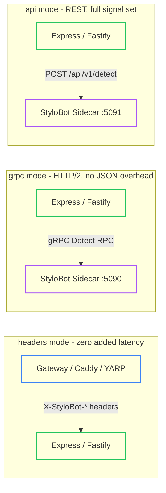
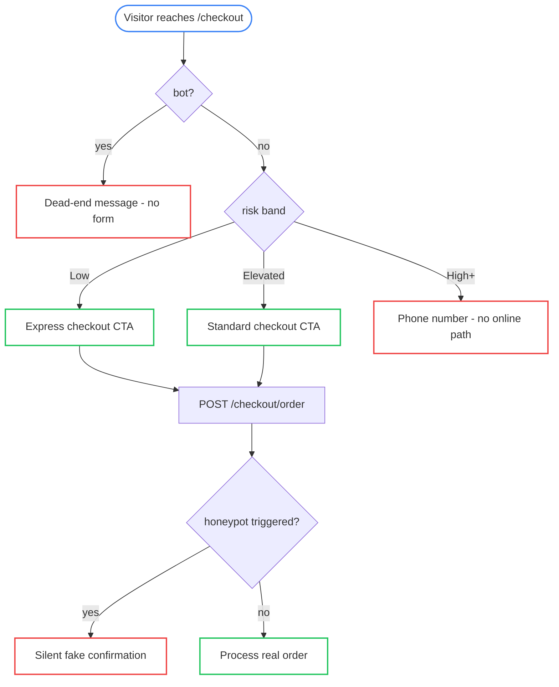
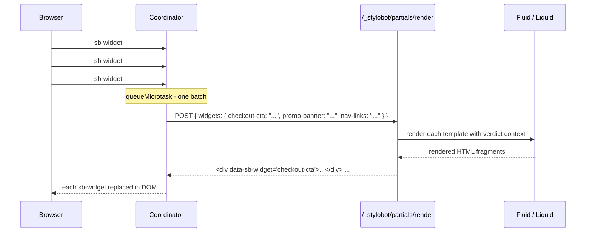

# StyloBot Release Series: Behaviour-Aware TypeScript UI

*Bot detection should not stop at allow/block. This post shows how StyloBot's classification result becomes application logic in TypeScript - server middleware for Express and Fastify, template helpers for Handlebars, Nunjucks, and EJS, and browser web components - so your UI can shape the experience instead of bolting friction on after the fact.*

> ## DRAFT
> This is a working draft in the StyloBot Release Series. APIs, package names, and code samples may still change before final release.
>
> **The `@stylobot/core` and `@stylobot/node` npm packages will be published shortly** - the snippets below describe the surface they will expose.

> **StyloBot Release Series**
>
> 1. [**Behaviour, Not Identity**](/blog/stylobot-fingerprint) - why StyloBot models clients behaviourally
> 2. [**Behaviour-Aware ASP.NET UI**](/blog/behaviour-aware-ux) - the server-rendered surface for .NET applications
> 3. [**Finding and Fixing Unbounded Growth in Long-Running .NET Services**](/blog/stylobot-release-reliability) - the reliability discipline that keeps the engine boring in production
> 4. **Behaviour-Aware TypeScript UI** - this article
> 5. **The Sidecar Architecture** - how the detection engine connects to non-.NET stacks

StyloBot's detection engine is written in ASP.NET Core - a high-performance framework with excellent async primitives, sub-millisecond hot-path latency, and twenty years of production pedigree behind it. The TypeScript SDK is the surface that brings the engine's output into Node.js applications and browsers without requiring either to know anything about what happened underneath.

<!--category-- TypeScript, Node.js, StyloBot, Bot Detection, Security -->
<datetime class="hidden">2026-05-12T10:30</datetime>

# Introduction

Most bot detection available in the TypeScript ecosystem gives you one of two things: a browser fingerprint that tells you whether the *client* looks automated, or a regex over the User-Agent string that catches only the bots that announce themselves.

Neither is useful at the application layer.

[botd](https://github.com/fingerprintjs/BotD) runs in the browser and has no view of request headers, TLS fingerprints, session behaviour, or IP reputation. A headless Chromium and a Googlebot look identical to it. Pure UA matching packages (`is-bot`, `isbot`) catch only what opts in to being caught. Network-layer products (Cloudflare Bot Management, DataDome) block at the edge but cannot personalise at the application layer - you learn a request was blocked, never that a request that reached your app had a 0.87 bot probability and a Medium risk band, so your checkout page could have shown a friction step and your analytics could have excluded it, all without an error code.

What StyloBot gives your TypeScript application is a verdict: a typed result with a continuous bot probability score, a classification (`AiBot`, `Scraper`, `GoodBot`, `MaliciousBot`, ...), a risk band, a recommended action, and a threat score. What you do with that verdict is up to you.

This article walks through a sample storefront and shows how that verdict becomes application behaviour at every layer: server middleware, template helpers, and browser components.

[TOC]

# The verdict

Before anything else, this is what arrives:

```ts
// @stylobot/core
interface Verdict {
  isBot: boolean;
  botProbability: number;        // 0.0–1.0 - not binary, a continuous score
  confidence: number;            // certainty in that score
  botType: BotType | null;       // 'AiBot' | 'Scraper' | 'GoodBot' | 'MaliciousBot' | ...
  botName: string | null;        // 'GPTBot', 'Googlebot', 'curl/8.9.1', ...
  riskBand: RiskBand;            // 'VeryLow' | 'Low' | 'Elevated' | 'Medium' | 'High' | 'VeryHigh'
  recommendedAction: RecommendedAction;  // 'Allow' | 'Throttle' | 'Challenge' | 'Block'
  threatScore: number;           // elevated when CVE probes or credential stuffing detected
  threatBand: ThreatBand;        // 'None' | 'Low' | 'Elevated' | 'High' | 'Critical'
}
```

A checkout endpoint can throttle `Medium` risk instead of blocking it. An API can exclude `AiBot` traffic from rate-limit quotas without counting it against real users. A login form can add proof-of-work for `Elevated` risk without touching the experience for `Low` risk visitors. None of this is possible if the detection result is a boolean at the network layer.

Risk bands in order: `VeryLow`, `Low`, `Elevated`, `Medium`, `High`, `VeryHigh`, `Verified`.

# Installation

```bash
npm install @stylobot/core @stylobot/node

# only needed for grpc mode
npm install @grpc/grpc-js @grpc/proto-loader
```

`@stylobot/core` has zero runtime dependencies. It contains the type definitions, the REST client, the header parser, and (optionally) the gRPC client. It works in Node, Deno, and Bun without modification.

`@stylobot/node` provides Express middleware, a Fastify plugin, template helper utilities, and the verdict injector. It depends on `@stylobot/core` and nothing else at runtime.

# The server surface

## How the verdict reaches your middleware

The middleware has three modes. All three produce the same `req.stylobot` shape. Which one you use depends on where in your infrastructure detection runs:



**`headers` mode** - detection ran upstream at the gateway; the middleware reads injected headers with no network call. This is the production pattern when a Caddy or YARP gateway sits in front.

**`grpc` mode** - the middleware calls the sidecar directly over HTTP/2. Lowest latency, no JSON overhead, requires `@grpc/grpc-js`. The gRPC interface and sidecar deployment details are in the [Sidecar Architecture article](/blog/sidecar-architecture).

**`api` mode** - calls `POST /api/v1/detect` over HTTP/1.1. Also returns `reasons` (per-detector contributions) and `signals` (the full blackboard state) that the other modes omit.

The middleware always fails open. If the sidecar is unreachable or times out, `req.stylobot` is set to a permissive empty verdict and the request continues.

## Wiring it up

**Express:**

```ts
import express from 'express';
import { styloBotMiddleware } from '@stylobot/node';

const app = express();
app.use(styloBotMiddleware({ mode: 'headers' }));
// or:
app.use(styloBotMiddleware({ mode: 'grpc', endpoint: 'localhost:5090', timeout: 100 }));
```

**Fastify:**

```ts
import Fastify from 'fastify';
import { styloBotPlugin } from '@stylobot/node';

const fastify = Fastify();
await fastify.register(styloBotPlugin, { mode: 'headers' });
```

Add a type declaration if you want typed access on Fastify requests:

```ts
// types.d.ts
import type { StyloBotResult } from '@stylobot/node';
declare module 'fastify' {
  interface FastifyRequest { stylobot: StyloBotResult; }
}
```

# The storefront

The same sample storefront from the [ASP.NET article](/blog/behaviour-aware-ux) - product page, checkout, login, newsletter - but in TypeScript. The detection result is the same; what changes is how the surface exposes it.

## Page 1: The product page

Price scrapers start here. They want product names, prices, and stock levels. You want the catalogue indexable by search engines and useful to humans without handing the commercial signals to systematic harvesting.

*Scenario: a price scraper hits `/products/:id`. It sees no discount code, no add-to-cart button, and no purchase signal worth acting on.*

The route handler:

```ts
app.get('/products/:id', (req, res) => {
  const { verdict } = req.stylobot;
  const product = getProduct(req.params.id);

  res.render('product', {
    product,
    sbVerdict: verdict,
    showDiscount:   verdict.riskBand === 'VeryLow' || verdict.riskBand === 'Low',
    showBuyButton:  !verdict.isBot,
    showCartWarning: verdict.recommendedAction === 'Challenge',
    isSearchBot:    verdict.botType === 'SearchEngine' || verdict.botType === 'VerifiedBot',
  });
});
```

The template (Handlebars):

```handlebars
{{! verified crawlers get structured metadata instead of commercial UI }}
{{#if isSearchBot}}
  <meta name="description" content="{{product.name}} -{{product.category}}." />
  <p>{{product.description}}</p>
{{else}}

  {{! discount only for low-risk human visitors }}
  {{#if showDiscount}}
    <div class="alert alert-success">
      Member price: use code <strong>LOYAL10</strong> for 10% off.
    </div>
  {{/if}}

  {{! add-to-cart only for non-bot traffic }}
  {{#if showBuyButton}}
    <form method="post" action="/cart/add">
      <input type="hidden" name="productId" value="{{product.id}}" />
      {{#if showCartWarning}}
        <p class="text-warning">Additional verification may be required at checkout.</p>
      {{/if}}
      <button type="submit" class="btn btn-primary">Add to Cart</button>
    </form>
  {{else}}
    <p class="text-muted">Purchase available to human visitors.</p>
  {{/if}}

{{/if}}
```

Three patterns in use here. Crawler differentiation: `SearchEngine` and `VerifiedBot` get structured metadata without commercial signals, which is what they actually need. Discount targeting: a loyalty code shown only to low-risk traffic is less likely to end up on a voucher forum. Progressive friction: `Challenge` is a warning, not a block - suspicious sessions can still buy.

## Page 2: Checkout

Fraud automation, card testers, voucher brute-forcers, and scripted retries all converge at checkout. The aim is defence in depth without a CAPTCHA-first experience for everyone.

*Scenario: a voucher-testing bot hits `/checkout`. It sees a dead-end message, submits a honeypot-filled form, and receives a silent confirmation with no retry incentive.*



The route:

```ts
app.get('/checkout', (req, res) => {
  const { verdict } = req.stylobot;
  res.render('checkout', {
    sbVerdict: verdict,
    showForm:     !verdict.isBot,
    showExpress:  verdict.riskBand === 'VeryLow' || verdict.riskBand === 'Low',
    showStandard: ['VeryLow','Low','Elevated'].includes(verdict.riskBand),
    showPhone:    ['High','VeryHigh'].includes(verdict.riskBand),
  });
});

app.post('/checkout/order', (req, res) => {
  // honeypot fields are invisible to humans; bots fill everything
  if (req.body.hp_name || req.body.hp_email) {
    return res.redirect('/checkout/confirmed');  // silent fake - no retry incentive
  }
  return processRealOrder(req, res);
});
```

The template:

```handlebars
{{#if showForm}}
  <form method="post" action="/checkout/order">

    {{! invisible honeypot trap - humans leave blank, bots fill everything }}
    <div style="position:absolute;left:-9999px;opacity:0" aria-hidden="true">
      <input type="text" name="hp_name" tabindex="-1" autocomplete="off" />
      <input type="email" name="hp_email" tabindex="-1" autocomplete="off" />
    </div>

    {{#if showExpress}}
      <button type="submit" name="express" value="true" class="btn btn-success btn-lg">
        Express Checkout
      </button>
    {{/if}}

    {{#if showStandard}}
      <button type="submit" class="btn btn-primary">Proceed to Payment</button>
    {{/if}}

    {{#if showPhone}}
      <p>Please call us to complete your order: <strong>0800 123 456</strong></p>
    {{/if}}

  </form>
{{else}}
  <p class="text-muted">Checkout is available to human visitors only.</p>
{{/if}}
```

Honeypot discard is the key technique here. Error feedback teaches attackers to iterate; a silent fake confirmation wastes their time, and the confirmation page looks identical whether the order was real or discarded. Express checkout as a trust benefit (not a default) means only sessions that have earned it get the shorter path. In production, factor the honeypot `<div>` wrapper into a shared Handlebars partial (`{{> honeypot}}`) rather than repeating the inline style block on every protected form.

## Page 3: Login

Login is credential-stuffing territory. The trade-off is different from checkout: a false positive at checkout may lose a sale; a missed credential-stuffing attack loses an account. The enforcement can be stricter.

*Scenario: a credential-stuffing script hits `/login`. It sees a deterrent message, fills the honeypot, and gets bounced to `/login/denied` before any authentication runs.*

```ts
app.get('/login', (req, res) => {
  const { verdict } = req.stylobot;
  res.render('login', {
    sbVerdict: verdict,
    showWarning: verdict.isBot,
    showRisk:    ['High','VeryHigh'].includes(verdict.riskBand),
  });
});

app.post('/login', async (req, res) => {
  if (req.body.hp_user || req.body.hp_pass) {
    return res.redirect('/login/denied');
  }
  if (req.stylobot.verdict.isBot) {
    return res.redirect('/login/denied');
  }
  return authenticate(req, res);
});
```

```handlebars
{{#if showRisk}}
  <div class="alert alert-danger">
    High-risk signals detected. Login attempts are logged.
  </div>
{{/if}}

{{#if showWarning}}
  <div class="alert alert-warning">
    Automated login attempts are detected and blocked.
  </div>
{{/if}}

<form method="post" action="/login">
  <div style="position:absolute;left:-9999px;opacity:0" aria-hidden="true">
    <input type="text" name="hp_user" tabindex="-1" autocomplete="off" />
    <input type="password" name="hp_pass" tabindex="-1" autocomplete="off" />
  </div>
  <div class="form-group">
    <label for="email">Email</label>
    <input type="email" id="email" name="email" autocomplete="email" />
  </div>
  <div class="form-group">
    <label for="password">Password</label>
    <input type="password" id="password" name="password" autocomplete="current-password" />
  </div>
  <button type="submit" class="btn btn-primary">Sign In</button>
</form>
```

The bot sees the deterrent before submitting. If it submits anyway, the honeypot catches it. If it somehow avoids the honeypot, `verdict.isBot` is the final server-side check before any authentication logic runs. Three layers, all small.

## Page 4: Newsletter

AI crawlers are a different problem. They are not trying to brute-force accounts or harvest prices; they are ingesting content for model training. They are often honest about identity, which means the right response is commercial rather than adversarial.

*Scenario: GPTBot hits `/newsletter`. It sees a data licensing message instead of a subscription pitch. Its submission is silently discarded.*

```ts
app.get('/newsletter', (req, res) => {
  const { verdict } = req.stylobot;
  res.render('newsletter', {
    sbVerdict:     verdict,
    isHuman:       !verdict.isBot,
    isAiBot:       verdict.botType === 'AiBot',
    isOtherBot:    verdict.isBot && verdict.botType !== 'AiBot',
  });
});

app.post('/newsletter/subscribe', (req, res) => {
  if (req.body.hp_email2 || req.stylobot.verdict.isBot) {
    return res.redirect('/newsletter/thanks');  // silent discard
  }
  mailingList.subscribe(req.body.email);
  return res.redirect('/newsletter/thanks');
});
```

```handlebars
{{#if isHuman}}
  <p>Get exclusive deals delivered to your inbox. Unsubscribe any time.</p>
{{/if}}

{{#if isAiBot}}
  <div class="alert alert-info">
    This subscription endpoint is for human readers.
    For data licensing enquiries, <a href="/contact">contact us directly</a>.
  </div>
{{/if}}

{{#if isOtherBot}}
  <div class="alert alert-warning">
    Automated subscription attempts are discarded.
  </div>
{{/if}}

<form method="post" action="/newsletter/subscribe">
  <div style="position:absolute;left:-9999px;opacity:0" aria-hidden="true">
    <input type="email" name="hp_email2" tabindex="-1" autocomplete="off" />
  </div>
  <div class="form-group">
    <input type="email" name="email" placeholder="your@email.com" autocomplete="email" />
  </div>
  <button type="submit" class="btn btn-success">Subscribe</button>
</form>
```

`AiBot` is not just another hostile label; it is a classification that enables a business response. A licensing message is more useful than a 403: it tells an operator what they are dealing with and gives them an action to take.

# Template helpers

## Injecting the verdict into templates

`sbVerdictInjector` runs after the detection middleware and puts the verdict on `res.locals`:

```ts
import { sbVerdictInjector } from '@stylobot/node';

app.use(styloBotMiddleware({ mode: 'headers' }));
app.use(sbVerdictInjector({ mode: 'gateway' }));
// or for direct sidecar calls (REST port, not the gRPC port):
app.use(sbVerdictInjector({ mode: 'sidecar', endpoint: 'http://localhost:5091' }));
```

`res.locals.sbVerdict` is available in every template. `res.locals.sbVerdictScript` is an inline `<script>` tag that sets `window.__sb` for the browser components.

## Handlebars

Define `RISK_ORDER` once at module scope - the Nunjucks and EJS helpers below use the same map:

```ts
import type { Verdict, RiskBand } from '@stylobot/core';

const RISK_ORDER: Record<string, number> = {
  Unknown: 0, VeryLow: 1, Low: 2, Elevated: 3, Medium: 4, High: 5, VeryHigh: 6, Verified: 7,
};

// register on your Handlebars engine instance
hbs.engine({
  helpers: {
    // {{#sbGate sbVerdict "Low"}}...{{else}}...{{/sbGate}}
    sbGate(verdict: Verdict | null, maxRisk: string, options: any) {
      if (!verdict) return options.fn(this);
      return RISK_ORDER[verdict.riskBand] <= RISK_ORDER[maxRisk]
        ? options.fn(this)
        : options.inverse(this);
    },

    // {{#sbIsBot sbVerdict}}...{{else}}...{{/sbIsBot}}
    sbIsBot(verdict: Verdict | null, options: any) {
      return verdict?.isBot ? options.fn(this) : options.inverse(this);
    },

    // {{#sbBotType sbVerdict "AiBot"}}...{{/sbBotType}}
    sbBotType(verdict: Verdict | null, type: string, options: any) {
      return verdict?.botType === type ? options.fn(this) : options.inverse(this);
    },

    // {{#sbMinRisk sbVerdict "High"}}...{{/sbMinRisk}}
    sbMinRisk(verdict: Verdict | null, minRisk: string, options: any) {
      if (!verdict) return options.inverse(this);
      return RISK_ORDER[verdict.riskBand] >= RISK_ORDER[minRisk]
        ? options.fn(this)
        : options.inverse(this);
    },
  },
});
```

In templates:

```handlebars
{{#sbGate sbVerdict "Low"}}
  <a href="/checkout/express" class="btn btn-success">Express Checkout</a>
{{else}}
  <a href="/checkout" class="btn btn-secondary">Checkout</a>
{{/sbGate}}

{{#sbBotType sbVerdict "AiBot"}}
  <div class="alert alert-info">AI crawler detected - data licensing info above.</div>
{{/sbBotType}}

{{#sbMinRisk sbVerdict "High"}}
  <div class="alert alert-danger">High-risk session. Some features restricted.</div>
{{/sbMinRisk}}
```

## Nunjucks

```ts
import nunjucks from 'nunjucks';

// RISK_ORDER - same map defined in the Handlebars section above

class SbGateExtension {
  tags = ['sbgate'];
  parse(parser: any, nodes: any, lexer: any) {
    const tok = parser.nextToken();
    const args = parser.parseSignature(null, true);
    parser.advanceAfterBlockEnd(tok.value);
    const body = parser.parseUntilBlocks('else', 'endsbgate');
    let elseBody = null;
    if (parser.skipSymbol('else')) {
      parser.skip(lexer.TOKEN_BLOCK_END);
      elseBody = parser.parseUntilBlocks('endsbgate');
    }
    parser.advanceAfterBlockEnd();
    return new nodes.CallExtension(this, 'run', args, [body, elseBody]);
  }
  run(context: any, maxRisk: string, body: any, elseBody: any) {
    const v = context.ctx.sbVerdict;
    const fits = !v || RISK_ORDER[v.riskBand] <= RISK_ORDER[maxRisk];
    return fits ? body() : (elseBody?.() ?? '');
  }
}
env.addExtension('SbGateExtension', new SbGateExtension());
```

```nunjucks

  <a href="/checkout/express">Express checkout</a>

  <a href="/checkout">Checkout</a>

```

## EJS

EJS does not have block helpers, but locals functions cover most cases cleanly:

```ts
// RISK_ORDER - same map defined in the Handlebars section above

app.use((req, res, next) => {
  const v = res.locals.sbVerdict ?? null;
  res.locals.sbBelowRisk = (max: string) =>
    !v || RISK_ORDER[v.riskBand] <= RISK_ORDER[max];
  res.locals.sbAboveRisk = (min: string) =>
    v && RISK_ORDER[v.riskBand] >= RISK_ORDER[min];
  res.locals.sbIsBot  = () => v?.isBot ?? false;
  res.locals.sbBotIs  = (type: string) => v?.botType === type;
  next();
});
```

```ejs
<% if (sbBelowRisk('Low')) { %>
  <a href="/checkout/express" class="btn btn-success">Express Checkout</a>
<% } else { %>
  <a href="/checkout" class="btn btn-secondary">Checkout</a>
<% } %>

<% if (sbBotIs('AiBot')) { %>
  <div class="alert alert-info">AI crawler - data licensing enquiries via /contact.</div>
<% } %>
```

# The browser surface

## Injecting the verdict into the browser

Add `{{{sbVerdictScript}}}` to your layout head. It renders as:

```html
<script>window.__sb = {"isBot":false,"botProbability":0.12,"riskBand":"Low","recommendedAction":"Allow",...}</script>
```

Then load the elements bundle:

```handlebars
<head>
  {{{sbVerdictScript}}}
  <script type="module" src="/js/sb-elements.js"></script>
</head>
```

## `<sb-gate>`: show or hide content by risk band

```html
<!-- only shown when riskBand <= 'low' -->
<sb-gate max-risk="low">
  <a href="/checkout/express" class="btn btn-success">Express Checkout</a>
</sb-gate>

<!-- only shown when riskBand >= 'elevated' -->
<sb-gate min-risk="elevated">
  <div class="alert alert-warning">Unusual activity detected on your session.</div>
</sb-gate>
```

## `<sb-adapt>`: pick the first matching case

```html
<sb-adapt>
  <sb-case max-risk="low">
    Standard checkout - enter your card details below.
  </sb-case>
  <sb-case max-risk="medium">
    Additional verification is required before we can process your order.
  </sb-case>
  <sb-case>
    Automated checkout access is not permitted.
  </sb-case>
</sb-adapt>
```

`<sb-adapt>` picks the first `<sb-case>` whose `max-risk` fits and hides the rest. The final `<sb-case>` with no `max-risk` is the catch-all. Both `<sb-gate>` and `<sb-adapt>` listen for the `sb:verdict` event and re-evaluate if the verdict changes after the first paint.

## `<sb-widget>`: server-rendered Liquid fragments

`<sb-gate>` hides content client-side. If you need a bot to receive different markup - not hidden markup - you need the fragment to be rendered on the server with the detection context available to the template.

`<sb-widget>` reads a Liquid template from an inline `<template>` element, batches all widget requests on the page into a single round-trip, and replaces itself with the returned HTML:

```html
<sb-widget data-sb-widget="checkout-cta">
  <template>
    
      <p class="text-danger">Automated checkout is blocked.</p>
    
      <p>AI crawlers cannot complete purchases. <a href="/contact">Data licensing enquiries</a>.</p>
    
      <p class="text-muted">Checkout is available to human visitors.</p>
    
      <a href="/checkout/express" class="btn btn-success">Express Checkout</a>
    
  </template>
</sb-widget>
```

Template variables: `isBot`, `botProbability`, `confidence`, `botType`, `botName`, `riskBand`, `recommendedAction`, `threatScore`, `threatBand`. Plus any `vars` you pass from server-side when calling `RenderWidget` directly.

All `<sb-widget>` elements that connect in the same microtask tick are batched into one request. A page with five widgets makes one round-trip:



# The summary table

| Component | Layer | What it does |
|---|---|---|
| `styloBotMiddleware` | Express | Attaches `req.stylobot` via headers / gRPC / REST |
| `styloBotPlugin` | Fastify | Same, as a Fastify plugin with `decorateRequest` |
| `sbVerdictInjector` | Express | Populates `res.locals.sbVerdict` and `sbVerdictScript` |
| Handlebars helpers | Server templates | `sbGate`, `sbIsBot`, `sbBotType`, `sbMinRisk` block helpers |
| Nunjucks extension | Server templates | `...` |
| EJS locals | Server templates | `sbBelowRisk()`, `sbAboveRisk()`, `sbIsBot()`, `sbBotIs()` |
| `<sb-gate>` | Browser | Show/hide content by risk band, listens for `sb:verdict` |
| `<sb-adapt>` | Browser | Pick first matching case from a list |
| `<sb-widget>` | Browser | Fetch server-rendered Liquid fragment, batched per tick |
| `StyloBotGrpcClient` | Node / Bun / Deno | Direct gRPC client for non-middleware use |

Next in the release series: [**The Sidecar Architecture**](/blog/sidecar-architecture) - how the detection engine connects to non-.NET stacks, the Go SDK, the Caddy plugin, and the gRPC interface that ties it together.

If you arrived here from the .NET side, [Behaviour-Aware ASP.NET UI](/blog/behaviour-aware-ux) covers the same storefront patterns with tag helpers and action filters; the reliability rework that keeps the engine memory-stable under sustained traffic is in [Finding and Fixing Unbounded Growth in Long-Running .NET Services](/blog/stylobot-release-reliability).