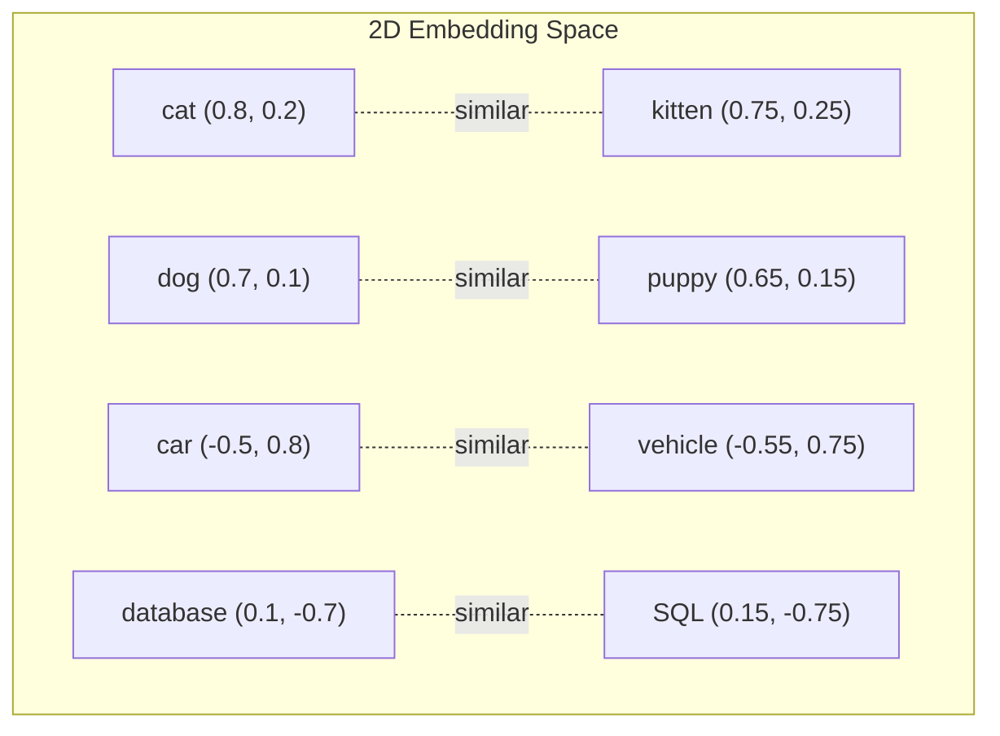
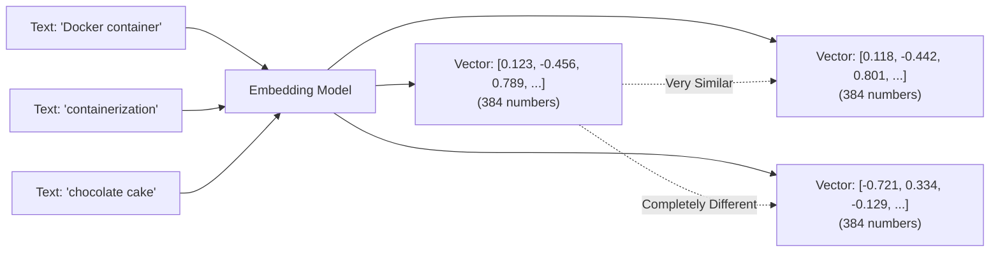

# Understanding Embeddings for .NET Developers: A Practical Guide

<!--category-- AI, Embeddings, C#, Machine Learning, Semantic Search -->
<datetime class="hidden">2025-11-13T14:30</datetime>

# Introduction

If you've been following the AI space over the past year or so, you've probably heard the term "embeddings" bandied about quite a bit. Perhaps you've seen them mentioned alongside vector databases, semantic search, or RAG (Retrieval Augmented Generation) systems. But what actually *are* embeddings, and why should you, as a .NET developer, care about them?

The short answer: embeddings are a way to represent text (or images, audio, etc.) as numbers in a way that captures their *meaning*. They're the secret sauce that makes modern AI applications understand concepts rather than just matching keywords.

In this article, I'll explain embeddings from first principles, show you practical C# examples, and demonstrate why they're genuinely useful for real-world applications. No PhD in machine learning required – just your existing .NET knowledge and a willingness to learn something rather clever.

[TOC]

## What Problem Do Embeddings Solve?

Let's start with a problem that traditional programming struggles with: understanding that different words can mean the same thing.

Imagine you're building a search feature for a blog (like this one!). A user searches for "error handling in C#". Your traditional keyword search would look for posts containing exactly those words. But what about excellent posts that instead use phrases like:

- "Exception management in .NET"
- "Try-catch patterns in C#"
- "Dealing with failures in ASP.NET Core"
- "Handling faults gracefully"

These are all talking about the same *concept*, but keyword search would miss most of them. This is where embeddings come in.

## What Are Embeddings, Really?

An embedding is simply a list of numbers (a vector) that represents a piece of text. Here's the clever bit: similar concepts get similar numbers, even if they use completely different words.

### A Simplified Example

Imagine we could represent every word using just two numbers (in reality, we use hundreds or thousands, but let's start simple):

```csharp
// Simplified 2D embeddings (real ones use 384-1536 dimensions!)
var embeddings = new Dictionary<string, float[]>
{
    ["cat"] = new[] { 0.8f, 0.2f },
    ["kitten"] = new[] { 0.75f, 0.25f },
    ["dog"] = new[] { 0.7f, 0.1f },
    ["puppy"] = new[] { 0.65f, 0.15f },

    ["car"] = new[] { -0.5f, 0.8f },
    ["vehicle"] = new[] { -0.55f, 0.75f },

    ["database"] = new[] { 0.1f, -0.7f },
    ["SQL"] = new[] { 0.15f, -0.75f }
};
```

If you plotted these on a graph, you'd see:
- Pet-related words cluster together
- Vehicle words are near each other
- Database terms form their own group
- Unrelated concepts are far apart

Here's a visual representation:



### Real Embeddings Use Hundreds of Dimensions

In practice, modern embedding models use between 384 and 1536 dimensions (not just 2!). This allows them to capture much more nuance:

- Dimension 1 might represent "animal-ness"
- Dimension 2 might capture "cuteness"
- Dimension 3 might encode "formality"
- Dimension 4 might represent "technical-ness"
- ... and so on for hundreds of dimensions

This multi-dimensional representation is what gives embeddings their power to understand subtle semantic relationships.

## How Do We Get These Numbers?

You don't calculate embeddings yourself (thank goodness!). Instead, you use a pre-trained **embedding model** – a neural network that's been trained on vast amounts of text to learn these semantic relationships.

The process looks like this:



Notice that "Docker container" and "containerization" get similar vectors even though they share no words in common!

## Measuring Similarity: Cosine Distance

Once you have embeddings, you need to measure how similar they are. The most common method is **cosine similarity**, which measures the angle between two vectors.

Here's a C# implementation:

```csharp
public static class EmbeddingMath
{
    public static float CosineSimilarity(float[] vectorA, float[] vectorB)
    {
        if (vectorA.Length != vectorB.Length)
            throw new ArgumentException("Vectors must have the same length");

        // Calculate dot product (sum of element-wise multiplication)
        float dotProduct = 0f;
        for (int i = 0; i < vectorA.Length; i++)
        {
            dotProduct += vectorA[i] * vectorB[i];
        }

        // Calculate magnitude of each vector
        float magnitudeA = 0f;
        float magnitudeB = 0f;
        for (int i = 0; i < vectorA.Length; i++)
        {
            magnitudeA += vectorA[i] * vectorA[i];
            magnitudeB += vectorB[i] * vectorB[i];
        }
        magnitudeA = MathF.Sqrt(magnitudeA);
        magnitudeB = MathF.Sqrt(magnitudeB);

        // Cosine similarity = dot product / (magnitude_a * magnitude_b)
        return dotProduct / (magnitudeA * magnitudeB);
    }
}
```

**Cosine similarity ranges from -1 to 1:**
- `1.0` = Identical meaning (vectors point in exactly the same direction)
- `0.0` = Completely unrelated (vectors are perpendicular)
- `-1.0` = Opposite meaning (vectors point in opposite directions)

In practice, you'll typically see scores between 0.3 and 0.95 for real-world text.

### Practical Example

```csharp
var embedding1 = GetEmbedding("ASP.NET Core middleware");
var embedding2 = GetEmbedding("request pipeline in ASP.NET");
var embedding3 = GetEmbedding("baking sourdough bread");

float similarity12 = EmbeddingMath.CosineSimilarity(embedding1, embedding2);
float similarity13 = EmbeddingMath.CosineSimilarity(embedding1, embedding3);

Console.WriteLine($"Middleware vs Pipeline: {similarity12:F3}");  // ~0.85 (very similar!)
Console.WriteLine($"Middleware vs Bread: {similarity13:F3}");     // ~0.12 (unrelated)
```

## Real-World Use Cases for .NET Developers

Right, so embeddings let us compare text by meaning rather than keywords. What can we actually *do* with that?

### 1. Semantic Search

Instead of keyword matching, find content by *concept*. This is brilliant for:
- Documentation search
- Code snippet discovery
- Knowledge base systems
- E-commerce product search

I covered this in detail in my article on [building a semantic search engine with Qdrant](/blog/qdrantwithaspdotnetcore).

### 2. Recommendation Systems

Find similar items based on descriptions:
```csharp
// User liked this blog post
var likedPostEmbedding = GetEmbedding(post.Content);

// Find similar posts
var similarPosts = allPosts
    .Select(p => new
    {
        Post = p,
        Similarity = CosineSimilarity(likedPostEmbedding, GetEmbedding(p.Content))
    })
    .Where(x => x.Similarity > 0.7f)
    .OrderByDescending(x => x.Similarity)
    .Take(5);
```

### 3. Content Classification

Categorise text without training a custom classifier:

```csharp
var categories = new Dictionary<string, float[]>
{
    ["Technical Tutorial"] = GetEmbedding("step-by-step programming guide with code examples"),
    ["Opinion Piece"] = GetEmbedding("personal thoughts and perspectives on technology trends"),
    ["News"] = GetEmbedding("latest announcements and updates in the tech industry")
};

var articleEmbedding = GetEmbedding(article.Content);

var bestMatch = categories
    .Select(kvp => new
    {
        Category = kvp.Key,
        Similarity = CosineSimilarity(articleEmbedding, kvp.Value)
    })
    .OrderByDescending(x => x.Similarity)
    .First();

Console.WriteLine($"This article is probably: {bestMatch.Category}");
```

### 4. Duplicate Detection

Find near-duplicate content even if worded differently:

```csharp
var newComment = "This product is absolutely rubbish and doesn't work at all";
var existingComments = GetAllComments();

foreach (var existing in existingComments)
{
    float similarity = CosineSimilarity(
        GetEmbedding(newComment),
        GetEmbedding(existing.Text)
    );

    if (similarity > 0.9f)
    {
        Console.WriteLine($"Possible duplicate of comment {existing.Id}");
    }
}
```

### 5. RAG Systems (Retrieval Augmented Generation)

This is the foundation of modern AI applications. When building a chatbot or writing assistant, you:
1. Embed your knowledge base (documentation, past articles, etc.)
2. When the user asks a question, embed the question
3. Find the most relevant documents using similarity search
4. Feed those documents to an LLM along with the question

I'm building exactly this in my [Lawyer GPT series](/blog/building-a-lawyer-gpt-for-your-blog-part1), which uses embeddings to create a writing assistant for blog posts.

## Getting Started with Embeddings in C#

Let's build a simple but practical example using a free, open-source embedding model.

### Option 1: Using OpenAI (Easiest, but Costs Money)

If you don't mind spending a few pence, OpenAI's embedding API is dead simple:

```bash
dotnet add package Azure.AI.OpenAI
```

```csharp
using Azure.AI.OpenAI;

public class OpenAIEmbeddingService
{
    private readonly OpenAIClient _client;
    private const string EmbeddingModel = "text-embedding-3-small"; // £0.015 per 1M tokens

    public OpenAIEmbeddingService(string apiKey)
    {
        _client = new OpenAIClient(apiKey);
    }

    public async Task<float[]> GetEmbeddingAsync(string text)
    {
        var options = new EmbeddingsOptions(EmbeddingModel, new[] { text });
        var response = await _client.GetEmbeddingsAsync(options);

        // Returns a 1536-dimensional vector
        return response.Value.Data[0].Embedding.ToArray();
    }
}
```

**Cost example**:
- 1,000 blog posts × 1,000 words each = ~1M tokens
- Cost: About £0.02 (two pence!) for one-time embedding
- Searches are free (you only pay to create embeddings, not to use them)

### Option 2: Local Models with ONNX Runtime (Free, More Complex)

For production systems or when you want complete control, run models locally using ONNX Runtime. This is what I use for [my semantic search implementation](/blog/qdrantwithaspdotnetcore).

```bash
dotnet add package Microsoft.ML.OnnxRuntime.Gpu
dotnet add package Microsoft.ML.Tokenizers
```

First, download a pre-trained model. I recommend **bge-base-en-v1.5** (it's excellent and free):

```bash
# You can download pre-converted ONNX models from Hugging Face
# Or convert yourself using Python's optimum library
```

Then create an embedding service:

```csharp
using Microsoft.ML.OnnxRuntime;
using Microsoft.ML.OnnxRuntime.Tensors;
using Microsoft.ML.Tokenizers;

public class LocalEmbeddingService : IDisposable
{
    private readonly InferenceSession _session;
    private readonly Tokenizer _tokenizer;
    private const int EmbeddingDimension = 768; // bge-base uses 768 dimensions

    public LocalEmbeddingService(string modelPath, string tokenizerPath)
    {
        // Configure to use GPU if available
        var options = new SessionOptions();
        options.AppendExecutionProvider_CUDA(0); // Remove this line for CPU-only

        _session = new InferenceSession(modelPath, options);
        _tokenizer = Tokenizer.CreateTokenizer(tokenizerPath);
    }

    public float[] GetEmbedding(string text)
    {
        // Step 1: Tokenize the text
        var encoding = _tokenizer.Encode(text);
        var inputIds = encoding.Ids.Select(i => (long)i).ToArray();

        // Step 2: Create input tensors
        var inputIdsTensor = new DenseTensor<long>(inputIds, new[] { 1, inputIds.Length });
        var attentionMask = Enumerable.Repeat(1L, inputIds.Length).ToArray();
        var attentionMaskTensor = new DenseTensor<long>(attentionMask, new[] { 1, attentionMask.Length });

        // Step 3: Run the model
        var inputs = new List<NamedOnnxValue>
        {
            NamedOnnxValue.CreateFromTensor("input_ids", inputIdsTensor),
            NamedOnnxValue.CreateFromTensor("attention_mask", attentionMaskTensor)
        };

        using var results = _session.Run(inputs);
        var outputTensor = results.First().AsTensor<float>();

        // Step 4: Extract and normalize the embedding
        return ExtractAndNormalize(outputTensor, attentionMask);
    }

    private float[] ExtractAndNormalize(Tensor<float> outputTensor, long[] attentionMask)
    {
        // Mean pooling: average all token embeddings
        int seqLength = outputTensor.Dimensions[1];
        int embeddingDim = outputTensor.Dimensions[2];

        var embedding = new float[embeddingDim];
        int tokenCount = attentionMask.Count(m => m == 1);

        for (int seq = 0; seq < seqLength; seq++)
        {
            if (attentionMask[seq] == 0) continue;

            for (int dim = 0; dim < embeddingDim; dim++)
            {
                embedding[dim] += outputTensor[0, seq, dim];
            }
        }

        // Average and normalize to unit length
        for (int dim = 0; dim < embeddingDim; dim++)
        {
            embedding[dim] /= tokenCount;
        }

        return Normalize(embedding);
    }

    private float[] Normalize(float[] vector)
    {
        float magnitude = MathF.Sqrt(vector.Sum(v => v * v));
        return vector.Select(v => v / magnitude).ToArray();
    }

    public void Dispose()
    {
        _session?.Dispose();
    }
}
```

For a complete, working example with all the details, check out [Part 3 of my Lawyer GPT series](/blog/building-a-lawyer-gpt-for-your-blog-part3).

## Storing and Searching Embeddings at Scale

Once you've generated embeddings for your content, you need to store them somewhere and search efficiently. This is where **vector databases** come in.

### The Problem with Naive Search

If you have 10,000 documents and someone searches, you can't compare against all 10,000 embeddings every time:

```csharp
// BAD: O(n) search - checks EVERY embedding!
var bestMatch = allEmbeddings
    .Select(e => new { Doc = e.Document, Score = CosineSimilarity(query, e.Embedding) })
    .OrderByDescending(x => x.Score)
    .First();
```

For 10,000 embeddings × 768 dimensions = 7.68 million floating-point comparisons. That's slow (50-100ms), and it doesn't scale.

### Vector Databases to the Rescue

Vector databases use clever data structures (like HNSW graphs) to search in O(log n) time instead of O(n). This brings search time down to 1-5ms even with millions of vectors.

I've written detailed guides on two excellent options:

**[Qdrant](/blog/qdrantwithaspdotnetcore)** - Purpose-built vector database:
```csharp
// Create collection
await client.CreateCollectionAsync("blog_posts", new VectorParams
{
    Size = 768,
    Distance = Distance.Cosine
});

// Insert
await client.UpsertAsync("blog_posts", new[]
{
    new PointStruct
    {
        Id = 1,
        Vectors = embedding,
        Payload = { ["title"] = "My Post", ["content"] = "..." }
    }
});

// Search (fast!)
var results = await client.SearchAsync("blog_posts", queryEmbedding, limit: 5);
```

**PostgreSQL with pgvector** (covered in [my full-text search series](/blog/textsearchingpt1)):
```sql
-- Create table with vector column
CREATE TABLE documents (
    id SERIAL PRIMARY KEY,
    content TEXT,
    embedding VECTOR(768)
);

-- Create HNSW index for fast similarity search
CREATE INDEX ON documents USING hnsw (embedding vector_cosine_ops);

-- Search (also fast!)
SELECT content, 1 - (embedding <=> $1) as similarity
FROM documents
ORDER BY embedding <=> $1
LIMIT 5;
```

Both approaches work brilliantly. Qdrant is purpose-built and slightly faster; pgvector keeps everything in your existing PostgreSQL database.

## Common Gotchas and Best Practices

### 1. Dimension Mismatch Errors

**Problem**: The most common error you'll encounter:
```
Error: Vector dimension mismatch. Expected 768, got 1536
```

**Solution**: Ensure your embedding model, vector database, and similarity calculations all use the same dimension size. If you use `text-embedding-3-small` (1536 dimensions), everything must be configured for 1536.

### 2. Not Normalizing Vectors

**Problem**: Unnormalized vectors make cosine similarity calculations more expensive.

**Solution**: Always normalize embeddings to unit length:
```csharp
private float[] Normalize(float[] vector)
{
    float magnitude = MathF.Sqrt(vector.Sum(v => v * v));
    return vector.Select(v => v / magnitude).ToArray();
}
```

With normalized vectors, cosine similarity becomes a simple dot product (much faster).

### 3. Embedding the Wrong Text

**Problem**: Embedding too much or too little context.

**Best practices**:
- For search: Embed meaningful chunks (150-500 words)
- For classification: Embed the entire document
- For comparison: Embed similar-sized texts

**Bad**:
```csharp
var embedding = GetEmbedding(blogPost.Title); // Too short, loses context
```

**Good**:
```csharp
var embedding = GetEmbedding($"{blogPost.Title}\n\n{blogPost.Content}"); // Full context
```

### 4. Not Caching Embeddings

Embeddings are expensive to generate (10-100ms each). Always cache them:

```csharp
public class EmbeddingCache
{
    private readonly Dictionary<string, float[]> _cache = new();
    private readonly IEmbeddingService _service;

    public async Task<float[]> GetEmbeddingAsync(string text)
    {
        string hash = ComputeHash(text);

        if (_cache.TryGetValue(hash, out var cached))
            return cached;

        var embedding = await _service.GetEmbeddingAsync(text);
        _cache[hash] = embedding;

        return embedding;
    }
}
```

### 5. Ignoring Batch Processing

**Problem**: Generating embeddings one-by-one is slow.

**Solution**: Batch them when possible:
```csharp
// BAD: 1000 round trips
foreach (var doc in documents)
{
    doc.Embedding = await GetEmbeddingAsync(doc.Text);
}

// GOOD: Batch processing
var texts = documents.Select(d => d.Text).ToList();
var embeddings = await GetEmbeddingsAsync(texts); // Single batch call

for (int i = 0; i < documents.Count; i++)
{
    documents[i].Embedding = embeddings[i];
}
```

## Practical End-to-End Example

Let's put it all together with a simple blog search system:

```csharp
public class BlogSearchEngine
{
    private readonly IEmbeddingService _embeddings;
    private readonly List<BlogPost> _posts;
    private readonly Dictionary<int, float[]> _postEmbeddings;

    public BlogSearchEngine(IEmbeddingService embeddingService, List<BlogPost> posts)
    {
        _embeddings = embeddingService;
        _posts = posts;
        _postEmbeddings = new Dictionary<int, float[]>();
    }

    // Index all blog posts (run this once on startup)
    public async Task IndexAllPostsAsync()
    {
        Console.WriteLine($"Indexing {_posts.Count} blog posts...");

        for (int i = 0; i < _posts.Count; i++)
        {
            var post = _posts[i];
            var text = $"{post.Title}\n\n{post.Content}";

            _postEmbeddings[post.Id] = await _embeddings.GetEmbeddingAsync(text);

            if ((i + 1) % 10 == 0)
                Console.WriteLine($"Indexed {i + 1}/{_posts.Count}");
        }

        Console.WriteLine("Indexing complete!");
    }

    // Search for similar posts
    public async Task<List<SearchResult>> SearchAsync(string query, int topK = 5)
    {
        // Generate embedding for the query
        var queryEmbedding = await _embeddings.GetEmbeddingAsync(query);

        // Calculate similarity with all posts
        var results = _posts.Select(post => new SearchResult
        {
            Post = post,
            Similarity = EmbeddingMath.CosineSimilarity(
                queryEmbedding,
                _postEmbeddings[post.Id]
            )
        })
        .Where(r => r.Similarity > 0.5f) // Only return reasonably similar results
        .OrderByDescending(r => r.Similarity)
        .Take(topK)
        .ToList();

        return results;
    }
}

public class SearchResult
{
    public BlogPost Post { get; set; }
    public float Similarity { get; set; }
}

// Usage
var searchEngine = new BlogSearchEngine(embeddingService, allPosts);
await searchEngine.IndexAllPostsAsync();

var results = await searchEngine.SearchAsync("How do I handle errors in ASP.NET Core?");

foreach (var result in results)
{
    Console.WriteLine($"{result.Post.Title} (similarity: {result.Similarity:F3})");
}
```

**Output**:
```
Building Error Handling Middleware (similarity: 0.876)
Using Polly for Retries (similarity: 0.823)
Exception Filters in ASP.NET Core (similarity: 0.801)
Logging Best Practices (similarity: 0.687)
```

Notice it found relevant posts even though they don't contain the exact phrase "handle errors"!

## Performance Considerations

### Cost Analysis (for 10,000 Blog Posts)

**OpenAI API Approach:**
- One-time embedding cost: ~£2-5
- Storage: Negligible (768 floats × 10K = ~30MB)
- Search: Free (local computation)
- **Total**: ~£5 setup, then free forever

**Local Model Approach:**
- Initial setup: Free (open-source model)
- Embedding generation: 10-30 minutes on CPU, 2-5 minutes on GPU
- Storage: Same (~30MB)
- Search: Free (local computation)
- **Total**: Free, but requires upfront time investment

### Speed Benchmarks (10,000 Documents)

| Operation | Naive Search | With Vector DB |
|-----------|--------------|----------------|
| Single query | 50-100ms | 1-5ms |
| 100 queries | 5-10s | 0.1-0.5s |
| 1M queries | 14 hours | 16-83 minutes |

Vector databases are essential at scale!

## Where to Go From Here

Embeddings are the foundation of modern AI applications. Here are some next steps:

1. **Build a semantic search feature** - Follow my [Qdrant guide](/blog/qdrantwithaspdotnetcore) to implement this for your application
2. **Create a RAG system** - Check out my [Lawyer GPT series](/blog/building-a-lawyer-gpt-for-your-blog-part1) for building a complete AI writing assistant
3. **Experiment with different models** - Try various embedding models to see which works best for your domain
4. **Add hybrid search** - Combine embeddings (semantic) with traditional full-text search (keywords) for best results

## In Conclusion

Embeddings might seem like magic, but they're actually quite straightforward: they're just a way to represent text as numbers that capture meaning rather than just keywords.

For .NET developers, this opens up a world of possibilities:
- Semantic search that actually understands what users mean
- Recommendation systems that find truly similar content
- Classification without training custom models
- RAG systems that provide grounded, accurate AI responses

The best part? You can start using them today with just a few lines of C# code. Whether you use OpenAI's API for simplicity or run models locally for control, the concepts remain the same.

Give it a try on your next project – I think you'll be pleasantly surprised at how useful they are!

## Resources

- [Building a Semantic Search Engine with Qdrant](/blog/qdrantwithaspdotnetcore) - Complete implementation guide
- [Lawyer GPT Part 3: Understanding Embeddings](/blog/building-a-lawyer-gpt-for-your-blog-part3) - Deep dive into embedding models
- [Full-Text Search Series](/blog/textsearchingpt1) - Traditional search for comparison
- [Sentence Transformers](https://www.sbert.net/) - Popular embedding models
- [ONNX Runtime Documentation](https://onnxruntime.ai/) - For running models locally
- [OpenAI Embeddings Guide](https://platform.openai.com/docs/guides/embeddings) - API-based approach
