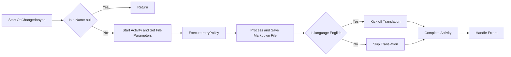
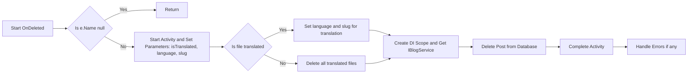

# Using A Hybrid Approach To Blogging

# Introduction
I've [blogged many](/blog/category/Markdown) times about how I use Markdown to create my blog posts; I really like this approach but it has one major drawback - it means I have to do a complete Docker build cycle to update a post. This was FINE while I was creating more features which I then blogged about but it's pretty limiting now. I want to be able to update my blog posts without having to do a full build cycle. 
So now I've added a new bit of functionality to my blog which allows me to do just that.

<!--category-- ASP.NET, Markdown -->

<datetime class="hidden">2024-09-14T00:30</datetime>

[TOC]
# The Hybrid Approach
By 'hybrid' approach I mean this lifecycle; again pretty simplistic but kinda cool (in a super geeky way!). 

So it's pretty simple.
1. I write a new blog post in Markdown, save it to my local machine
2. upload it to my website.
3. A FileWatcher detects the new file and processes it.
4. The post is inserted into the database
5. translations are kicked off.
6. Once the translations are complete the post is updated on the website.

This allows me to keep using Rider locally to create blog posts (in future I'll likely move to also allowing this to happen in the site itself), all the translations happen dynamically on the site itself and I can update posts without having to do a full build cycle.


# The Code
The code for this is YET ANOTHER `IHostedService`, this time it uses the `FileSystemWatcher` class to watch a directory for new files. When a new file is detected it reads the file, processes it and inserts it into the database. OR if I delete an English language post it will delete all translations of that post too.

The whole code is below but I'll break it down a bit here.

<details>
<summary>MarkdownDirectoryWatcherService.cs</summary>


```csharp
using Mostlylucid.Config.Markdown;
using Polly;
using Serilog.Events;

namespace Mostlylucid.Blog.WatcherService;

public class MarkdownDirectoryWatcherService(MarkdownConfig markdownConfig, IServiceScopeFactory serviceScopeFactory,
    ILogger<MarkdownDirectoryWatcherService> logger)
    : IHostedService
{
    private Task _awaitChangeTask = Task.CompletedTask;
    private FileSystemWatcher _fileSystemWatcher;

    public Task StartAsync(CancellationToken cancellationToken)
    {
        _fileSystemWatcher = new FileSystemWatcher
        {
            Path = markdownConfig.MarkdownPath,
            NotifyFilter = NotifyFilters.FileName | NotifyFilters.LastWrite | NotifyFilters.CreationTime |
                           NotifyFilters.Size,
            Filter = "*.md", // Watch all markdown files
            IncludeSubdirectories = true // Enable watching subdirectories
        };
        // Subscribe to events
        _fileSystemWatcher.EnableRaisingEvents = true;

        _awaitChangeTask = Task.Run(()=> AwaitChanges(cancellationToken));
        logger.LogInformation("Started watching directory {Directory}", markdownConfig.MarkdownPath);
        return Task.CompletedTask;
    }

    public Task StopAsync(CancellationToken cancellationToken)
    {
        // Stop watching
        _fileSystemWatcher.EnableRaisingEvents = false;
        _fileSystemWatcher.Dispose();

        Console.WriteLine($"Stopped watching directory: {markdownConfig.MarkdownPath}");

        return Task.CompletedTask;
    }

    private async Task AwaitChanges(CancellationToken cancellationToken)
    {
        while (!cancellationToken.IsCancellationRequested)
        {
            var fileEvent = _fileSystemWatcher.WaitForChanged(WatcherChangeTypes.All);
            if (fileEvent.ChangeType == WatcherChangeTypes.Changed ||
                fileEvent.ChangeType == WatcherChangeTypes.Created)
            {
                await OnChangedAsync(fileEvent);
            }
            else if (fileEvent.ChangeType == WatcherChangeTypes.Deleted)
            {
                OnDeleted(fileEvent);
            }
            else if (fileEvent.ChangeType == WatcherChangeTypes.Renamed)
            {
               
            }
        }
    }

    private async Task OnChangedAsync(WaitForChangedResult e)
    {
        if (e.Name == null) return;

        var activity = Log.Logger.StartActivity("Markdown File Changed {Name}", e.Name);
        var retryPolicy = Policy
            .Handle<IOException>() // Only handle IO exceptions (like file in use)
            .WaitAndRetryAsync(5, retryAttempt => TimeSpan.FromMilliseconds(500 * retryAttempt), 
                (exception, timeSpan, retryCount, context) =>
                {
                    activity?.Activity?.SetTag("Retry Attempt", retryCount);
                    // Log the retry attempt
                    logger.LogWarning("File is in use, retrying attempt {RetryCount} after {TimeSpan}", retryCount, timeSpan);
                });

        try
        {
            var fileName = e.Name;
            var isTranslated = Path.GetFileNameWithoutExtension(e.Name).Contains(".");
            var language = MarkdownBaseService.EnglishLanguage;
            var directory = markdownConfig.MarkdownPath;

            if (isTranslated)
            {
                language = Path.GetFileNameWithoutExtension(e.Name).Split('.').Last();
                fileName = Path.GetFileName(fileName);
                directory = markdownConfig.MarkdownTranslatedPath;
            }

            var filePath = Path.Combine(directory, fileName);
            var scope = serviceScopeFactory.CreateScope();
            var markdownBlogService = scope.ServiceProvider.GetRequiredService<IMarkdownBlogService>();

            // Use the Polly retry policy for executing the operation
            await retryPolicy.ExecuteAsync(async () =>
            {
                var blogModel = await markdownBlogService.GetPage(filePath);
                activity?.Activity?.SetTag("Page Processed", blogModel.Slug);
                blogModel.Language = language;

                var blogService = scope.ServiceProvider.GetRequiredService<IBlogService>();
                await blogService.SavePost(blogModel);
                if (language == MarkdownBaseService.EnglishLanguage)
                {
                    var translateService = scope.ServiceProvider.GetRequiredService<BackgroundTranslateService>();
                    await translateService.TranslateForAllLanguages(
                        new PageTranslationModel(){OriginalFileName = filePath, OriginalMarkdown = blogModel.Markdown,Persist = true});
                }
                activity?.Activity?.SetTag("Page Saved", blogModel.Slug);
            });

            activity?.Complete();
        }
        catch (Exception exception)
        {
            activity?.Complete(LogEventLevel.Error, exception);
        }
    }

    private void OnDeleted(WaitForChangedResult e)
    {
        if(e.Name == null) return;
        var isTranslated = Path.GetFileNameWithoutExtension(e.Name).Contains(".");
        var language = MarkdownBaseService.EnglishLanguage;
        var slug = Path.GetFileNameWithoutExtension(e.Name);
        if (isTranslated)
        {
            var name = Path.GetFileNameWithoutExtension(e.Name).Split('.');
            language = name.Last();
            slug = name.First();
            
        }
        else
        {
            var translatedFiles = Directory.GetFiles(markdownConfig.MarkdownTranslatedPath, $"{slug}.*.*");
            _fileSystemWatcher.EnableRaisingEvents = false;
            foreach (var file in translatedFiles)
            {
                File.Delete(file);
            }
            _fileSystemWatcher.EnableRaisingEvents = true;
        }
        var scope = serviceScopeFactory.CreateScope();
        var blogService = scope.ServiceProvider.GetRequiredService<IBlogService>();
        blogService.Delete(slug, language);
   
    }

    private void OnRenamed(object sender, RenamedEventArgs e)
    {
        Console.WriteLine($"File renamed: {e.OldFullPath} to {e.FullPath}");
    }
}
```

</details>

## Starting it Up

So all it does is kick off a new Task which uses `FileSystemWatcher` in it's `StartAsync` method. In an `IHostedService` this is the entry point the ASP.NET Core framework uses to start the service. 

```csharp
    private FileSystemWatcher _fileSystemWatcher;

    public Task StartAsync(CancellationToken cancellationToken)
    {
        _fileSystemWatcher = new FileSystemWatcher
        {
            Path = markdownConfig.MarkdownPath,
            NotifyFilter = NotifyFilters.FileName | NotifyFilters.LastWrite | NotifyFilters.CreationTime |
                           NotifyFilters.Size,
            Filter = "*.md", // Watch all markdown files
            IncludeSubdirectories = true // Enable watching subdirectories
        };
        // Subscribe to events
        _fileSystemWatcher.EnableRaisingEvents = true;

        _awaitChangeTask = Task.Run(()=> AwaitChanges(cancellationToken));
        logger.LogInformation("Started watching directory {Directory}", markdownConfig.MarkdownPath);
        return Task.CompletedTask;
    }
```
I have a task local to the Service which I fire the change loop on

```csharp 
private Task _awaitChangeTask = Task.CompletedTask;
 _awaitChangeTask = Task.Run(()=> AwaitChanges(cancellationToken));
   
```

This is important as otherwise this becomes blocking, you need to ensure this runs in the background (ask me how I know this).

In here we have set up a `FileSystemWatcher` to listen for events in my Markdown directory (mapped to a host directory for reasons we'll see later!)

```csharp
 _fileSystemWatcher = new FileSystemWatcher
        {
            Path = markdownConfig.MarkdownPath,
            NotifyFilter = NotifyFilters.FileName | NotifyFilters.LastWrite | NotifyFilters.CreationTime |
                           NotifyFilters.Size,
            Filter = "*.md", // Watch all markdown files
            IncludeSubdirectories = true // Enable watching subdirectories
        };
        // Subscribe to events
        _fileSystemWatcher.EnableRaisingEvents = true;
```
You can see I'm watching for `FileName`, `LastWrite`, `CreationTime` and `Size` changes. This is because I want to know if a file is created, updated or deleted.

I also have a `Filter` set to `*.md` so I only watch for markdown files and specify I want to watch subdirectories too (for the translations).


## The Change Loop
Inside this code I have a change loop which waits for changes to the file system. 
Note you can also just hook into the Change events here but this felt cleaner to me.

```csharp
    private async Task AwaitChanges(CancellationToken cancellationToken)
    {
        while (!cancellationToken.IsCancellationRequested)
        {
            var fileEvent = _fileSystemWatcher.WaitForChanged(WatcherChangeTypes.All);
            if (fileEvent.ChangeType == WatcherChangeTypes.Changed ||
                fileEvent.ChangeType == WatcherChangeTypes.Created)
            {
                await OnChangedAsync(fileEvent);
            }
            else if (fileEvent.ChangeType == WatcherChangeTypes.Deleted)
            {
                OnDeleted(fileEvent);
            }
            else if (fileEvent.ChangeType == WatcherChangeTypes.Renamed)
            {
               
            }
        }
    }
```

Again pretty simple, all it does is wait for a change event and then calls the `OnChangedAsync` method. OR if the file is deleted it calls the `OnDeleted` method.

## OnChangedAsync
This is where the 'magic' happens. 
What it does is listen for the change event. It then Processes the Markdown file using my pipeline (to get the HTML categories, date, Title etc) and inderts this into the database. It THEN detects if the file is in English (so I wrote it :)) and if it is it kicks off a translation process. See [this post](/blog/backgroundtranslationspt2) for how this works.

```csharp
   await retryPolicy.ExecuteAsync(async () =>
            {
                var blogModel = await markdownBlogService.GetPage(filePath);
                activity?.Activity?.SetTag("Page Processed", blogModel.Slug);
                blogModel.Language = language;

                var blogService = scope.ServiceProvider.GetRequiredService<IBlogService>();
                await blogService.SavePost(blogModel);
                if (language == MarkdownBaseService.EnglishLanguage)
                {
                    var translateService = scope.ServiceProvider.GetRequiredService<BackgroundTranslateService>();
                    await translateService.TranslateForAllLanguages(
                        new PageTranslationModel(){OriginalFileName = filePath, OriginalMarkdown = blogModel.Markdown,Persist = true});
                }
                activity?.Activity?.SetTag("Page Saved", blogModel.Slug);
            });
```


Note that I use `Polly` here to handle the file processing; this ensures that the file has REALLY been uploaded / saved before it tries to process it. 

```csharp
      var retryPolicy = Policy
            .Handle<IOException>() // Only handle IO exceptions (like file in use)
            .WaitAndRetryAsync(5, retryAttempt => TimeSpan.FromMilliseconds(500 * retryAttempt), 
                (exception, timeSpan, retryCount, context) =>
                {
                    activity?.Activity?.SetTag("Retry Attempt", retryCount);
                    // Log the retry attempt
                    logger.LogWarning("File is in use, retrying attempt {RetryCount} after {TimeSpan}", retryCount, timeSpan);
                });
```

I also use `SerilogTracing` activities to help me find any problems when it's in 'production' more easily (I [have an article](/blog/selfhostingseqpt2) on that too!).



<details>
<summary>OnChangedAsync</summary>


```csharp
   private async Task OnChangedAsync(WaitForChangedResult e)
    {
        if (e.Name == null) return;

        var activity = Log.Logger.StartActivity("Markdown File Changed {Name}", e.Name);
        var retryPolicy = Policy
            .Handle<IOException>() // Only handle IO exceptions (like file in use)
            .WaitAndRetryAsync(5, retryAttempt => TimeSpan.FromMilliseconds(500 * retryAttempt), 
                (exception, timeSpan, retryCount, context) =>
                {
                    activity?.Activity?.SetTag("Retry Attempt", retryCount);
                    // Log the retry attempt
                    logger.LogWarning("File is in use, retrying attempt {RetryCount} after {TimeSpan}", retryCount, timeSpan);
                });

        try
        {
            var fileName = e.Name;
            var isTranslated = Path.GetFileNameWithoutExtension(e.Name).Contains(".");
            var language = MarkdownBaseService.EnglishLanguage;
            var directory = markdownConfig.MarkdownPath;

            if (isTranslated)
            {
                language = Path.GetFileNameWithoutExtension(e.Name).Split('.').Last();
                fileName = Path.GetFileName(fileName);
                directory = markdownConfig.MarkdownTranslatedPath;
            }

            var filePath = Path.Combine(directory, fileName);
            var scope = serviceScopeFactory.CreateScope();
            var markdownBlogService = scope.ServiceProvider.GetRequiredService<IMarkdownBlogService>();

            // Use the Polly retry policy for executing the operation
            await retryPolicy.ExecuteAsync(async () =>
            {
                var blogModel = await markdownBlogService.GetPage(filePath);
                activity?.Activity?.SetTag("Page Processed", blogModel.Slug);
                blogModel.Language = language;

                var blogService = scope.ServiceProvider.GetRequiredService<IBlogService>();
                await blogService.SavePost(blogModel);
                if (language == MarkdownBaseService.EnglishLanguage)
                {
                    var translateService = scope.ServiceProvider.GetRequiredService<BackgroundTranslateService>();
                    await translateService.TranslateForAllLanguages(
                        new PageTranslationModel(){OriginalFileName = filePath, OriginalMarkdown = blogModel.Markdown,Persist = true});
                }
                activity?.Activity?.SetTag("Page Saved", blogModel.Slug);
            });

            activity?.Complete();
        }
        catch (Exception exception)
        {
            activity?.Complete(LogEventLevel.Error, exception);
        }
    }
```
</details>

## OnDeleted
This one is really simple, it just detects when a file is deleted and removes it from the database; I MAINLY use this as an idiot-proofing measure as I'm apt to upload articles then immediately see they have errors. As you can see it tests to see if the file is translated and if it is it deletes all translations of that file.
    


```csharp
 private void OnDeleted(WaitForChangedResult e)
    {
        if (e.Name == null) return;
        var activity = Log.Logger.StartActivity("Markdown File Deleting {Name}", e.Name);
        try
        {
            var isTranslated = Path.GetFileNameWithoutExtension(e.Name).Contains(".");
            var language = MarkdownBaseService.EnglishLanguage;
            var slug = Path.GetFileNameWithoutExtension(e.Name);
            if (isTranslated)
            {
                var name = Path.GetFileNameWithoutExtension(e.Name).Split('.');
                language = name.Last();
                slug = name.First();
            }
            else
            {
                var translatedFiles = Directory.GetFiles(markdownConfig.MarkdownTranslatedPath, $"{slug}.*.*");
                _fileSystemWatcher.EnableRaisingEvents = false;
                foreach (var file in translatedFiles)
                {
                    File.Delete(file);
                }

                _fileSystemWatcher.EnableRaisingEvents = true;
            }

            var scope = serviceScopeFactory.CreateScope();
            var blogService = scope.ServiceProvider.GetRequiredService<IBlogService>();
            blogService.Delete(slug, language);
            activity?.Activity?.SetTag("Page Deleted", slug);
            activity?.Complete();
            logger.LogInformation("Deleted blog post {Slug} in {Language}", slug, language);
        }
        catch (Exception exception)
        {
            activity?.Complete(LogEventLevel.Error, exception);
            logger.LogError("Error deleting blog post {Slug}", e.Name);
        }
    }

```
# Uploading the Files
I use WinSCP to upload the files to my website. I can just do a 'sync' to upload any markdown files then my service will add them to the DB. This is the directory that the `FileSystemWatcher` is watching. In FUTURE I'll add an image upload capability to this too, there I'll add some preprocessing and handling of larger files.


# In Conclusion
So this is a pretty simple way to add new blog posts to my site without having to do a full build cycle. In this post I showed how to use the `FileSystemWatcher` to detect changes to a directory and process them. I also showed how to use `Polly` to handle retries and `Serilog` to log the process.