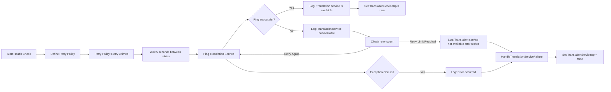

# Using Polly For Retries

# Introduction
[Polly](https://www.pollydocs.org/) is a critical part of any .NET developer's toolkit. It is a library that allows you to define policies for handling exceptions and retries in your application. In this article, we will explore how to *I* use Polly to handle retries in this application.
<!--category-- Polly,ASP.NET,C# -->

<datetime class="hidden">2024-09-15T02:20</datetime>
[TOC]
# Polly
So while Polly does retries really well it's not all it can do, it's really a toolkit for adding resilience to your applications. Both making calls to outside services and internally.

* Retry: Try again if something fails. This can be useful when the problem is temporary and might go away.
* Circuit Breaker: Stop trying if something is broken or busy. This can benefit you by avoiding wasting time and making things worse. It can also support the system to recover.
* Timeout: Give up if something takes too long. This can improve your performance by freeing up space and resources.
* Rate Limiter: Limit how many requests you make or accept. This can enable you to control the load and prevent problems or penalties.
* Fallback: Do something else if something fails. This can improve your user experience and keep the program working.
Hedging: Do more than one thing at the same time and take the fastest one. This can make your program faster and more responsive.

# How I Use Polly
In this application I use Polly in multiple places.

## BackgroundTransalteService
For starting up my translation service and checking the EasyNMT servers are available. Thsi allows me to check the service is available before starting to 'offer' the translation service in my app. You'll recall this is both used for [my Editor 'toy'](/blog/backgroundtranslationspt3) to enable you to translate markdown  and for my 'on the fly' [blog post translation engine](/blog/usingfilebasedhybridblogging). So it's critical I check EasyNMT hasn't gone down (and enable waiting until it comes up; which can take a few seconds).

```csharp
 private async Task StartupHealthCheck(CancellationToken cancellationToken)
    {
        var retryPolicy = Policy
            .HandleResult<bool>(result => !result) // Retry when Ping returns false (service not available)
            .WaitAndRetryAsync(3, // Retry 3 times
                attempt => TimeSpan.FromSeconds(5), // Wait 5 seconds between retries
                (result, timeSpan, retryCount, context) =>
                {
                    logger.LogWarning("Translation service is not available, retrying attempt {RetryCount}", retryCount);
                });

        try
        {
            var isUp = await retryPolicy.ExecuteAsync(async () =>
            {
                return await Ping(cancellationToken); // Ping to check if the service is up
            });

            if (isUp)
            {
                logger.LogInformation("Translation service is available");
                TranslationServiceUp = true;
            }
            else
            {
                logger.LogError("Translation service is not available after retries");
                await HandleTranslationServiceFailure();
                TranslationServiceUp = false;
            }
        }
        catch (Exception ex)
        {
            logger.LogError(ex, "An error occurred while checking the translation service availability");
            await HandleTranslationServiceFailure();
            TranslationServiceUp = false;
        }
    }
```

Here you can see we set up a Polly Retry policy that will retry 3 times with a 5-second wait between each retry. If the service is still not available after the retries, we log an error and handle the failure by setting the `TranslationServiceUp` flag to false. This then allows any services using the translation service to know that it is not available.



## Umami.Net
I also use Polly in my Umami.Net library to handle retries when making requests to the Umami API. This is a critical part of the library as it allows me to handle any issues with the API and retry the request if necessary.

Here I set up my `HttpClient` to use a Retry Policy; in this case I'm checking for a `HttpStatusCode.ServiceUnavailable` and retrying the request if it occurs. I'm also using a `Decorrelated Jitter Backoff` strategy to wait between retries. This is a good strategy to use as it helps to avoid the 'thundering herd' problem where all clients retry at the same time (even though it's just me :)). This can help to reduce the load on the server and improve the chances of the request succeeding.

```csharp
     var httpClientBuilder = services.AddHttpClient<AuthService>(options =>
            {
                options.BaseAddress = new Uri(umamiSettings.UmamiPath);
            })
            .SetHandlerLifetime(TimeSpan.FromMinutes(5)) 
            .AddPolicyHandler(RetryPolicyExtension.GetRetryPolicy());


    public static IAsyncPolicy<HttpResponseMessage> GetRetryPolicy()
    {
        var delay = Backoff.DecorrelatedJitterBackoffV2(TimeSpan.FromSeconds(1), 3);
        return HttpPolicyExtensions
            .HandleTransientHttpError()
            .OrResult(msg => msg.StatusCode == HttpStatusCode.ServiceUnavailable)
            .WaitAndRetryAsync(delay);
    }
```

Using a retry policy for `HttpClient` requests is an important way of improving reliability. While we like to think our web services are always available there's always SOME downtime (in my case when for example [Watchtower](https://github.com/containrrr/watchtower) detects an update is pending and restarts the Umami container). So having a retry policy in place can help to ensure that your application can handle these situations gracefully.

## FileSystemWatcher
Another use I make of Polly is when dealing with loading and saving files in my application. I use a `FileSystemWatcher` to monitor the directory where my markdown files are stored. When a file is created or updated I load the file and process it. This can be a problem if the file is still being written to when the event is triggered. So I use a `RetryPolicy` to handle this situation.

Here you can see I handle the `IOException` that is thrown when the file is in use and retry the operation. I use a `WaitAndRetryAsync` policy to retry the operation 5 times with a delay between each retry. This allows me to handle the situation where the file is still being written to and retry the operation until it succeeds.

What's critical here is that I throw 'up' to `IOException` from my `SavePost` method which allows the Polly policy to handle the retry. This is a good pattern to follow as it allows you to handle the retry logic in a central place and not have to worry about it in every method that might need to retry an operation.

In general **always handle exceptions where you can** and **throw up** to a higher level where you can handle them in a more centralised way (or log them). This can help to reduce the complexity of your code and make it easier to handle exceptions in a consistent way.

```csharp
      private async Task OnChangedAsync(WaitForChangedResult e)
    {
       ...
        var retryPolicy = Policy
            .Handle<IOException>() // Only handle IO exceptions (like file in use)
            .WaitAndRetryAsync(5, retryAttempt => TimeSpan.FromMilliseconds(500 * retryAttempt),
                (exception, timeSpan, retryCount, context) =>
                {
                    activity?.Activity?.SetTag("Retry Attempt", retryCount);
                    // Log the retry attempt
                    logger.LogWarning("File is in use, retrying attempt {RetryCount} after {TimeSpan}", retryCount,
                        timeSpan);
                });

      ...

            // Use the Polly retry policy for executing the operation
            await retryPolicy.ExecuteAsync(async () =>
            {
              ...
                var blogService = scope.ServiceProvider.GetRequiredService<IBlogService>();
                await blogService.SavePost(blogModel);
               ...
            });
...
    }
```

Again this is an example of my code interacting with an outside service, in this case the filesystem. Where I EXPECT certain error types to occur. I also log these using [SerilogTracing](https://www.mostlylucid.net/blog/selfhostingseqpt2) which sends them to Seq which THEN sends me an email when the errror is logged so I can identify any issues that might be occurring. 

Again, the general approach is to handle exceptions where you can, log them when you can't and ensure you have a way to know what's happening. This can help to ensure that your application is resilient and can handle any issues that might occur.

## EmailService
In my Email Service I use both the `CircuitBreaker` pattern and a retry policy. The retry policy is used to handle the case where the email service is not available and the circuit breaker is used to handle the case where the email service is busy or overloaded.

Both of these are important in the case of emails; SMTP is a relatively slow and potentially unreliable protocol. 

Here I handle SmtpExceptions, where when an error comes from the SMTP service it will first retry three times with a delay between each retry. If the service is still not available after the retries (and two more for a new send), the circuit breaker will open and stop sending emails for a minute. This can help to prevent the email service from being overloaded (and my account being blocked) and improve the chances of the email being sent successfully.

```csharp
         // Initialize the retry policy
            var retryPolicy = Policy
                .Handle<SmtpException>() // Retry on any exception
                .WaitAndRetryAsync(3, // Retry 3 times
                    attempt => TimeSpan.FromSeconds(2 * attempt),
                    (exception, timeSpan, retryCount, context) =>
                    {
                        logger.LogWarning(exception, "Retry {RetryCount} for sending email failed", retryCount);
                    });

            // Initialize the circuit breaker policy
            var circuitBreakerPolicy = Policy
                .Handle<SmtpException>()
                .CircuitBreakerAsync(
                    5,
                    TimeSpan.FromMinutes(1), 
                    onBreak: (exception, timespan) =>
                    {
                        logger.LogError("Circuit broken due to too many failures. Breaking for {BreakDuration}", timespan);
                    },
                    onReset: () =>
                    {
                        logger.LogInformation("Circuit reset. Resuming email delivery.");
                    },
                    onHalfOpen: () =>
                    {
                        logger.LogInformation("Circuit in half-open state. Testing connection...");
                    });
            _policyWrap = Policy.WrapAsync(retryPolicy, circuitBreakerPolicy);
            
            
```

This is then used in my Email Sending loop which waits for new messages to be added to the channel then tries to send them.

This uses all the functioanlity in the wrapped policy to add resilience to the email sending process. 

```csharp
 while (await _mailMessages.Reader.WaitToReadAsync(token))
        {
            BaseEmailModel? message = null;
            try
            {
                message = await _mailMessages.Reader.ReadAsync(token);

                // Execute retry policy and circuit breaker around the email sending logic
                await _policyWrap.ExecuteAsync(async () =>
                {
                    switch (message)
                    {
                        case ContactEmailModel contactEmailModel:
                            await _emailService.SendContactEmail(contactEmailModel);
                            break;
                        case CommentEmailModel commentEmailModel:
                            await _emailService.SendCommentEmail(commentEmailModel);
                            break;
                    }
                });

                _logger.LogInformation("Email from {SenderEmail} sent", message.SenderEmail);
            }
            catch (OperationCanceledException)
            {
                break;
            }
            catch (Exception exc)
            {
                _logger.LogError(exc, "Couldn't send an e-mail from {SenderEmail}", message?.SenderEmail);
            }
        }
```


# In Conclusion
Polly is a powerful library that can help you to add resilience to your applications. By using Polly you can handle retries, circuit breakers, timeouts, rate limiters, fallbacks and hedging in your application. This can help to ensure that your application is reliable and can handle any issues that might occur.
In this post I jsut covered one aspect of Polly; retries, these are a mechanism which can improve the resilience and reliability of your application. By using Polly you can handle retries in a consistent way and ensure that your application can handle any issues that might occur.